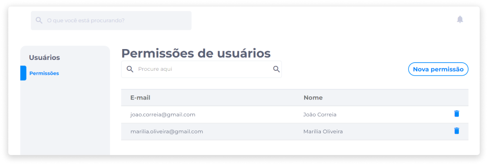
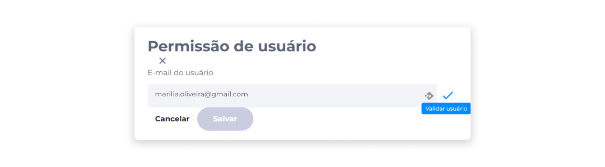
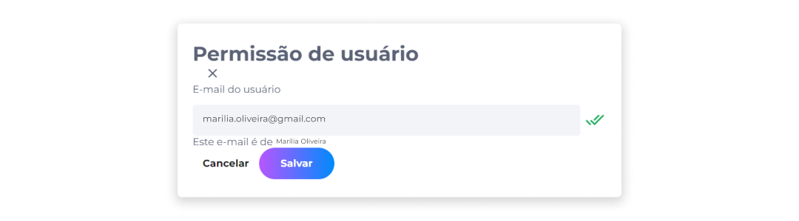
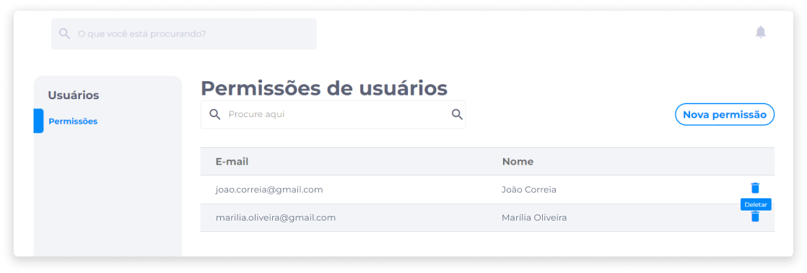

# Usuários
Os usuários de lojas são proprietários ou funcionários que atuam na administração das vendas e, dependendo do cargo, têm permissão para modificar todas ou apenas algumas sessões da loja, como categorias, promoções, produtos, pedidos, entre outros.

O administrador tem a autonomia de atribuir quais são as permissões de cada usuário, que serão configuradas na aba **Permissões** da área de gerenciamento de usuários.

Para adicionar um funcionário no sistema de backoffice da loja, o administrador deverá solicitar ao funcionário a realização do cadastro através do site da loja como um cliente comum.

## Gerenciamento de Permissões
As permissões são funções concedidas a operadores do E-commerce e do Marketplace, viabilizando a administração de diferentes áreas da loja. Um usuário pode exercer mais de uma função, desde que esteja com as devidas permissões.

O administrador da loja tem acesso à todas as permissões.

### Adicionar um permissão
Para conceder uma nova permissão a um usuário, no painel administrativo, clique em **Usuários**.

1. Clique em **Nova permissão**.

2. Insira o e-mail do usuário.

3. Clique no ícone **Validar usuário**.

4. Após a confirmação de validação do usuário, clique em **Salvar**.

### Deletar uma permissão
Em **Usuários**, identifique ou busque pelo usuário que deseja remover.

1. Clique no ícone **Deletar**.

2. Confirme se realmente deseja remover o usuário.

::: danger ⚠️ <dangerblocktitle>Atenção</dangerblocktitle>
<dangerblocktext>Remover uma permissão é um procedimento irreversível e fará com que todas as suas configurações sejam perdidas. Caso queira recuperá-la, será necessário concedê-la novamente.</dangerblocktext>
:::