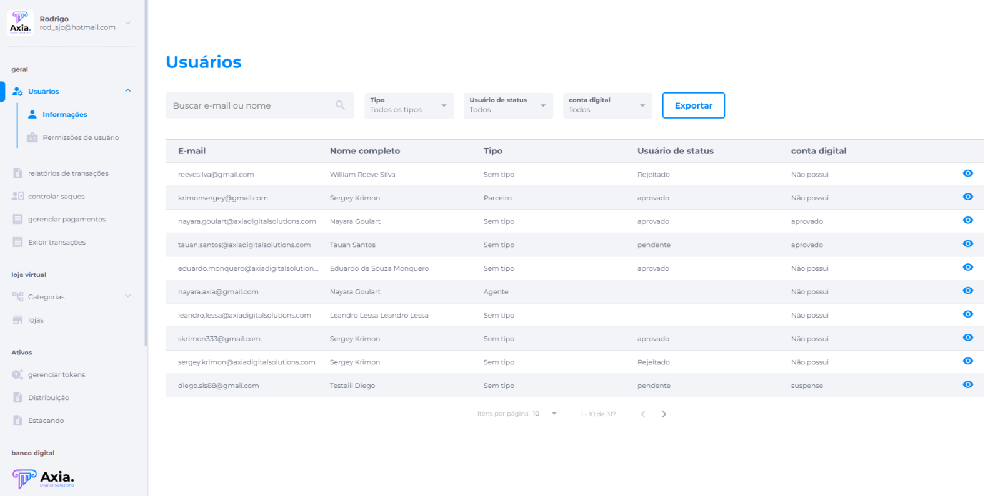

# Funcionalidades

## BackOffice

O BackOffice se refere ao gerenciamento interno administrativo e financeiro, responsável por resolver problemas rotineiros nas empresas e ajustar configurações. Ainda que esse setor não tenha contato direto com o cliente, seus procedimentos são essenciais para os processos internos, que refletem diretamente com o usuário final, lidando diretamente com o lucro da instituição e na satisfação do cliente.

### Principais funcionalidades:

1. **Gestão de contas**

   - Novos usuários são liberados pela Axia de acordo com o poder administrativo do negócio.
   - Usuário Super Administrador tem acesso a todo gerenciamento, podendo ele dar permissão a outro um usuário administrador a tornar usuário Super Admin
   - Usuário Admin (Acesso limitado ao gerenciamento).
2. **Deletar usuário**

   - Qualquer usuário deve poder solicitar a exclusão da conta e deve perder o acesso à plataforma, no entanto, isso não será excluído automaticamente, mas deve acontecer de acordo com os Termos de Uso.
3. **KYC (Know Your Customer)**

   - A funcionalidade de KYC tem integração com a plataforma idWall e também permite a aprovação de documentos manuais.
   - Foto de Selfie com Documento;
   - Foto de Documento;
   - Comprovante de endereço;
   - Utilização do SDK da idWall para captura de faceId com prova de vida.
4. **MFA (Multi-Factor Authentication)**

   - A funcionalidade do MFA tem como método de segurança a utilização de dois ou mais variáveis atestando a identidade de alguém para acesso do sistema, documento, informação ou transação.
   - Uma vez configurado em nosso sistema, o usuário deverá informar o código gerado pelo app Authy ou similar no momento do login.
   - Para acessar a plataforma, utilizamos o método OTP.
   - É possível remover o MFA de usuário, basta buscar pelo usuário, e clicar no símbolo que aparece em frente ao texto: "Remover MFA".
5. **Gerenciamento de usuários**

   - Alguns filtros para melhor usabilidade do administrador;
   - Busca por: nome ou e-mail do usuário
   - Tipo: Sem definição, Agentes, Parceiros;
   - Status de usuários: Aprovados, Pendentes, Rejeitados;
   - Conta digital: Aprovado, Desaprovado, Processando, Suspenso.
   - Exportação de dados;
6. **Informações do usuário**

   - É exibido usuários, informações com todo relatórios de transações ou empréstimos
   - Usuários: Alguns filtros para melhor usabilidade;
   - Busca por: nome ou e-mail do usuário
   - Tipo: Sem definição, Agentes, Parceiros;
   - Status de usuários: Aprovados, Pendentes, Rejeitados;
   - Conta digital: Aprovado, Desaprovado, Processando, Suspenso.
   - Exportação de dados;
   - Informações do usuário.
7. **Troca de e-mail do usuário**

   - O username é o e-mail do usuário e poderá ser alterado quando solicitado.
   - Essa alteração gera riscos de segurança;
   - É preciso que antes de alterar, garanta que recebeu as informações necessárias para verificar a autenticidade do usuário.
8. **Permissão de usuário**

   - Quando acessado por Super Admin, este pode dar permissão do tipo de usuário clicando em editar;
   - Pode ativar e desativar um usuário;
   - Excluir usuário;
   - Campos de busca por e-mail;
   - Filtros: Administrador ou Super Administrador.
9. **Relatório de transação**

   - É possível emitir um relatório por período desejado.
   - O relatório segue o modelo adequado conforme as solicitações da Receita Federal para ativos digitais
10. **Gerenciamento de saques**

    - O administrador fica responsável pela aprovação e cancelamento de solicitação de saque;
    - Enquanto não foi analisado, o saque fica com status aguardo.
    - Alguns filtros de status da transação podem ser selecionados pelo administrador.
    - Poderá gerenciar saque fiduciário, banco digital, Bitcoin/ETH.

    Informações de transação fiduciário:

    - Data/hora
    - Nome
    - CPF/CNPJ
    - Banco / agência/ conta
    - Valor de taxa / Valor da transação
    - Status aprovado, cancelado, aguardando
    - Setor para negar ou aprovar saque

    Informações de transação do banco digital:

    - Data/hora
    - Nome
    - Valor de taxa / Valor da transação
    - Status aprovado, cancelado, aguardando
    - Setor para negar ou aprovar saque

    Informações de transação de criptomoeda:

    - Data/hora
    - Nome
    - Tipo: Bitcoin/Ethereum
    - Carteira digital
    - Valor de taxa / Valor da transação
    - Status aprovado, cancelado, aguardando
    - Setor para negar ou aprovar saque
11. **Gerenciamento de Lojas**

    - Categorias - configuração e criar novas categorias “pai” ou principais e as subcategorias;
    - É possível editar ou excluir categorias e subcategorias;
    - Parâmetros - são características para criação do produto.
    - É possível duplicar a informação, editar, excluir ou visualizar.
    - Quando criado ou editado para parâmetro numérico, A configuração definida será utilizada como validação dos valores no cadastro do produto ou serviço que tenha esta característica;
    - Quando criado ou editado para parâmetro opções, nela as opções criadas e inseridas serão exibidas em ordem alfabética.
    - Quando criado ou editado para parâmetro de texto livre, O tipo "Texto livre" permite inserir um texto de no máximo 200 caracteres no cadastro do produto ou serviço que tenha esta característica.
12. **Lojas**

    - É possível realizar busca por nome da loja e visualizar a loja.
    - Gerais: Nome, Descrição, Logo, Tempo de expiração do produto desta loja no carrinho de compras (dias);
    - Endereço;
    - Meios de pagamentos configurados;
    - Termos: conteúdo dos termos de criação de loja;
    - Promoções: A loja pode criar promoções;
    - Variáveis: Para criar o produto, este campo será utilizado como chave estrangeira.
    - Apenas visualizar a loja ou editar.
    - Imagem da loja
**13 - Ativos**

Refere-se a todo o gerenciamento de ativos para transações.

Gerenciamento de saques:

- Filtros por status, fiduciário, Banco digital, Bitcoin/ETH:

**Fiduciário:**

- Data / hora da transação;
- Nome do usuário; CPF/CNPJ;
- Instituição bancária; Agência; Tipo da conta;
- Valor da taxa;
- Valor total da transação mais taxa.
- Status de aprovação: aprovado, aguardando (aceitar ou reprovar), cancelado;
- Detalhes do usuário.

**Banco digital:**

- Data / hora da transação;
- Nome do usuário;
- Valor da taxa;
- Valor total da transação mais taxa.
- Status de aprovação: aprovado, aguardando (aceitar ou reprovar), cancelado;
- Detalhes do usuário.

**Bitcoin/ETH:**

- Data / hora da transação;
- Nome do usuário;
- Tipo (Bitcoin ou Ethereum);
- Carteira do usuário;
- Valor da taxa;
- Valor total da transação mais taxa.
- Status de aprovação: aprovado, aguardando (aceitar ou reprovar), cancelado;
- Detalhes do usuário.

**14 - Gerenciamento de pagamentos**

- Possível filtrar por documentos, tipo e status;
- Exibição do histórico:

- Data / hora da transação;
- Nome do usuário; CPF/CNPJ;
- Tipo (TED, Pix ou Netteler);
- Valor; Moeda comprada;
- Status de aprovação: confirmado, aguardando (aceitar ou reprovar mediante comprovante), não confirmado;

**15 - Gerenciamento de tokens**

- É possível o administrador criar um token, após isso algumas informações não podem ser alteradas, como:

  - Sigla, Nome, Contrato na blockchain, quantidade de tokens emitidos, preço inicial.

- Porém muitas outras informações do token podem ser alteradas, como:

  - Site, Nome do Market Cap, Emissor, Rede, Descrição, Detalhes, Ecossistema, Documentos, foto, banner.

- É possível editar as configurações de transações, como:

  - Quantia mínima de tokens para realizar uma transferência;
  - Quantia mínima de tokens para serem comprados;
  - Tipo de transação para taxas e configurações de taxas:
    1. Outras configurações de ativação de funcionalidades.

**16 - Exibição de tokens**

- É possível configurar que o token só apareça para o usuário que se cadastrar com código de indicação do token.

**17 - Publicar token**

- Permite que os tokens sejam exibidos nas plataformas.

**18 - Usar como forma de pagamento**

- Permite que o token seja usado como meio de pagamento.

**19 - Disponibilizar via MetaMask**

- Permite que o token seja transacionado pela MetaMask.

**20 - Trava cambial**

- Ao ativar a trava em um token e salvar as configurações, a operação não poderá ser desfeita;
- Permite ao administrador configurar a trava limitando os valores ou quantidade no momento da transação, seja por quantidade mínima ou máxima no momento da compra.

**21 - Pode ser comprado**

- Viabiliza o token para ser comprado.

**22 - Apenas valores inteiros**

- Indica se não vai ser possível comprar uma fração do token.

**23 - Recomprável**

- Permite que o token seja recomprado pela empresa emissora;
- É preciso configurar as especificações:
  - Após o início das vendas do token, não é possível editar o modelo de recompra.
  - Modelo integral - permite que todos os tokens sejam recomprados.
  - Neste modelo de recompra, é realizado uma única vez onde todos os tokens que estão no mercado são recomprados, sem precisar de autorização dos seus proprietários.
  - Desta forma todos os tokens são retirados do mercado de vendas.
  - Modelo opcional através de ordem de recompra.
  - Ao criar uma ordem de recompra de tokens, todas as pessoas que possuem este token poderão revendê-los.
  - O pagamento sempre será realizado em valor fiduciário, para isto pe necessário que exista saldo fiduciário suficiente na plataforma para executar a ordem de recompra.

**24 - Disponibilizar para staking**

- Permite que o token seja utilizado para staking

**25 - Recompensa por indicação**

- O usuário que indicou um amigo poderá receber uma recompensa em tokens de suas maneiras:
  - Quando o amigo utilizar o código de indicação na hora do cadastro da conta.
  - A quantidade será configurada sempre em valor absoluto.
  - Quando o amigo comprar um token que tenha a configuração de recompensa por indicação ativada.
  - A quantidade pode ser configurada em valor percentual ou absoluto.
  - O valor em porcentagem deve ter um limite máximo de tokens para a recompensa.

**26 - Transferível**

- Indica se o token pode ser transferível via carteira digital.

**27 - Disponibilizar para saque**

- Permite que o usuário sacar seus tokens através da carteira digital.

**28 - Hold automático**

- Com essa opção, ao comprar um token, o usuário irá entrar em staking configurado para ser aderido automaticamente.

**29 - Visualização de transações**

- Exibição de todo histórico de todas as transações:
  - Data;
  - E-mail;
  - Meio de pagamento;
  - Tipo de compra: NFT, Token, Marketplace;
  - Quantia em tokens.
  - Valor;
  - Moeda comprada;
  - Status: criado, finalizado, cancelado, faturamento;
  - Status de conclusão se foi ou não transferida.

**30 - Distribuição de tokens**

- Possível criar uma distribuição por tokens ou NFT.
- Histórico de distribuição:
  - Data;
  - Token a distribuir;
  - Quantidade;
  - Ativo considerado;
  - Status: Processado;
  - Lista de usuário impactados com a distribuição;
  - Carteira, Valor de acordo com a quantia de token o usuário tem na carteira e status da aplicação.

**31 - Gerenciamento de Staking**

- Essa funcionalidade é uma forma de obter recompensas enquanto se detém determinadas criptomoedas, podendo elas serem configuradas de forma automática ou não.
- As implementações variam de projeto para projeto e os termos de cada staking garantido pela segurança da blockchain.
- Possível criar um staking, visualizar, editar ou excluir.
- Criar staking:
  - Período de tempo: recebimento da recompensa sobre o valor aplicado, podendo ser estabelecido por número de dias ou meses;
  - Quantidade mínima de participação: indica o mínimo de tokens que precisam ser investidos em staking para ser elegível e receber a recompensa. A quantidade mínima pode ser 1 ou mais conforme a configuração;
  - Rentabilidade: é o valor que será aplicado como recompensa de aposta. O valor mínimo pode ser de 1% ou mais, ou qualquer valor absoluto acima de 1 token;
  - Método: porcentagem ou valor absoluto aplicado à recompensa de aposta;
  - Permite configurar um valor de taxa sobre retirada antecipada;
  - Em qual token será pago a recompensa;
  - É permitida a retirada antecipada conforme descritos nos termos do staking, quando:
    - Sim, o cliente recebe o valor calculado proporcionalmente ao número de dias que participou;
    - Não, o cliente pode sacar o valor, mas não recebe nenhum valor extra, além do que já tinha.
  - Pagamento da recompensa é realizado sempre no dia de vencimento da campanha de staking e o token bloqueado para staking também é desbloqueado para o usuário.
  - É possível gerenciar a exibição de staking, permitindo que apareça ou não para os usuários.

**32- Liberação especial de Staking**

- Tem como fazer como fazer com que o staking não apareça para todos os usuários.
- Nesta opção tem como liberar a visualização do staking para ser visível por um período de 24h.

**33 - Empréstimos**

- Dentro do banco digital é possível solicitar um empréstimo quando configurado via backoffice.
- Campo de busca por e-mail de usuário.
- Neste campo é exibido o histórico de empréstimos solicitados pelo Banco Digital, Contendo:
  - Data; Nome; Telefone; E-mail;
  - Tipo da solicitação:
    - Empréstimo consignado;
    - Empréstimo para pessoa física;
    - Empréstimo para pessoa jurídica;
    - Antecipação de recebíveis;
    - Financiamento de veículos;
    - Consórcio de imóveis.;
  - Valor do empréstimo.
  - É possível exportar todo relatório do histórico de empréstimos.

**34 - Gerenciamento de tickets**

- Nesta funcionalidade é possível realizar uma busca de pedidos, visualizar o histórico e detalhes dos pedidos ou extrair um PDF de todos os pedidos.
- A exibição mostra:
  - Código do pedido;
  - Data/hora;
  - E-mail;
  - Cliente;
  - Documento;
  - Valor total;
  - Status do pedido:
    - Aguardando evento ou compareceu
  - É possível mudar o status do pedido, onde o usuário compareceu no evento, clicando no ícone de um “caminhão”;
  - Exibir detalhes do pedido:
    - Valor total;
    - Data e hora da compra;
    - Forma de pagamento;
    - Status: aguardando evento ou compareceu;
    - Número do pedido;
    - Nome do comprador;
    - Documento;
    - E-mail;
    - Evento;
    - Data do evento;
    - Horário;
    - Quantidade de ingresso comprado.

**35 - Gerenciamento de NFT**

- É possível criar e gerenciar NFTs, coleções ou Pacotes de NTF.
- O administrador poderá visualizar, excluir ou editar.

**36 - Split de pagamento**

- Coloque o preço de venda para que o cliente possa realizar a compra. É possível visualizá-lo em valor monetário e selecionar em quais moedas o cliente poderá pagar, bem como dividir a porcentagem para cada moeda.

**37 - NFT**

- Na sessão NFT, o administrador pode realizar busca pelo nome da NFT ou poderá filtrar por coleção.
- Criar novo NFT:
  - É necessário que o administrador preencha as informações: Gerais; Precificação; Mídias; Carteiras; Publicação.
  - Gerais:
    - Atribuir a uma coleção;
    - Atribuir a uma categoria: artistas, terrenos, cards, jogos (É configurável de acordo com o tipo de negócio do cliente);
    - Atribuir por tipo: bronze, silver, gold, diamond, platinum;
    - Nome da NF;
    - Quantidade para publicação da NFT (Uma vez publicada, não poderá adicionar mais quantias);
    - Descrição;
    - Características (características para detalhar mais o ativo. Estas informações serão exibidas na página de detalhes do ativo e na blockchain. Ex.: Estilo: Ilustração.)
      - Pode ou não informar uma ou mais características;
        - Nome da característica;
        - Valor da característica.
        - Pode confirmar ou excluir a características.
  - Precificação:
    - Coloque o preço de venda para que o cliente possa realizar a compra. É possível visualizá-lo em valor monetário e selecionar em quais moedas o cliente poderá pagar, bem como dividir a porcentagem para cada moeda.
    - Valor fiduciário;
    - É possível selecionar a opção de split de pagamento (essa opção o usuário terá a opção pagar com diversidade de moedas para pagamento conforme configurada).
  - Moedas aceitas:
    - Escolha de uma moeda aceita ou se selecionado split de pagamento, cada moeda poderá ser configurada uma  porcentagem de moeda aceita, por exemplo 10% Bitcoin o restante 90% em ETH.
  - Mídias:
    - Fotos da NFT.
  - Carteiras:
    - Carteira, é opcional colocar ou não uma carteira de usuário para receber comissão se configurada.
    - Comissão, é opcional colocar uma porcentagem da comissão.
  - Publicação:
    - Opcional realizar publicação no ato da criação ou deixar para mais tarde.
    - Selecionar ou não para publicar na plataforma;
    - Tipo de exibição: se vai exibir para todo o público ou somente para indicados;
    - Prazo de exposição: Ex.: 30 dias.
- Editar NFT:
  - Editar informações: Poderá editar todas informações cadastradas exceto a quantidade de NFT.
- Excluir NFT;
- Tornar público ou privado;
- Publicar NFT: Poderá publicar o ativo e o mesmo ficará disponível para venda.
- Encerrar publicação: Poderá suspender a publicação por tempo indeterminado.

**38 - Histórico de NFT**

- É possível visualizar todo histórico de NFT's vendidas e receber informações dos filtros, como:

  - Data / hora da transação;
  - Nome do usuário;
  - Valor total da transação mais taxa;
  - Nome da NFT;
  - Quantidade da NFT;
  - Valor unitário da NFT;
  - Valor em criptomoeda;
  - Valor em fiduciário;
  - Status de aprovação: aguardando, cancelado;
  - Detalhes do usuário.

**39 - Histórico de participações**

- Visualização do histórico de participações nas ofertas.
- É possível visualizar o histórico de ofertas com as seguintes informações:
  - Data;
  - Nome;
  - Título da oferta;
  - Quantidade;
  - Valor da quantia em oferta.

**40 - Conta de gerente**

- Controle do administrador da plataforma.
- Contém as seguintes informações:
  - Nome do administrador;
  - Código de acesso;
  - E-mail;
  - Tipo de conta;
  - Última atividade;
  - Ações: editar ou excluir conta.

**41 - Controle de acesso**

- Permite configurar a exibição de áreas e funcionalidades da plataforma para cada tipo de usuário ou grupo.
- Opções de visualização: Admin, Controle, Analista, Financeiro, Convidado.

**42 - Valores personalizados**

- Contém informações de valores personalizados para usuários, exibição de valores como:
  - Débito (valor);
  - Crédito (valor);
  - Token (valor).

**43 - Desativação de carteira**

- Possibilidade de desativar a carteira do usuário.

**44 - Monitoramento**

- É possível monitorar toda atividade de tráfego na plataforma, contendo informações de registros como:
  - Data;
  - Atividade realizada;
  - Tipo de usuário;
  - Área acessada;
  - Origem do usuário;
  - Dados sobre a atividade realizada.
  - 
**45 - Comissão de parceiro**

- Todo novo usuário que usou o código de indicação do parceiro e fizer um staking, deve aparecer no histórico de transação o valor em porcentagem indicada nos detalhes do usuário.
- Nesta configuração, o valor inserido nesse campo será a porcentagem paga para esse parceiro por cada staking feito por usuários indicados, usando código de indicação.
- É possível ativar ou desativar a comissão de agente.
- É possível editar o valor percentual.
- O pagamento poderá ser configurado para receber a comissão no momento da aplicação ou no final da campanha de staking aplicado pelo usuário.

**46 - Remover MFA**

- Antes da remoção do MFA, o administrador deverá realizar algumas verificações do usuário:
    - Confirmação do e-mail.
    - CPF/CPNJ.
    - Selfie segurando o documento de identidade.
- Para remover, basta buscar pelo usuário e clicar no símbolo que aparece em frente ao texto: "Remover MFA".

**47 - Atualizar documentos**

- Nesta seção é possível atualizar os documentos pessoais do usuário, como:
    - Documento de identidade.
    - Comprovante de endereço.
    - Selfie segurando o documento de identidade.

**48 - Criar conta digital**

- Esta funcionalidade tem como objetivo ajudar o usuário quando o mesmo estiver com dificuldade durante a criação de conta digital.
- O usuário deverá encaminhar via suporte as informações necessárias para a criação da conta.
- Utilizamos CPF, CNPJ para pessoas físicas ou jurídicas.
- O username é o e-mail do usuário e poderá ser alterado via BackOffice quando solicitado. Porém, essa alteração gera riscos de segurança, é preciso que antes de alterar, garanta que recebeu as informações necessárias para verificar a autenticidade do usuário.
- Estrangeiros: devem solicitar abertura de conta no banco digital por suporte administrativo.
- Dados pessoais e informações necessárias para validação:
    - Nome, e-mail, celular, apelido, data de nascimento, nome mãe, endereço.
- Após completar as informações, a aprovação da abertura do banco digital será feita manualmente pelo administrador via BackOffice que poderá também suspender a conta se preciso.

**49 - Usuários indicados**

- Exibe a lista de todos os usuários que se cadastraram utilizando o código de indicação ou o link de código de indicação.

**50 - Saldos do usuário**

- Exibe a quantia de tokens total da carteira mais tokens aplicados.