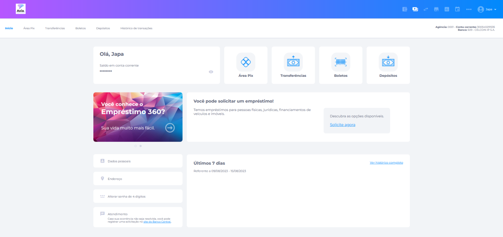

# Funcionalidades

## Conta digital

Nosso banco digital está integrado com as APIs da Celcoin e da idWall para fornecer as melhores experiências do mercado em segurança e praticidade. Totalmente conectada com mecanismo de Tokenização, fornecendo uma solução capaz de trazer o mercado institucional para dentro do mercado Web3.

### Principais funcionalidades:

1. **Abertura de Conta Corrente**

   A abertura da conta é simples. Após leitura e aceite dos termos de abertura da conta, a solicitação passa por algumas etapas de preenchimento com informações do usuário para serem validadas, aprovadas ou reprovadas pelo administrador através do BackOffice.
   
   Utilizamos CPF, CNPJ para pessoas físicas ou jurídicas;
   O username é o e-mail do usuário e poderá ser alterado via BackOffice quando solicitado. Porém, essa alteração gera riscos de segurança, é preciso que antes de alterar, garanta que recebeu as informações necessárias para verificar a autenticidade do usuário.
   Estrangeiros: devem solicitar abertura de conta no banco digital por suporte administrativo.
   
   Dados pessoais e informações necessárias para validação:
   
   - Nome, e-mail, celular, apelido, data de nascimento, nome da mãe, endereço.
   
   Aprovada a abertura do banco digital: é possível suspender a conta pelo administrador via BackOffice.

2. **Senha**

   A senha pode ser alterada pelo usuário e solicitada a recuperação da senha.
   
   Utilizamos alguns parâmetros para criação da senha:
   
   - 8 a 20 caracteres;
   - Letras minúsculas;
   - Letras maiúsculas;
   - Números;
   - Caracteres especiais.
   
   **Alterar senha pelo usuário:**
   
   Senha atual e nova senha.
   
   **Recuperação de senha:**
   
   É encaminhado um código de validação por e-mail;
   Esse código deverá ser informado no momento da criação de nova senha.

3. **MFA (Multi-Factor Authentication)**

   A funcionalidade do MFA tem como método de segurança a utilização de dois ou mais variáveis atestando a identidade de alguém para acesso do sistema, documento, informação ou transação.
   
   Uma vez configurado em nosso sistema, o usuário deverá informar o código gerado pelo app Authy ou similar no momento do login.
   
   Para acessar a plataforma, utilizamos o método OTP.

4. **Senha de validação - 4 Dígitos**

   A funcionalidade é utilizada para finalizar uma transação no banco digital, inserindo a senha de 4 dígitos.
   
   A senha poderá ser alterada pelo usuário;
   Quando necessário, poderá solicitar ajuda pelo suporte.

5. **KYC (Know Your Customer)**

   A funcionalidade de KYC tem integração com a plataforma idWall e também permite a aprovação de documentos manuais.
   
   - Foto de Selfie com Documento;
   - Foto de Documento;
   - Comprovante de endereço;
   - Utilização do SDK da idWall para captura de faceId com prova de vida.

6. **Informações bancárias**

   Com a aprovação da conta, são disponibilizadas as informações bancárias no perfil da plataforma.
   
   - Agência, conta corrente e banco.

7. **Banners**

   Utilizado como o marketing do negócio, sendo atrativo para o usuário.
   
   Pode ser uma imagem informativa, imagens em formato de carrossel ou clicável com direcionamento para um link.
   
   Dimensionamentos para desktop e mobile.

8. **Solicitação de empréstimo**

   É possível que o usuário faça sua solicitação de acordo com as opções configuradas conforme o negócio do cliente.
   
   Essa solicitação será analisada, o administrador receberá notificação por e-mail e quando aprovada, o usuário também receberá notificação que o depósito foi aprovado ou reprovado e quando creditado na conta.
   
   Tipos de empréstimos:
   
   - Para pessoa física;
   - Para pessoa jurídica;
   - Para financiamento de veículos;
   - Para financiamentos de imóveis;
   - Empréstimo de antecipação de recebíveis.

9. **Área Pix**

   O Pix foi criado como um meio de facilitar e agilizar uma transação bancária, realizado sem custos e taxas.
   
   Nele, o usuário terá a experiência utilizando ferramentas como:
   
   - Transferir;
   - Pix copia e cola;
   - Ler QRcode;
   - Receber;
   - Minha chaves;
   - Histórico.
   
   Alguns filtros para proporcionar uma melhor usabilidade do usuário.
   
   Em caso de ocorrências, o usuário é levado ao link do Banco Central onde o mesmo poderá solicitar o seu registro.

10. **Transferência (TED)**

    O usuário poderá transferir um valor fiduciário e é configurada como TED, sua compensação será realizada entre 7h e 17h.
    
    É necessário informar os dados da conta de destino.
    
    - Tipo de conta, corrente ou poupança;
    - Transferência para si mesmo ou outra pessoa, necessário informar CPF/CNPJ e nome completo.
    
    Ao finalizar, o usuário pode confirmar ou cancelar a transação.

11. **Pagamento de boletos**

    O pagamento por boleto pode ser efetuado:
    
    - Dentro do horário de funcionamento, de segunda a sexta das 08:00 às 19:30 exceto feriados.
    - Dentro do prazo de vencimento, até as 17h.
    - Será aceito até as 22h, pagamentos de água, luz e tributos.
    
    É possível o usuário realizar o pagamento por meio da inserção de código de barras.
    
    Antes de efetuar o pagamento, é aberto um modal para conferência das informações, podendo ser confirmada ou cancelada.

12. **Depósitos**

    São exibidas todas as informações bancárias da conta para serem compartilhadas com outro usuário para realizar o depósito.

13. **Menu Perfil**

    - **Troca de senha**
    
      O usuário deverá informar a senha atual e nova senha.
    
    - **Documentos pessoais**
    
      São os documentos enviados para o registro do KYC;
      O usuário poderá verificar seus documentos, se foram aprovados ou rejeitados;
      Quando rejeitado, o usuário deverá enviar um novo documento para aprovação.
      
    - **Pagamentos**
    
      Exibição de todas as transações realizadas pelo usuário.
      Valor, tipo, data/hora e status.
      
      Temos alguns filtros para melhor usabilidade do usuário:
      
      - Buscar por valor;
      - Tipo: TED, Pix, Netteler e outros conforme configuração de meios de pagamento;
      - Status: Confirmado, não confirmado e aguardando.

14. **Sobre a empresa**

    É a descrição da visão geral dos principais aspectos do negócio da empresa.

15. **Política de privacidade / Termos de Uso**

    São termos e condições de segurança referentes às práticas e processos adotados pela plataforma para tornar transparente a relação com o usuário.
    
    Informação sobre todos os direitos, garantias, formas de uso, dados recolhidos, processamento e descarte dessas informações pessoais do usuário.
    
    Também chamado de termos de uso, solicitada no momento do cadastro ou início do uso da plataforma, para que o usuário demonstre seu expresso consentimento e concordância com esses termos.
    
    É uma maneira não apenas de informar ao usuário o que será feito com seus dados, como também isentar o provedor de qualquer responsabilidade decorrente da falta de consentimento.

16. **FAQ**

    É uma ferramenta estratégica de autoatendimento que tem como objetivo oferecer soluções rápidas para perguntas recorrentes de usuários.
    
    Artigos com respostas sobre dúvidas ou problemas.

17. **Remover conta**

    É possível que o próprio usuário remova sua conta.
    
    Fica de responsabilidade total do usuário quando a conta é removida manualmente por ele.

18. **Redes sociais**

    É possível integrar as redes sociais da empresa, expandindo o alcance de usuários por divulgações da empresa.
    
    - Facebook;
    - Instagram;
    - LinkedIn;
    - Twitter;
    - Whatsapp;
    - YouTube
