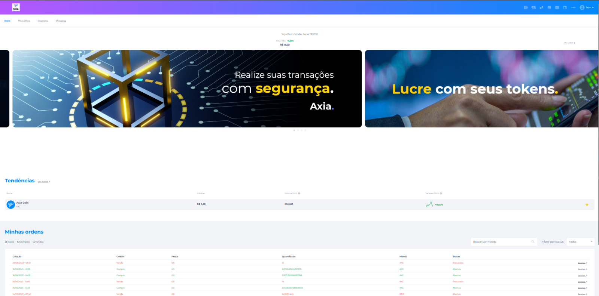

# Funcionalidades

## Exchange

As exchanges são ferramentas extremamente úteis no mercado de criptomoedas, também chamadas de corretoras de valores. Elas têm a função de intermediar as negociações entre vendedores e compradores de ativos digitais, gerando custódias para aqueles investidores que não querem manter suas criptos em carteiras próprias. Por esse serviço, são configuradas taxas, funcionando como uma bolsa de valores independente, variando os preços conforme a lei da oferta e demanda.

### Principais funcionalidades:

1. **Criação de Conta**

   Permite a criação de contas nacionais (Brasil) e estrangeiras.

   - Utilizamos CPF, Passaporte, CNPJ.
   - O username é o e-mail do usuário e poderá ser alterado via BackOffice quando solicitado. Porém, essa alteração gera riscos de segurança, é preciso que antes de alterar, garanta que recebeu as informações necessárias para verificar a autenticidade do usuário.

2. **KYC (Know Your Customer)**

   A funcionalidade de KYC tem integração com a plataforma idWall e também permite a aprovação de documentos manuais.

   - Foto de Selfie com Documento.
   - Foto de Documento.
   - Comprovante de endereço.
   - Utilização do SDK da idWall para captura de faceId com prova de vida.

3. **Senhas**

   A senha pode ser alterada pelo usuário e solicitada a recuperação da senha.

   - Utilizamos alguns parâmetros para criação da senha:
     - 8 a 20 caracteres.
     - Letras minúsculas.
     - Letras maiúsculas.
     - Números.
     - Caracteres especiais.
   
   - **Alterar senha pelo usuário:**
     - Senha atual e nova senha.
   
   - **Recuperação de senha:**
     - É encaminhado um código de validação por e-mail.
     - Esse código deverá ser informado no momento da criação de nova senha.

4. **MFA (Multi-Factor Authentication)**

   A funcionalidade do MFA tem como método de segurança a utilização de dois ou mais fatores para atestar a identidade de alguém para acesso ao sistema, documento, informação ou transação. Uma vez configurado em nosso sistema, o usuário deverá informar o código gerado pelo app Authy ou similar no momento do login. Para acessar a plataforma, utilizamos o método OTP.

5. **Cotação e Variação de Tokens**

   Utilizamos fontes como:
   
   - CoinMarketCap.
   - PancakeSwap.
   - Banco Central.
   - API dinâmica.

6. **Banners**

   Utilizados como ferramentas de marketing do negócio, sendo atrativos para o usuário. Podem ser imagens informativas, imagens em formato de carrossel ou clicáveis com direcionamento para um link. Dimensionados para desktop e mobile.

7. **Meus Ativos**

   O usuário poderá visualizar todos os ativos digitais na carteira em formato de lista, também poderá escolher a visualização de ativos favoritos. Em cada ativo (token), são exibidos alguns detalhes para facilitar a usabilidade do usuário, incluindo token, saldo total em valor fiduciário, saldo reservado quando aplicado, cotação do token, quantidade total do token na carteira e campo de busca.

8. **Saque**

   Para realização de saque, o usuário recebe algumas orientações configuráveis para iniciar a transação. Envios de ativos não podem ser cancelados. É necessário informar o código da chave interna do destinatário e o código MFA. O usuário compartilha o código da chave interna ou o QRcode com o destinatário.

9. **Depósito**

   O usuário compartilha o código da chave interna ou o QRcode com o destinatário.

10. **Histórico**

    Dentro da tela de saque e depósito, é exibido todo o histórico de transações de saques e depósitos, incluindo dados como data e hora da transação, quantia de tokens, valor da taxa, valor total fiduciário e destino.

11. **Exchange**

    Listagem de tokens, cada um com suas informações detalhadas, incluindo cotação, volume (24h), variação (24h), e opções para remover ou favoritar o token.

12. **Market Cap**

    O valor de capitalização de mercado é calculado multiplicando a oferta do ativo (fornecimento em circulação) pelo seu preço atual.

13. **Volume (24h)**

    Valor total em dólares de todas as transações deste ativo nas últimas 24 horas.

14. **Circulating Supply (Fornecimento em Circulação)**

    É o fornecimento em circulação, mostrando o número de moedas ou tokens emitidos até o momento.

15. **Variação (24h)**

    Variação percentual no volume de trading deste ativo na última 1 hora.

16. **Transação**

    As transações podem levar alguns instantes para serem exibidas.

17. **Spread**

    É a diferença entre os preços de compra (dos compradores) e os preços de venda (dos vendedores) de um título ou ativo.

18. **Minhas Ordens**

    Oferece alguns filtros para proporcionar uma melhor usabilidade, incluindo opções para visualizar todas as ordens, compras, vendas, token e status.

19. **Histórico de Ordens**

    Exibe informações sobre a criação da ordem, data e horário da solicitação, tipo de ordem (compra ou venda), preço estipulado na criação da ordem ou de acordo com a cotação do dia, quantidade de tokens da ordem, tipo da moeda (token) e status (executada, aberta, cancelada).

20. **Criação de Ordem de Venda**

    Permite a criação de ordens de venda de tokens. Ao iniciar a criação da ordem, será exibida a cotação do token atual. É necessário informar preço de venda e quantidade de tokens. Após executar a ordem, o valor do token ficará travado até o momento da compra. A ordem ficará listada no livro de ofertas, detalhando preço, quantidade e total. É possível cancelar a ordem de venda. Caso seja comprada, a ordem será exibida na listagem de últimas negociações.

21. **Criação de Ordem de Compra**

    Permite a criação de ordens de compra de tokens. O usuário pode observar e buscar ordens de venda na lista de ofertas. É necessário informar preço de compra e quantidade de tokens. Enquanto não houver uma ordem de venda com as mesmas especificações, a ordem de compra ficará em aberta. Quando a transação for concluída, as informações serão exibidas na listagem de últimas negociações. É possível cancelar a ordem de compra.

22. **Order Book**

    Proporciona informações próprias ou interação com a Kraken Exchange.

23. **Detalhes da Transação**

    - **Executada:** Usuário que criou a ordem, moeda, tipo da ordem, status, histórico da transação com data, hora, preço e quantidade de tokens.
    - **Abertas:** Usuário que criou a ordem, moeda, tipo da ordem, status, opção de cancelar a ordem.
    - **Canceladas:** Usuário que criou a ordem, moeda, tipo da ordem, status.

24. **Menu Perfil**

    - **Troca de Senha:** O usuário deverá informar a senha atual e a nova senha.
    - **Documentos Pessoais:** São os documentos enviados para o registro do KYC. O usuário pode verificar se foram aprovados ou rejeitados. Quando rejeitado, o usuário deverá enviar um novo documento para aprovação.
    - **Pagamentos:** Exibição de todas as transações realizadas pelo usuário, incluindo valor, tipo, data/hora e status. Possui filtros para melhor usabilidade, incluindo busca por valor, tipo (TED, Pix, Netteler e outros conforme configuração de meios de pagamento) e status (confirmado, não confirmado e aguardando).

25. **Sobre a Empresa**

    - É a descrição da visão geral dos principais aspectos do negócio da empresa.

26. **Política de Privacidade / Termos de Uso**

    - São termos e condições de segurança referentes às práticas e processos adotados pela plataforma para tornar transparente a relação com o usuário. Informam todos os direitos, garantias, formas de uso, dados recolhidos, processamento e descarte dessas informações pessoais do usuário. Também chamado de termos de uso, são solicitados no momento do cadastro ou início do uso da plataforma, para que o usuário demonstre seu expresso consentimento e concordância com esses termos. É uma maneira não apenas de informar ao usuário o que será feito com seus dados, mas também de isentar o provedor de qualquer responsabilidade decorrente da falta de consentimento.

27. **FAQ**

    - É uma ferramenta estratégica de autoatendimento que tem como objetivo oferecer soluções rápidas para perguntas recorrentes de usuários. Contém artigos com respostas sobre dúvidas ou problemas.

28. **Remover Conta**

    - É possível que o próprio usuário remova sua conta, ficando de responsabilidade total do usuário quando a conta é removida manualmente por ele.

29. **Redes Sociais**

    - É possível integrar as redes sociais da empresa, expandindo o alcance de usuários por meio de divulgações da empresa, incluindo Facebook, Instagram, Linkedin, Twitter, Whatsapp e YouTube.
