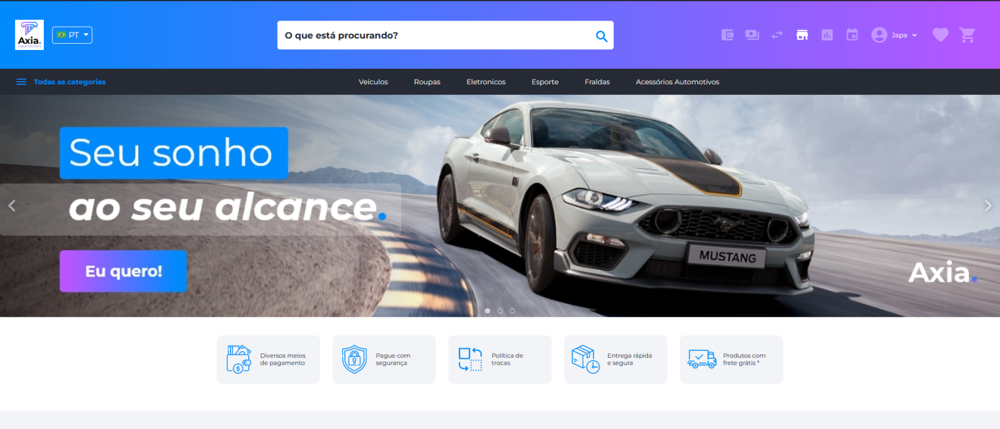

# Funcionalidades

## Marketplace

O marketplace disponibiliza oportunidades para outros revendedores ou fabricantes subirem seus produtos na mesma plataforma. Diferentemente do e-commerce, que refere-se às vendas pela internet realizadas por uma única empresa, seja um fabricante ou revendedor, por meio de uma plataforma virtual própria ou via white label.

O Kairos é uma solução digital totalmente estruturada, pensando em cada detalhe que possa ajudar e simplificar a vida de quem quer realizar vendas online, que se encaixe em qualquer formato que faça sentido para o modelo de negócio, seja lojas virtuais ou marketplaces. A ideia é proporcionar uma plataforma totalmente customizável, segura e de fácil navegação, tanto para quem vende quanto para quem compra.

### Principais funcionalidades

1. **Criação de Conta**

   Permite a criação de contas nacionais (Brasil) e estrangeiras.

   - Utilizamos CPF, Passaporte, CNPJ;
   - O username é o e-mail do usuário e pode ser alterado via BackOffice quando solicitado. Porém, essa alteração gera riscos de segurança, é preciso que antes de alterar, garanta que recebeu as informações necessárias para verificar a autenticidade do usuário.

2. **KYC (Know Your Customer)**

   A funcionalidade de KYC tem integração com a plataforma idWall e também permite a aprovação de documentos manuais.

   - Foto de Selfie com Documento;
   - Foto de Documento;
   - Comprovante de endereço;
   - Utilização do SDK da idWall para captura de faceId com prova de vida.

3. **Senhas**

   A senha pode ser alterada pelo usuário e solicitada a recuperação da senha.

   - Utilizamos alguns parâmetros para criação da senha:
     - 8 a 20 caracteres;
     - Letras minúsculas;
     - Letras maiúsculas;
     - Números;
     - Caracteres especiais.
   
   - Alterar senha pelo usuário: senha atual e nova senha
   - Recuperação de senha: é encaminhado um código de validação por e-mail que deverá ser informado no momento da criação da nova senha.

4. **Tradução (Translater)**

   Tem como funcionalidade traduzir as informações da plataforma (Inglês ou Português) e suporte para outros idiomas.

5. **Campo de Busca**

   Para melhor usabilidade do usuário, no caso de procurar um produto específico ou categoria.

6. **Banners**

   Utilizado como marketing do negócio, sendo atrativo para o usuário. Pode ser uma imagem informativa, imagens em formato de carrossel ou clicável com direcionamento para um link. Dimensionamentos para desktop e mobile.

7. **Configuração de Exibição**

   Posicionamento de temas, mudanças de títulos

   - Mais vendidos: Imagem do produto, nome, disponibilidade, desconto, valor.
   - Categoria em destaque: Imagem e título da categoria.
   - Lançamentos: Imagem do produto, nome, disponibilidade, desconto, valor.

8. **Listagem de Produtos**

   Temos alguns filtros para melhor usabilidade do usuário.

   - Categorias, subcategorias, produto.
   - Ajuste de valor mínimo e máximo de produto.
   - Tipo de produto comprável ou anúncio.
   - Imagem do produto, nome, disponibilidade, desconto, valor.

9. **Produto Comprável**

   Refere-se àqueles que são cadastrados no sistema para serem vendidos, portanto, terão um preço e gerenciamento de estoque relacionado a eles.

10. **Produto de Anúncio**

    Refere-se àqueles que estão cadastrados no sistema apenas para serem anunciados e expostos na plataforma. Eles NÃO serão vendidos, portanto, não há preço para usuários e nem gerenciamento de estoque. Imagem do produto, nome, disponibilidade, desconto, valor.

11. **Controle de Estoque**

    - Utilizando contagem automática do estoque se disponível, indisponível, produtos para negociação.
    - A quantidade de produto pode ser editável, acrescentando ou excluindo o produto de sua subcategoria.
    - Um Operador de Loja, quando necessário, aumenta ou diminui manualmente a quantidade de estoque.
    - No caso de exclusão do produto, ele deve ser removido da lista de favoritos do usuário.
    - No caso de cancelamento de produto, a quantidade deve voltar ao estoque.
    - Produto indisponível (esgotado), o usuário pode optar por ser avisado quando o produto estiver disponível novamente. Informação do e-mail para notificação sobre o produto.
    - Produtos para negociação de preço ou mais informações, o usuário pode optar em clicar em "saiba mais".
      - Agendar conversa
      - Informação de nome, e-mail, telefone, período e observação, se tiver.
    - Em qualquer uma dessas situações, o histórico de alterações deve ser mantido no sistema.

12. **Detalhes do Produto**

    - Imagens, deverão aparecer na mesma ordem em que foi selecionada durante a criação, enquanto o vídeo será a última mídia.
    - Nome do produto;
    - Classificação do produto (avaliado por clientes que compraram o produto);
    - Características;
    - Marca;
    - Categoria em que se encontra o produto.
    - Descrição;
    - Valor fiduciário;
    - Cálculo de fretes (configurável);
    - Adicionar ao carrinho;

13. **Favoritar Produto**

    É possível o usuário favoritar um produto, mesmo estando indisponível. No perfil em favoritos, todos os itens marcados pelo usuário serão listados.

14. **Carrinho de Compra**

    - Opcional adicionar ou retirar mais produtos do mesmo item de acordo com a quantidade disponível;
    - Quando um produto é adicionado ou incrementado no Carrinho de Compras, a mesma quantidade é diminuída do estoque;
    - É possível manter o carrinho com o item desejado e adicionar outros produtos.
    - Deve ser possível remover os produtos do carrinho de compra.

15. **Detalhes do Carrinho**

    - Deve ser possível selecionar, trocar, adicionar ou remover um endereço de entrega;
    - Exibição do valor total fiduciário com taxas (as taxas são configuráveis e podem ser editadas);
    - Cálculo de frete = quantia x taxa x endereço de entrega;
    - Revisão da compra: cotação do token, saldo em tokens.

16. **Formas de Pagamentos**

    - Diversificação de pagamentos de forma ágil e segura;
    - Transparência e credibilidade na hora da compra, mais vendas e menos carrinhos abandonados.
    - As informações criptografadas são transmitidas para a adquirente ou o banco. Nessa hora, as informações de pagamento são verificadas para saber se os dados do cartão estão corretos e se há saldo/limite para que a compra seja realizada;
    - Meios de pagamento configuráveis conforme a necessidade de cada cliente:
      - Criptos/Tokens;
      - Saldo fiduciário;
      - Depósitos TED/Pix;
      - Neteller (USD);
      - Metamask;
      - Banco Digital Axia;
      - Cartões de crédito/débito;
      - Pagseguro;
      - Coin_Payments (Bitcoin).
    - O cartão de crédito utiliza integração stripe, e assim que o pagamento for confirmado a carteira configurada em PGH secret será utilizada para transferir o valor dos tokens;
    - Para TED/Pix é enviado um comprovante, seguido de validação, aprovação ou rejeição da transação pelo administrador.

17. **Meus Pedidos**

    Acompanhamento dos pedidos, esses sendo listados e exibidos por:

    - Foto;
    - Nome do produto;
    - Número do pedido;
    - Data/hora da compra;
    - Quantidade;
    - Endereço de entrega;
    - Forma de pagamento;
    - Status da compra:
      - Pedidos abertos: Criado, Aguardando Pagamento, Separando Estoque, Entregando ou Processando Cancelamento;
      - Pedidos finalizados: Entregue ou Cancelado.
    - Envio de e-mail caso tenha ocorrido algo de errado com o pedido.

18. **Lista de Desejos (What List)**

    Ferramenta que o usuário poderá usar para acompanhar um produto quando este sofre alguma alteração. Será encaminhado um e-mail notificando o usuário sobre o produto.

19. **Menu Perfil**

    - Troca de senha: o usuário deverá informar a senha atual e nova senha.
    - Documentos pessoais: são os documentos enviados para o registro do KYC. O usuário poderá verificar se foram aprovados ou rejeitados. Quando rejeitado, o usuário deverá enviar um novo documento para aprovação.
    - Pagamentos: exibição de todas as transações realizadas pelo usuário. Valor, tipo, data/hora e status. Temos alguns filtros para melhor usabilidade do usuário:
      - Buscar por valor;
      - Tipo: TED, Pix, Netteler e outros conforme configuração de meios de pagamento;
      - Status: Confirmado, não confirmado e aguardando.

20. **Sobre a Empresa**

    É a descrição da visão geral dos principais aspectos do negócio da empresa.

21. **Política de Privacidade / Termos de Uso**

    São termos e condições de segurança referentes às práticas e processos adotados pela plataforma para tornar transparente a relação com o usuário. Informação sobre todos os direitos, garantias, formas de uso, dados recolhidos, processamento e descarte dessas informações pessoais do usuário. Também chamado de termos de uso, solicitados no momento do cadastro ou ao iniciar o uso da plataforma, para que o usuário demonstre seu expresso consentimento e concordância com esses termos. É uma maneira não apenas de informar ao usuário o que será feito com seus dados, como também isentar o provedor de qualquer responsabilidade decorrente da falta de consentimento.

22. **FAQ**

    É uma ferramenta estratégica de autoatendimento que tem como objetivo oferecer soluções rápidas para perguntas recorrentes de usuários. Artigos com respostas sobre dúvidas ou problemas.

23. **Remover Conta**

    É possível o próprio usuário remover sua conta. Fica de responsabilidade total do usuário quando a conta é removida manualmente por ele.

24. **Redes Sociais**

    É possível integrar as redes sociais da empresa, expandindo o alcance de usuários por meio de divulgações da empresa.

    - Facebook;
    - Instagram;
    - Linkedin;
    - Twitter;
    - Whatsapp;
    - YouTube.