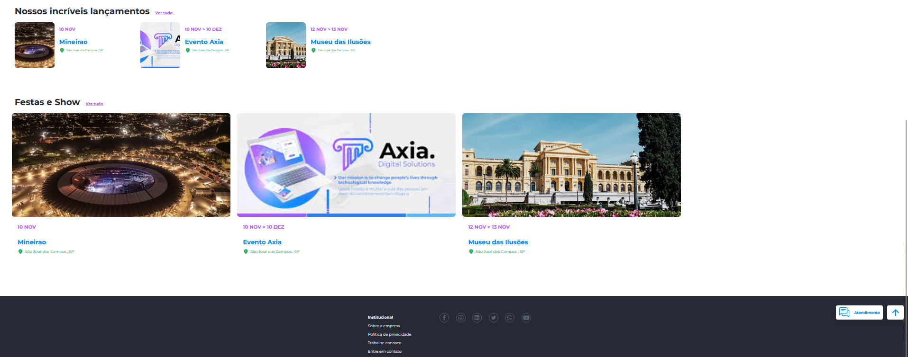

# Funcionalidades

**Ticketeria**

Ticketeria é o termo utilizado para identificar empresas da área de Tecnologia que vendem tickets ou ingressos online. A importância de mercado de uma Ticketeria se demonstra na eficiência tecnológica contando com a facilidade do check-in ágil, através da leitura de QRCodes que acompanham o ingresso digital, facilitando a entrada das pessoas em eventos. O que é feito de forma rápida e prática, evitando que grandes filas sejam formadas.

**Principais funcionalidades:**

1. **Criação de Conta**
   - Permite a criação de contas nacionais (Brasil) e estrangeiras.
   - Utilizamos CPF, Passaporte, CNPJ;
   - O username é o e-mail do usuário e poderá ser alterado via BackOffice quando solicitado. Porém, essa alteração gera riscos de segurança, é preciso que antes de alterar, garanta que recebeu as informações necessárias para verificar a autenticidade do usuário.

2. **KYC (Conheça Seu Cliente)**
   - A funcionalidade de KYC tem integração com a plataforma idWall e também permite a aprovação de documentos manuais.
   - Foto de Selfie com Documento;
   - Foto de Documento;
   - Comprovante de endereço;
   - Utilização do SDK da idWall para captura de faceId com prova de vida.

3. **Senhas**
   - A senha pode ser alterada pelo usuário e solicitada a recuperação da senha.
   - Utilizamos alguns parâmetros para criação da senha:
     - 8 a 20 caracteres;
     - Letras minúsculas;
     - Letras maiúsculas;
     - Números;
     - Caracteres especiais.
   - **Alterar senha pelo usuário:**
     - Senha atual e nova senha.
   - **Recuperação de senha:**
     - É encaminhado um código de validação por e-mail que deverá ser informado no momento da criação da nova senha.

4. **Translater**
   - Tem como funcionalidade traduzir as informações da plataforma (Inglês ou Português) e suporte para outros idiomas.

5. **Campo de busca**
   - Para melhor usabilidade do usuário no caso de procurar um produto específico ou categoria.

6. **Banners**
   - Utilizado como o marketing do negócio, sendo atrativo para o usuário.
   - Pode ser uma imagem informativa, imagens em formato de carrossel ou clicável com direcionamento para um link.
   - Dimensionamentos para desktop e mobile.

7. **Mercado de Ingressos**
   - Fácil manuseio, com transparência ao consumidor;
   - Variedade de produto, controle de estoque, gerenciamento de promoções;
   - Pagamentos por criptomoedas e fiduciário, histórico de pedidos e compras.

8. **Configuração de exibição**
   - Posicionamento de temas, mudanças de títulos.
   - **Mais vendidos:**
     - Imagem do evento, nome, disponibilidade, desconto, valor.
   - **Categoria em destaque:**
     - Imagem e título da categoria.
   - **Lançamentos:**
     - Imagem do produto, nome, disponibilidade, desconto, valor.

9. **Listagem de Produtos**
   - Temos alguns filtros para melhor usabilidade do usuário.
   - Categorias, todos eventos, eventos por localização.
   - Tipo de ingresso, se é comprável, anúncio de próximos eventos.
   - **Comprável:** refere-se àqueles que são cadastrados no sistema para serem vendidos, portanto, terá um preço e gerenciamento de estoque relacionado a ele;
   - **Anúncio:** refere-se àqueles que estão cadastrados no sistema para serem apenas anunciados e expostos na plataforma. Eles NÃO serão vendidos, portanto, não há preço de usuário e nem gerenciamento de estoque.
   - Imagem do produto, nome, disponibilidade, desconto, valor.

10. **Controle de Estoque**
    - Utilizando contagem automática do estoque ingressos se disponível ou indisponível.
    - A quantidade de produto pode ser editável, manualmente por um operador de Loja, quando necessário aumenta ou diminui manualmente a quantidade de estoque;
    - No caso de cancelamento, a quantidade deve voltar ao estoque.
    - Produtos indicados para mais informações, o usuário pode optar em clicar em saiba mais.
    - **Agendar conversa:**
      - Informação de nome, e-mail, telefone, período e observação se tiver;
    - Em qualquer uma dessas situações, o histórico de alterações deve ser mantido no sistema.

11. **Detalhes do Evento**
    - Imagens.
    - Descrição do evento;
    - Horários de funcionamento.
    - **Bilheteria.**
    - **Checkins.**
    - Informação de ingressos individuais.
    - Valor de ingresso.
    - Informações pós requisição.
    - Cancelamentos, reembolsos ou problemas com ingresso.
    - Não é possível alterar data após requisição.
    - **Meia-entrada:**
      - Breve descrição com informações de quem poderá pagar meia entrada.
        - Professores, estudantes, idosos, pessoas com deficiência, pessoas carentes.
    - **Reservas:**
      - São realizadas somente pelo site.
    - **Dúvida Gerais.**

12. **Seleção de Datas**
    - Expositor de datas dos eventos e outras informações.
    - Data do evento, dia da semana.
    - Lista para seleção de horários.
    - Valores e meios de pagamento (parcelamento quando configurado).
    - Status do ingresso, disponível ou esgotado.

13. **Lista de Horários e Valores**
    - Após escolha de horário o usuário deve ter as opções de quantidade de ingresso que queira adquirir.
    - Meios de pagamentos especificados para cada situação, sendo inteira e meia entrada para professores, estudantes, idosos, pessoas com deficiência, pessoas carentes.
    - A cada quantidade adquirida é somado automaticamente o valor a ser pago.

14. **Compra de Ingresso**
    - Exibimos o resumo da compra com os detalhes do ingresso e valor;
    - Também informações que o ingresso será enviado para o e-mail ou celular.

15. **Formas de Pagamentos**
    - Diversificação de pagamentos de forma ágil e seguro.
    - Transparência e credibilidade na hora da compra, mais vendas e menos carrinhos abandonados.
    - As informações criptografadas são transmitidas para a adquirente ou o banco. Nessa hora, as informações de pagamento são verificadas para saber se os dados do cartão estão certos e se há saldo/limite para que a compra seja realizada;
    - **Meios de pagamento configuráveis na necessidade de cada cliente:**
      - Criptos/Tokens;
      - Saldo fiduciário;
      - Depósitos TED/Pix;
      - Neteller (USD);
      - Metamask;
      - Banco Digital Axia;
      - Cartões de crédito/débito;
      - Pagseguro;
      - Coin_Payments (Bitcoin).
    - O cartão de crédito utiliza integração Stripe, e assim que o pagamento for confirmado a carteira configurada em PGH secret, será utilizada para transferir o valor dos tokens;
    - Para TED/Pix é enviado um comprovante, seguido de validação, aprovação ou rejeição da transação pelo administrador.

16. **Meus Ingressos**
    - Acompanhamento dos pedidos, esses sendo listados e exibidos por:
      - Foto;
      - Nome do evento;
      - Número do pedido;
      - Data/hora da compra;
      - Quantidade;
      - Endereço de entrega;
      - Forma de pagamento;
      - Status da compra:
        - Pedidos abertos: Criado, Aguardando Pagamento, Separando Estoque, Entregando ou Processando Cancelamento;
        - Pedidos finalizados: Entregue ou Cancelado.
    - Envio de e-mail caso tenha ocorrido algo de errado com seu ingresso.

17. **Documentos Pessoais**
    - Refere-se aos documentos do usuário mostrando o status, se estão aprovados ou reprovados pelo administrador (sem aprovação não é possível realizar qualquer transação);
    - Identidade, comprovante de endereço, selfie segurando o documento de identidade.

18. **Relatório de Transações**
    - É possível emitir um relatório por período desejado.
    - O relatório segue o modelo adequado conforme as solicitações da Receita Federal para ativos digitais.

19. **Sobre a Empresa**
    - É a descrição da visão geral dos principais aspectos do negócio da empresa.

20. **Política de Privacidade / Termos de Uso**
    - São termos e condições de segurança referente às práticas e processos adotados pela plataforma para tornar transparente a relação com o usuário.
    - Informação todos os direitos, garantias, formas de uso, dados recolhidos, processamento e descarte dessas informações pessoais do usuário.
    - Também chamado de termos de uso, solicitada no momento cadastro, ou iniciar o uso da plataforma, para que o usuário demonstre seu expresso consentimento e concordância com esses termos.
    - É uma maneira não apenas de informar ao usuário o que será feito com seus dados, como também isentar o provedor de qualquer responsabilidade decorrente da falta de consentimento.

21. **FAQ**
    - É uma ferramenta estratégia de autoatendimento que tem como objetivo oferecer soluções rápidas para perguntas recorrentes de usuários;
    - Artigos com respostas sobre dúvidas ou problemas.

22. **Remover Conta**
    - É possível o próprio usuário remover sua conta;
    - Fica de responsabilidade total do usuário quando a conta é removida manualmente por ele.

23. **Redes Sociais**
    - É possível integrar as redes sociais da empresa, expandindo o alcance de usuários por divulgações da empresa:
      - Facebook;
      - Instagram;
      - Linkedin;
      - Twitter;
      - Whatsapp;
      - YouTube.
