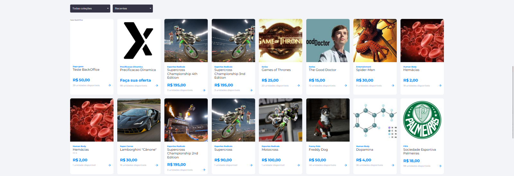

# Funcionalidades

## Tokenizadora

Os tokens, em geral, são um recurso de segurança que gera um código identificador digital exclusivo e aleatório para proteger dados sensíveis. Isso, aliado a várias camadas de segurança, traz total tranquilidade e transparência para as realizações das transações.

Neste produto, é possível gerar contratos inteligentes automaticamente em qualquer rede EVM, tornando-se um recurso de extrema segurança e credibilidade. Isso aumenta a experiência do usuário com controle de saldos, comercialização, transações simples, rápidas e eficazes.

### Principais funcionalidades:

1. **Criação de Conta**
    - Permite a criação de contas nacionais (Brasil) e estrangeiras.
    - Utilizamos CPF, Passaporte, CNPJ.
    - O username é o e-mail do usuário e poderá ser alterado via BackOffice quando solicitado. No entanto, essa alteração gera riscos de segurança, é preciso garantir que recebeu as informações necessárias para verificar a autenticidade do usuário.

2. **KYC**
    - A funcionalidade de KYC tem integração com a plataforma idWall e também permite a aprovação de documentos manuais.
    - Foto de Selfie com Documento.
    - Foto de Documento.
    - Comprovante de endereço.
    - Utilização do SDK da idWall para captura de faceId com prova de vida.

3. **Senhas**
    - A senha pode ser alterada pelo usuário e solicitada a recuperação da senha.
    - Utilizamos alguns parâmetros para criação da senha:
        - 8 a 20 caracteres.
        - Letras minúsculas.
        - Letras maiúsculas.
        - Números.
        - Caracteres especiais.
    - Alterar senha pelo usuário:
        - Senha atual e nova senha.
    - Recuperação de senha:
        - É encaminhado um código de validação por e-mail; Esse código deverá ser informado no momento da criação de nova senha.

4. **Cotação e variação de tokens**
    - Utilizamos:
        - CoinMarketCap.
        - PancakeSwap.
        - Banco central.
        - API dinâmica.

5. **Translater**
    - Tem como funcionalidade traduzir as informações da plataforma (Inglês ou Português) e suporte para outros idiomas.

6. **Banners**
    - Utilizado como o marketing do negócio, sendo atrativo para o usuário.
    - Pode ser uma imagem informativa, imagens em formato de carrossel ou clicável com direcionamento para um link.
    - Dimensionamentos para desktop e mobile.

7. **Menu do perfil**
    - Praticidade para navegação do usuário.
    - Saldo de tokens na carteira do usuário.
    - Troca de senha.
    - Meus ativos.
    - Copiar código de indicação.
    - Staking de NFT.
    - Pagamentos.
    - Documentos Pessoais.
    - Relatório de transações.

8. **Campo de busca**
    - Para melhor usabilidade do usuário no caso de uma procura de NFT, categoria ou tokens.
    - É possível ajustar as posições ou retirar os produtos de acordo com o negócio, seja um comércio somente de NFT ou Token.
    - Temos alguns filtros para melhor usabilidade do usuário.

9. **Coleção**
    - Toda criação de coleção e gera um endereço de contrato que será implantada no sistema, este não pode ser editado.
    - A coleção pode ser criada para qualquer blockchain EVM que esteja configurado no sistema.
    - Cada coleção deve ser rastreada para ter o usuário que criou a coleção.
    - Uma coleção deve conter: nome, descrição, imagem, imagem de capa e rede.
    - As NFTs criadas na coleção receberão um ID que deverá ser aumentado de acordo com a sequência de coleta.
    - Não é possível excluir uma coleção que tenha um NFT ativo.
    - Fornecemos estatísticas das cobranças, com as seguintes informações:
        - Número de vendas.
        - Número de NFTs.
        - Proprietário.
        - Preço médio.
        - Preço total da coleção.
    - Listagem de TOP Coleções ordenadas por coleções de maior valor para coleções de menor valor.

10. **NFT (Non Fungible Token)**
    - Uma NFT deve ter: Nome, Descrição, Características, Preço, Carteira de Comissão, Categoria, Coleção e Imagens.
    - Deve ser possível selecionar os tokens que serão permitidos usar para pagar a NFT.
    - Deve ser possível parcelar o pagamento, permitindo ter mais de uma moeda paga por NFT, mas com um percentual do valor para cada moeda.
    - A cunhagem do NFT só acontecerá quando o usuário o comprar.

11. **Pacotes**
    - O sistema deve permitir o pacote de NFTs, criando uma dinâmica de surpresa para o usuário.
    - Os pacotes são agrupados por:
        - Coleta (opcional).
        - Categoria.
        - Tipo de NFT.
    - Deve ser configurável quantos NFTs serão disponíveis por pacote.
    - Deve ser configurável quantos pacotes serão criados.
    - Selecionável por categorias ou tipo de NFT.
    - Alguns filtros para proporcionar uma melhor usabilidade: Coleções, recentes, maior e menor preço.

12. **Staking NFT**
    - O Staking, em geral, oferece aos investidores uma forma de colocar seus ativos digitais para trabalhar e obter renda passiva sem precisar vendê-los.
    - Para Administrador:
        - Deve ser capaz de configurar uma nova campanha de staking NFT.
        - Durante o registro da estaca:
            - Deve selecionar o período de carência.
            - Deve ser definido Diariamente ou Mensalmente.
            - Deve selecionar quais NFTs poderão participar desta campanha.
            - Ele deve selecionar quais NFTs o usuário poderá receber após o período de aposta.
        - Um pool de NFTs será previamente determinado pelo Administrador.
        - O usuário receberá apenas uma NFT após o período de carência.
        - O sistema selecionará aleatoriamente as NFTs do pool considerando o valor configurado.
        - Deve ser capaz de ver todas as campanhas de staking de NFT, como cada status e quantos NFTs estão atualmente em tal campanha de staking.
        - O sistema deve manter todo o histórico da campanha.
    - Para usuário:
        - Deve ser possível ver se o próprio NFT está em jogo.
        - Deve ser possível identificar que todas as NFTs próprias estão em jogo.
        - Deve ser possível apostar um NFT próprio a qualquer momento durante o período de campanha.
        - Deve ser possível retirar uma NFT própria do staking a qualquer momento, porém, caso seja antes do término do período de carência, o usuário não receberá a recompensa.
        - O usuário pode colocar quantos NFTs desejar na mesma campanha de staking.
        - Se algum NFT for candidato a alguma campanha de staking, isso deve ser indicado nos detalhes do NFT.
        - Sempre que o usuário receber uma NFT, ele deve ser capaz de determinar de qual campanha ela veio.
        - NFTs colocados para "revenda" não podem ser colocados em staking. E os NFTs colocados em aposta não podem ser colocados para revenda.

13. **Tokens**
    - O token refere-se a qualquer criptomoeda ou criptoativo executado sobre a blockchain de outro criptomoeda, ajudam também em aplicações descentralizadas.
    - Porém, todas as operações relacionadas a tokens dentro do ecossistema Axia serão configuradas na tabela de tokens dentro do Finance.
    - Nosso sistema aceitará qualquer Token ERC20 como de qualquer blockchain EVM, que esteja previamente configurado na tabela de redes no módulo BCH.
    - O usuário com gerenciamento de administradores pode criar novos tokens via BackOffice.
    - Deveria ter uma nova tela para CRUD.
    - Deve ser armazenado em uma tabela diferente da NFT.
    - Lembrando: Deve ter um PDF com as Características do Token durante a compra do Token informando que isso vai acontecer, também deve ser considerado no CRUD.
    - Print de tela de taxas.

14. **Dividendos de Tokens**
    - É possível receber dividendo com pagamentos em moeda fiduciária.
    - O dividendo deve ser agendado por empresa e visível para o usuário.
    - Mecanismo de agendamento para pagar os dividendos, mesmo aqueles que serão imediatamente.
    - Mecanismo para depósito em fiduciário apenas para empresa.
    - Exibição histórico de transações.
    - Deve ter dados fiduciários e de token para serem filtrados.
    - A forma como a empresa vai distribuir os dividendos entre os usuários deve ser configurável, por exemplo:
        - 50% -> 60% permanece com usuário, 40% para proprietários de tokens.
        - 50% -> 50% permanece com usuário, 40% para proprietários de NFT e 10% para proprietários de token.

15. **Staking automático**
    - Permite por configuração que o administrador habilite ou remova a função, sendo esta quando comprado o token ele é colocado automaticamente para staking.
    - O pagamento será realizado após término do período da campanha configurada.

16. **Exibição do token**
    - Deve ser apresentado o detalhe do token: Resumo do projeto, Detalhe do token, Ecossistema, outras informações.
    - **Resumo do projeto:**
        - Imagem do projeto, descrição, emissor, fundação e site.
        - Campo com o valor unitário do token, total de compradores.
        - Valor mínimo de compra de tokens, podendo ser configurável.
        - Termos sobre a compra de token.
        - Cálculo automático quando inserida a quantidade de token ou valor que queira comprar.
    - **Detalhe do token:**
        - Informações do token: rede onde foi cadastrado o token, valor do token, quantidade de tokens emitidos, quantidade de Compradores, quantidade de Tokens com o emissor, Tokens em circulação.
        - Documentos: Institucionais e do token.
    - **Ecossistema:**
        - Inclusão do funcionamento do Ecossistema.
    - **Outras informações:**
        - Logo.
        - Link direcionável.

17. **Pagamentos**
    - Todos os produtos, NFTs e Tokens dentro do Axia Ecosystem podem ser adquiridos com as seguintes opções:
        - Pagamento criptográfico.
        - Com tokens criados no sistema.
        - Com tokens ERC20 como em blockchains EVM (Ethereum Virtual Machine), tais como: BNB, ETH, BUSD, USDT e assim por diante.
        - Pagamentos fiduciários.
        - Cielo para PIX, CARTÃO DE CRÉDITO e CARTÃO DE DÉBITO.
        - Stripe para cartão de crédito.
        - PagSeguro para PO e Cartões de Crédito.
        - Depósitos TED/Pix.
    - O sistema deve permitir o pagamento de NFTs com moedas fiduciárias ou Criptomoedas.
    - Os tokens usados para pagar são os tokens marcados como aceitáveis nas Telas de gerenciar NFT ou Gerenciar Pacote.
    - Esses tokens podem ser configurados para serem aceitos apenas com saldo interno ou com MetaMask para carteiras externas.
    - Quando o recurso MetaMask está ativado, o produto deve mostrar um botão para o usuário fazer isso, caso contrário, nenhuma opção relacionada ao MetaMask deve aparecer.
    - Se o usuário tiver o MetaMask instalado no navegador, este botão deve ser ativado para que ele faça o pagamento.
    - Caso o usuário não tenha uma MetaMask instalada no navegador, precisamos mostrar um caminho (link) para o usuário criá-la e configurá-la (devemos considerar os idiomas português e inglês).
        - BR: [https://academy.binance.com/pt/articles/connecting-metamask-to-binance-smart-chain](https://academy.binance.com/pt/articles/connecting-metamask-to-binance-smart-chain)
        - ENG: [https://academy.binance.com/en/articles/connecting-metamask-to-binance-smart-chain](https://academy.binance.com/en/articles/connecting-metamask-to-binance-smart-chain)
    - Não é necessário que o usuário use Authy neste caso para concluir o checkout.

18. **Trava Cambial**
    - Permite ao administrador configurar a trava limitando os valores ou quantidade no momento da transação, seja por quantidade mínima ou máxima no momento da compra.

19. **Meus ativos**
    - Exibição dos ativos:
        - NFT, Imagem, nome, coleção, Identificação de registro e ofertas (Compra, revenda, detalhes do NFT).
    - **Revenda:**
        - Este recurso permite ao usuário revender seus NFTs dentro da Plataforma Eniato, escolhendo um novo valor para o NFT.
        - **Para revendedor:**
            - Na tela Meus Ativos, um novo ícone para revenda deve estar disponível.
            - Deverá ser aberto um modal para inserir o novo preço para revenda (confirmar/cancelar).
            - A NFT deve estar marcada como "Em revenda".
            - O usuário pode editar o preço ou cancelar a revenda quando quiser.
            - A revenda será feita somente em moeda fiduciária configurada no sistema (pode ser dólar ou real).
        - **Para o comprador:**
            - O nome do comprador deve ser mostrado na tela de detalhes do ativo.
            - Bloqueie a edição NFT depois de criada. Apenas informações sobre preço, forma de pagamento e se estará disponível poderão ser alteradas.

20. **Minha carteira**
    - Código com número da carteira digital.
    - QRcode para realização de depósitos.

21. **Código de indicação**
    - O administrador define esse recurso no CRUD de tokens pelo BackOffice.
    - De acordo com a configuração, é possível ganhar recompensas por indicação encaminhando um convite para o destinatário.
    - É necessário que o novo usuário utilize o código no momento do cadastro para que possa receber a recompensa.
    - A exibição da recompensa recebida fica na seção de histórico da transação.

22. **Recompensa por compra**
    - Quando configurado a recompensa por compra:
        - O usuário receberá a recompensa no ato da compra do token.

23. **Recompensa por cadastro**
    - Quando configurado a recompensa por cadastro:
        - Quando um novo usuário faz o cadastro seguindo o link de indicação ou o próprio código de indicação, o usuário receberá a recompensa.

24. **Meus pagamentos**
    - Permite através de alguns filtros proporcionar melhor usabilidade no rastreio de pagamentos.
    - **Busca:**
        - Tipos de pagamento: Todos, Pix, TED, Neteller, etc.
        - Status: Todos, confirmado, não confirmado, aguardando.
    - **Histórico de pagamentos:**
        - Exibida por valor, tipo, data/hora e status.

25. **Documentos pessoais**
    - Refere-se aos documentos do usuário mostrando o status, se estão aprovados ou reprovados pelo administrador (sem aprovação não é possível realizar qualquer transação).
    - Identidade, comprovante de endereço, selfie segurando o documento de identidade.

26. **Relatório de transações**
    - É possível emitir um relatório por período desejado.
    - O relatório segue o modelo adequado conforme as solicitações da Receita Federal para ativos digitais.

27. **Sobre a empresa**
    - É a descrição da visão geral dos principais aspectos do negócio da empresa.

28. **Política de privacidade / Termos de Uso**
    - São termos e condições de segurança referente às práticas e processos adotados pela plataforma para tornar transparente a relação com o usuário.
    - Informação todos os direitos, garantias, formas de uso, dados recolhidos, processamento e descarte dessas informações pessoais do usuário.
    - Também chamado de termos de uso, solicitada no momento cadastro, ou iniciar o uso da plataforma, para que o usuário demonstre seu expresso consentimento e concordância com esses termos.
    - É uma maneira não apenas de informar ao usuário o que será feito com seus dados, como também isentar o provedor de qualquer responsabilidade decorrente da falta de consentimento.

29. **FAQ**
    - É uma ferramenta estratégica de autoatendimento que tem como objetivo oferecer soluções rápidas para perguntas recorrentes de usuários.
    - Artigos com respostas sobre dúvidas ou problemas.

30. **Remover conta**
    - É possível o próprio usuário remover sua conta.
    - Fica de responsabilidade total do usuário quando a conta é removida manualmente por ele.

31. **Redes sociais**
    - É possível integrar as redes sociais da empresa, expandindo o alcance de usuários por divulgações da empresa.
    - Facebook.
    - Instagram.
    - Linkedin.
    - Twitter.
    - Whatsapp.
    - YouTube.