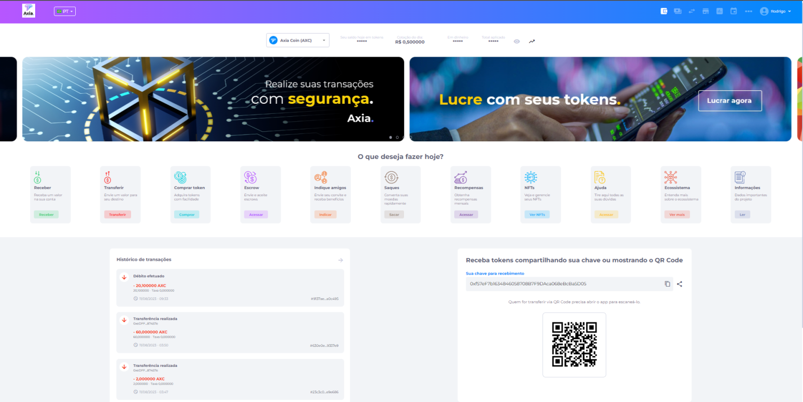

# Funcionalidades

**Carteira Digital**

A Carteira digital é uma plataforma para gerenciamento e utilização de pontos e tokens em redes blockchains, visando facilitar compras, vendas, transferências e valorizações de moedas digitais, apresentando total segurança para suas transações. Com alta tecnologia, o sistema apresenta uma estrutura robusta, permitindo configuração de segurança por autenticação multifator, reconhecimento fácil e utilização de transações via QR Code.

Os grandes benefícios são a inovação e segurança nas transações financeiras, melhorias na gestão administrativa, além da tokenização, que traz diversas possibilidades para as empresas, possibilitando que itens tokenizados possam ser utilizados dentro de seu ecossistema. Seja através da aplicação mobile, da versão WEB ou até mesmo das APIs.

**Principais funcionalidades:**

1. **Criação de Conta**
   - Permite a criação de contas nacionais (Brasil) e estrangeiros.
   - Utilizamos CPF, Passaporte, CNPJ;
   - O username é o e-mail do usuário e poderá ser alterado via BackOffice quando solicitado. Porém, essa alteração gera riscos de segurança, é preciso que antes de alterar, garanta que recebeu as informações necessárias para verificar a autenticidade do usuário.

2. **KYC**
   - A funcionalidade de KYC tem integração com a plataforma idWall e também permite a aprovação de documentos manuais.
   - Foto de Selfie com Documento;
   - Foto de Documento;
   - Comprovante de endereço;
   - Utilização do SDK da idWalll para captura de faceId com prova de vida.

3. **Senhas**
   - A senha pode ser alterada pelo usuário e solicitada a recuperação da senha.
   - Utilizamos alguns parâmetros para criação da senha:
     - 8 a 20 caracteres;
     - Letras minúsculas;
     - Letras maiúsculas;
     - Números;
     - Caracteres especiais.
   - Alterar senha pelo usuário:
     - Senha atual e nova senha.
   - Recuperação de senha:
     - É encaminhado um código de validação por e-mail;
     - Esse código deverá ser informado no momento da criação de nova senha.

4. **MFA (Multi-Factor Authentication)**
   - A funcionalidade do MFA tem como método de segurança a utilização de dois ou mais variáveis atestando a identidade de alguém para acesso do sistema, documento, informação ou transação.
   - Uma vez configurado em nosso sistema, o usuário deverá informar o código gerado pelo app Authy ou similar no momento do login.
   - Para acessar a plataforma, utilizamos o método OTP.

5. **Translater**
   - Tem como funcionalidade traduzir as informações da plataforma (Inglês ou Português) com suporte a outros idiomas.

6. **Banners**
   - Utilizado como o marketing do negócio, sendo atrativo para o usuário.
   - Pode ser uma imagem informativa, imagens em formato de carrossel ou clicável com direcionamento para um link.
   - Dimensionamentos para desktop e mobile.

7. **Tokens**
   - Os tokens no geral são um recurso de segurança que gera um código identificador digital exclusivo e aleatório para proteger dados sensíveis e isto aliado à várias camadas de segurança trazem total tranquilidade e transparência para as realizações das transações.
   - Atualmente a tokenização é muito usada em transações financeiras, e o motivo para que o token esteja dominando esse tipo de transação é bem simples: ao excluir o fator humano, a segurança aumenta, enquanto a margem de erro diminui. Os principais pontos são:
     - Tudo o que possui valor monetário, inclusive uma boa ideia pode ser considerado;
     - A moeda torna-se um recurso de extrema segurança e credibilidade;
     - As transações tornam-se transparentes, rápidas e seguras;
     - Quanto mais transações existirem, mais os tokens podem valorizar.

8. **Exibição de tokens**
   - É possível que token só aparecer para o usuário que se cadastrar com código de indicação do token.

9. **Lista de tokens**
   - Quando adquirido 2 ou mais tokens, esses podem ser selecionados para a visualização e aos detalhes do token na carteira digital.
   - Pode ser configura as funções por token.

10. **Cotação de tokens**
    - Utilizamos:
      - CoinMarketCap;
      - PancakeSwap;
      - Banco central;
      - API dinâmica.

11. **Gráfico do token**
    - É possível ser adicionado gráficos externos para cada token.

12. **Saldos**
    - É informado o valor do token na carteira:
      - Valor disponível em moeda fiduciária;
      - Total de tokens na carteira somados com tokens aplicados;
      - Total aplicado em staking.

13. **Vesting**
    - Integração de contrato de vesting na blockchain com total em vesting e as próximas datas de retirada.

14. **Receber**
    - Por método de compartilhamento de código da chave pública do usuário ou o QRcode, o usuário poderá receber uma transação.

15. **Transferir**
    - Para realizar uma transferência é obrigatório ser configurado o MFA na conta, garantido a segurança da transação.
    - Na transferência de token é exibido o saldo disponível do usuário, valor de taxa, valor fiduciário e total.
    - A taxa é configurável via BackOffice, podendo configurar taxas para transações internas e transações externas.
    - É possível transferir por meio do compartilhamento da chave pública do usuário ou algum amigo que já tenha sigo cadastrado.

16. **Amigo**
    - Cadastrando um amigo pela chave pública, o usuário pode de forma rápida realizar a busca pelo nome/apelido, editar e excluir amigo utilizando assim uma lista de favoritos para transferência de tokens.

17. **Indicação de amigos**
    - O administrador define esse recurso no CRUD de tokens pelo BackOffice;
    - De acordo com a configuração, é possível ganhar recompensas por indicação encaminhando um convite para o destinatário.
    - É necessário que o novo usuário utilize do código no momento do cadastro para que possa receber a recompensa.
    - A exibição da recompensa recebida fica na seção de histórico da transação.
    - O código pode ser inserido manualmente ou gerado um link pelo BackOffice.

18. **Compras**
    - Permitido que o usuário diga quantos tokens deseja comprar ou qual o valor que deseja comprar;
    - Diversidade de meios de pagamento, configurável na necessidade de cada cliente:
      - Criptos/Tokens;
      - Saldo fiduciário;
      - Depósitos TED/Pix;
      - Neteller (USD);
      - Metamask;
      - Banco Digital;
      - Cartões de crédito/débito;
      - Pagseguro;
      - Coin_Payments (Bitcoin).
    - O cartão de crédito utiliza integração stripe, e assim que o pagamento for confirmado a carteira configurada em PGH secret, será utilizada para transferir o valor dos tokens;
    - Para TED/Pix é enviado um comprovante, seguido de validação, aprovação ou rejeição da transação pelo administrador;
    - Para a transação ser feita a carteira principal do sistema deve ser abastecida como token que será vendido.

19. **Histórico de transações**
    - No histórico é mostrado as informações de forma prática toda transação do usuário, sendo ela recebida ou enviada.
    - Caso seja uma transação de Recebimento:
      - Identificação da transação;
      - Data hora em que a transação foi confirmada;
      - Total de ativos transferidos;
      - Valor convertido em BRL;
      - Taxa de transação.
    - Caso seja uma transação de Envio:
      - Identificador de Chave do Receptor;
      - Identificação da transação;
      - Data hora em que a transação foi confirmada;
      - Total de ativos transferidos;
      - Valor convertido em BRL;
      - Taxa de transação.
    - É possível expandir para ter uma visualização ou realizar a busca pela informação desejado.
    - Temos alguns filtros para melhor usabilidade do usuário.

20. **Escrow**
    - Garantia de operação com troca de valores para receber o mesmo valor em outra moeda.
    - Travamento dos valores até o momento da aprovação ou reprovação da solicitação.
    - Histórico de Escrow, caso seja uma solicitação recebida:
      - Identificação qual usuário fez a solicitação;
      - Moeda à enviar;
      - Moeda à receber;
      - Taxa de transação;
      - Data hora em que a transação foi confirmada;
      - Status da solicitação: PENDENTE/APROVADO/REPROVADO.
    - Caso seja uma solicitação enviada:
      - Identificação qual usuário fez a solicitação;
      - Moeda à enviar;
      - Moeda à receber;
      - Taxa de transação;
      - Data hora em que a transação foi confirmada;
      - Status da solicitação: PENDENTE/APROVADO/REPROVADO.
    - Resumo do Escrow, quando clicado na solicitação:
      - Usuário de origem;
      - Usuário de destino;
      - Valor fiduciário;
      - Moeda à enviar;
      - Moeda à receber;
      - Status da transação (PENDENTE/REPROVADA/APROVADA);
      - Taxa de rede;
      - Porcentagem da operação;
      - Data da solicitação;
      - Mensagem (caso o usuário queira especificar algo);
      - Logo temos os botões para reprovar ou aprovar operação.

21. **Saques**
    - Configurado de acordo com o negócio do cliente.
    - Quando o saque é permitido é mostrado o saldo de valor disponível para saque;
    - É configurável o valor de saque diário;
    - É configurável qual token permite saque;
    - Tipos de saques permitidos:
      - Valor fiduciário através de outras instituições bancárias para pessoas físicas ou jurídicas;
      - Valor fiduciário direto pelo Banco Digital, sendo creditado somente após aprovação;
      - Bitcoin/Ethereum com inserção da carteira digital do destinatário e o nome.
    - Tela com histórico de saques com alguns filtros para proporcionar uma melhor usabilidade;
      - Transação, valor de tokens, data e hora da solicitação;
      - Tipo: fiduciário, bitcoin, Ethereum;
      - Status: Em análise, realizado ou cancelado.

22. **Staking**
    - Essa funcionalidade é uma forma de obter recompensas enquanto se detém determinadas criptomoedas, podendo elas serem configuradas de forma automática ou não.
    - As implementações variam de projeto para projeto e os termos de cada staking garantido pela segurança da blockchain.
    - Configurado no CRUD de staking no BackOffice com as seguintes informações:
      - Período de tempo: recebimento da recompensa sobre o valor aplicado, podendo ser estabelecido por número de dias ou meses;
      - Quantidade mínima de participação: indica o mínimo de tokens que precisam ser investidos em staking para ser elegível e receber a recompensa. A quantidade mínima pode ser 1 ou mais conforme a configuração;
      - Rentabilidade: é o valor que será aplicado como recompensa de aposta. O valor mínimo pode ser de 1% ou mais, ou qualquer valor absoluto acima de 1 token;
      - Método: porcentagem ou valor absoluto aplicado à recompensa de aposta;
      - Permite retirada antecipada ou não;
      - Em qual token será pago a recompensa;
      - É permitido a retirada antecipada conforme descritos nos termos do staking, quando:
        - Sim, o cliente recebe o valor calculado proporcionalmente ao número de dias que participou;
        - Não, o cliente pode sacar o valor, mas não recebe nenhum valor extra, além do que já tinha.
    - Pagamento da recompensa é realizado sempre no dia de vencimento da campanha de staking e o token bloqueado para staking também é desbloqueado para o usuário.

23. **NFT**
    - Os NFTs são ativos digitais que representam diferentes objetos, como itens colecionáveis, arte e vários itens de jogos. Os tokens não fungíveis são geralmente negociados online, principalmente com criptomoedas, e são codificados em um contrato inteligente em uma blockchain.
    - Dentro do produto é possível comprar, enviar, receber e colocar como staking.
    - **Meus ativos:**
      - NFTs da carteira;
      - Detalhes como nome, coleção, identificação;
    - Podendo ser visualizada da informação detalhadas da NFT:
      - Nome do ativo, código de Identificação (ID), compartilhamento da NFT, coleção, rede da blockchain em que foi registrada, descrição.
    - Envio do ativo: inserido a carteira digital do destinatário;

24. **Ajuda**
    - Tem como funcionalidade ajudar o usuário com alguma dúvida, sugestão ou reclamação.
    - Link configurável para direcionamento de mensagem por e-mail, chat ou suporte.

25. **Ecossistema**
    - Todo produto tem como descrição as características de todo fluxo dentro da plataforma, podendo ele servir como orientação e também como transparência do projeto para segurança do usuário.

26. **Menu perfil**
    - **Troca de senha**
      - O usuário deverá informar a senha atual e nova senha.
    - **Documentos pessoais**
      - São os documentos enviados para o registro do KYC;
      - O usuário poderá verificar seus documentos, se foram aprovados ou rejeitados;
      - Quando rejeitado o usuário deverá mandar um novo documento para aprovação.
    - **Pagamentos**
      - Exibição de todas as transações realizadas pelo usuário.
      - Valor, tipo, data/hora e status
      - Temos alguns filtros para melhor usabilidade do usuário:
        - Buscar por valor;
        - Tipo: TED, Pix, Netteler, e outros;
        - Status: Confirmado, não confirmado e aguardando.

27. **Sobre a empresa**
    - É a descrição da visão geral dos principais aspectos do negócio da empresa;

28. **Política de privacidade / Termos de Uso**
    - São termos e condições de segurança referente às práticas e processos adotadas pela plataforma para tornar transparente a relação com o usuário.
    - Informação todos os direitos, garantias, formas de uso, dados recolhidos, processamento e descarte dessas informações pessoais do uisuário.
    - Também chamado de termos de uso, solicitada no momento cadastro, ou iniciar o uso da plataforma, para que o usuário demonstre seu expresso consentimento e concordância com esses termos.
    - É uma maneira não apenas de informar ao usuário o que será feito com seus dados, como também isentar o provedor de qualquer responsabilidade decorrente da falta de consentimento.

29. **FAQ**
    - É uma ferramenta estratégia de autoatendimento que tem como objetivo oferecer soluções rápidas para perguntas recorrentes de usuários;
    - Artigos com respostas sobre dúvidas ou problemas.

30. **Remover conta**
    - É possível o próprio usuário remover sua conta
    - Fica de responsabilidade total do usuário quando a conta é removida manualmente por ele.

31. **Redes sociais**
    - É possível integrar as redes sociais da empresa, expandindo o alcance de usuários por divulgações da empresa.
      - Facebook;
      - Instagram;
      - Linkedin;
      - Twitter;
      - Whatsapp;
      - YouTube
