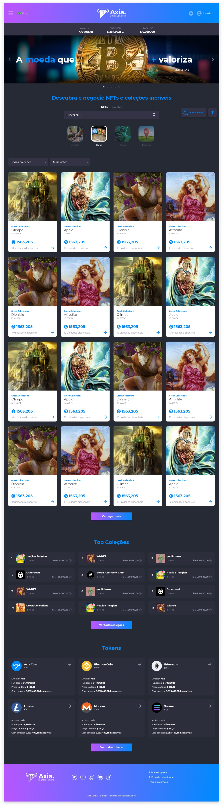

# Introdução
A página inicial apresenta a maior parte de informações e funcionalidades. A partir dela, é possível acessar o [perfil](../profile/profile.md) de usuário, onde podem ser acessados os saldos da conta e todas as funcionalidades disponíveis no Axia Eniato.

Também, apresenta o acesso ao menu para usuários com a [permissão Administrador](../account/account_permissions.md#administrador), onde estão os acessos para gerenciamentos diversos, disponíveis de acordo com as permissões de conta concedidas ao perfil do usuário.

::: info 📄 Nota
O design da página será adaptado à identidade da empresa, incluindo cores e logotipo. Os links de acesso do menu de navegação também poderão ser customizados em relação ao conteúdo e à quantidade, sendo permitidos, no máximo, até sete links.

A ordem dos conteúdos da página pode ser trocada para que as seções sejam exibidas de acordo com a estratégia de mercado da empresa, dando mais ênfase ao que for prioridade.
:::