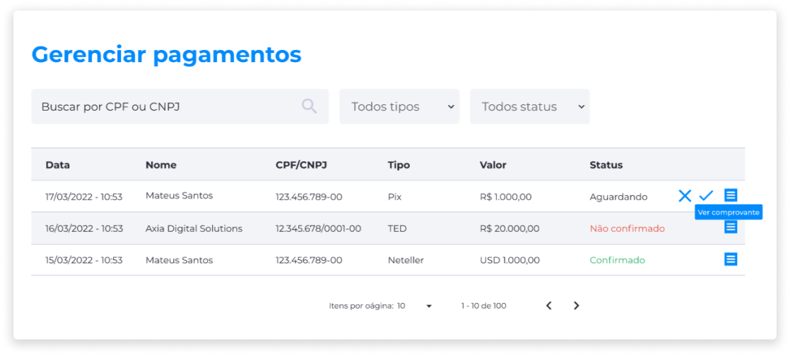

# Gerenciar Pagamentos
O gerenciamento de pagamentos exibe informações sobre todos os pagamentos efetuados pelos usuários.

Para o administrador, são exibidas as seguintes informações:

- Data e Hora da solicitação.
- Nome do usuário.
- Número do documento.
- Tipo de pagamento.
- Valor.
- Moeda comprada.
- Status do pagamento.

Para localizar um pagamento, o administrador pode utilizar o campo de busca inserindo o número do documento do usuário, ou aplicar os filtros por Tipo (Todos, TED, PIX e Neteller) e por Status (Confirmado, Aguardando, Não Confirmado).

A partir do recebimento de um pagamento, ao lado da informação de status, caso este esteja indicado como **Aguardando**, serão exibidos os botões **Negar**, **Confirmar** e **Ver Comprovante**.

O administrador deverá verificar no comprovante as informações relativas ao pagamento pendente, e, após analisar, decidir se irá negar ou aprovar a operação.