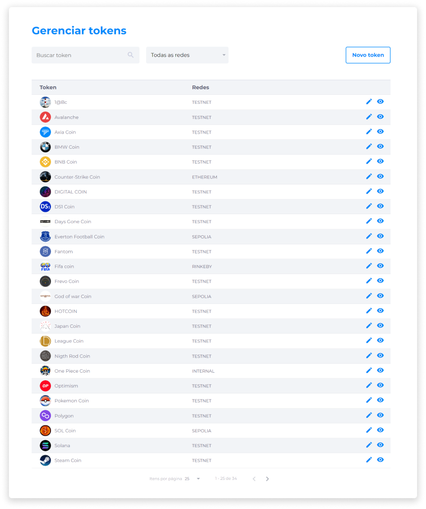

::: tip 🔐 Ativação da Licença <feature>MANAGE_TOKENS</feature>
O conteúdo desta página é válido somente se a licença [<feature>**MANAGE_TOKENS**</feature>](../about/licenses.md) estiver ativada.
:::

# Gerenciar Tokens
O gerenciamento de tokens permite visualizar, criar e editar tokens.

Para localizar um token, o administrador pode utilizar o campo de busca inserindo o nome do token, ou aplicar o filtro por Redes Blockchain.

Existe a possibilidade de inserir tokens já existentes na rede Blockchain para o Backoffice, a fim de utilizar as funcionalidades da plataforma como a compra e venda, o staking, a distribuição de dividendos e outras transações.