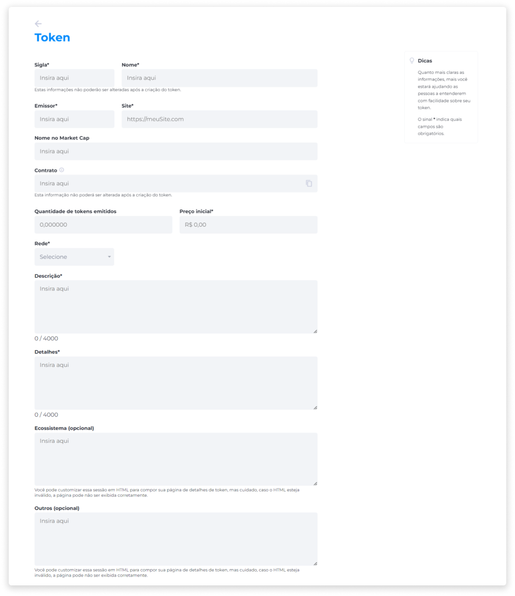
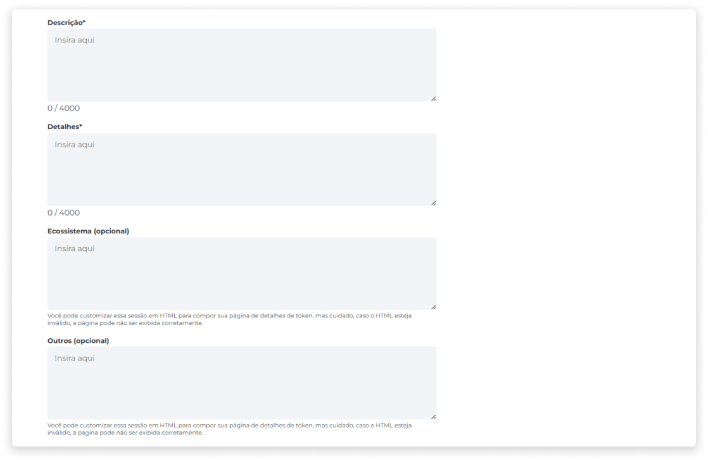
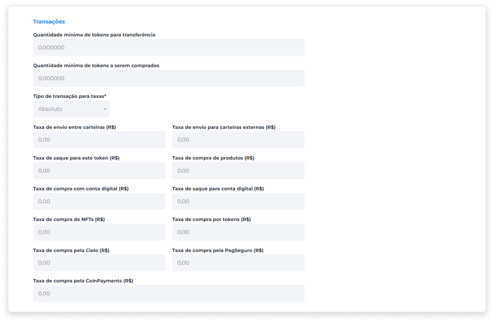
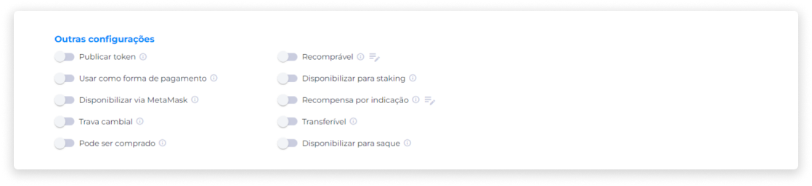
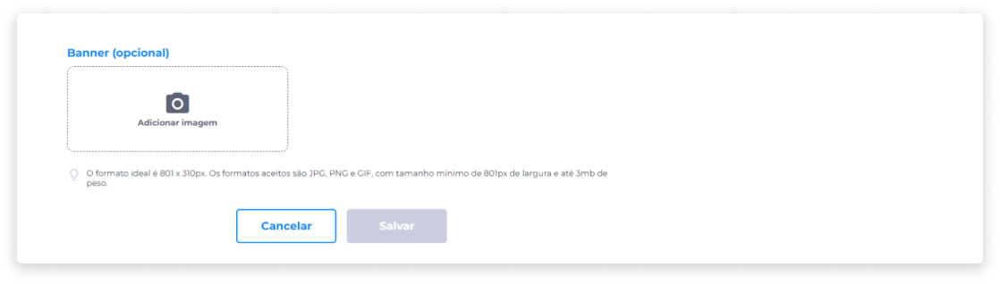

::: tip 🔐 Ativação da Licença <feature>MANAGE_TOKENS</feature>
O conteúdo desta página é válido somente se a licença [<feature>**MANAGE_TOKENS**</feature>](../about/licenses.md) estiver ativada.
:::

# Criar um token
Na página **Gerenciar Tokens**, clique em **Novo token**.

1. Insira a Sigla que representa o token.
2. Insira o Nome do token.
3. Insira o nome do Emissor.
4. Insira o URL do Site.
5. Insira o Nome do token no Market Cap.
6. Caso esteja importando um token existente para a plataforma, insira o número do contrato. Caso não tenha, deixe em branco para que o sistema crie um.
7. Insira a quantidade de tokens que serão emitidos.
8. Insira o preço inicial do token.
9. Selecione a rede Blockchain.

10. Insira uma descrição para o token.
11. Insira detalhes sobre o token.
12. Insira o ecossistema (HTML ou link externo sobre outros produtos e serviços relacionados ao token).
13. Insira outras informações (HTML ou link externo para inserir informações de apoio sobre o token).

::: warning ⚠️ <warningblocktitle>Atenção</warningblocktitle>
<warningblocktext>Você pode customizar esta seção em código HTML para compor sua página de detalhes de token, mas caso o HTML esteja inválido, a página pode não ser exibida corretamente.</warningblocktext>
:::

14. Adicione um Documento PDF sobre as informações do token.
15. Adicione o Documento Legal do token.
16. Adicione a imagem do token.

::: info ⚙️ <infoblocktitle>Especificações de Imagem</infoblocktitle>
 
<infoblocktext>- <b>Formatos aceitos</b>: JPG, PNG e GIF. 
- <b>Tamanho mínimo</b>: 150px. 
- <b>Peso</b>: até 1MB.</infoblocktext>
:::

## Transações

17. Selecione a quantidade mínima de tokens para transferência, se houver uma.
18. Selecione a quantidade mínima de tokens a serem comprados.
19. Selecione o tipo de transação para taxas.
	- Absoluto (R$).
	- Porcentagem (%).

Após selecionar o tipo de transação para taxas, defina:

- Taxa de envio entre carteiras.
- Taxa de envio para carteiras externas.
- Taxa de saque para este token.
- Taxa de compra de produtos.
- Taxa de compra com conta digital.
- Taxa de saque para conta digital.
- Taxa de compra de NFTs.
- Taxa de compra por tokens.
- Taxa de compra pela Cielo.
- Taxa de compra pela PagSeguro.
- Taxa de compra pela CoinPayments.

## Outras configurações
Além do preenchimento dos campos de informações básicas sobre o token, é possível adicionar configurações personalizadas para cada token criado. Nesta seção, você pode ativar ou desativar as opções disponíveis, gerenciando as seguintes configurações:

#### Publicar token
20. Selecione se o token deve ser publicado, permitindo que ele seja exibido na plataforma.

#### Usar como forma de pagamento
21. Selecione se o token pode ser usado como forma de pagamento em transações.

#### Disponibilizar via MetaMask
22. Selecione se o token poderá ser transacionado pela MetaMask.

#### Trava cambial
23. Selecione se o token estará sujeito a trava cambial.

::: info ℹ️ <infoblocktitle>Sobre Trava Cambial</infoblocktitle>
<infoblocktext>A Trava Cambial é uma configuração que congela o saldo do usuário para o momento da aquisição do token. A partir da compra de um token, o sistema registra a quantidade de tokens e sua cotação atual, gerando um preço médio.
  
À medida que mais tokens são comprados, o preço médio deste ativo é atualizado com base na compra atual. Por isso, cada vez que este token for usado, o sistema não irá considerar a cotação atual, mas sim o seu preço médio.
   
Com o objetivo de evitar que um token sofra com a alta volatilidade de mercado, e para que o usuário possa adquiri-lo a partir de um valor estável, a trava cambial é uma solução que pode ser configurada no momento da criação de um token, e consiste em travar o saldo do usuário para o momento da aquisição do ativo.</infoblocktext>
:::

::: warning ⚠️ <warningblocktitle>Atenção</warningblocktitle>
<warningblocktext>Ao aplicar uma trava cambial, a operação não poderá ser desfeita.</warningblocktext>
:::

#### Pode ser comprado
24. Selecione se o token poderá ser viabilizado para operações de compra.

#### Recomprável (necessário configurar)
25. Selecione se o token será recomprável pela empresa emissora.

::: info ℹ️ <infoblocktitle>Tipos de Recompra</infoblocktitle>
<infoblocktext>Com esta configuração ativada, pode ser escolhido um dos dois tipos de recompra do token:
  
1. <b>Modelo Integral</b> 
Neste modelo de recompra, todos os tokens que estão no mercado são recomprados sem que seja necessária a autorização de seus proprietários. Dessa forma, todos os tokens são retirados do mercado de vendas.
  
2. <b>Modelo Opcional através de Ordem de Recompra</b> 
Ao criar a ordem de recompra dos tokens, todos os usuários que possuem este token poderão revendê-los. O pagamento será sempre realizado em valor fiduciário. Para isto, é necessário que o emissor do token possua saldo fiduciário suficiente na plataforma para executar a ordem de recompra.</infoblocktext>
:::

::: warning ⚠️ <warningblocktitle>Atenção</warningblocktitle>
<warningblocktext>Após o início das vendas do token, não será possível editar o modelo de recompra.</warningblocktext>
:::

#### Disponibilizar para Staking
26. Selecione se o token poderá ser disponibilizado para Staking.

#### Recompensa por Indicação (necessário configurar)
27. Selecione se o token será aceito como pagamento de recompensa por indicação.

::: info ℹ️ <infoblocktitle>Sobre a Recompensa por Indicação</infoblocktitle>
<infoblocktext>Com esta configuração ativada, o usuário que indicou um amigo poderá receber uma recompensa em tokens de duas maneiras:
  
1. <b>Por Compra</b> 
Quando a pessoa indicada pelo usuário comprar um token que tenha a configuração de Recompensa por Indicação ativada. A quantidade pode ser configurada em valor Absoluto ou Percentual, e o valor em porcentagem deve ter um limite máximo de tokens permitidos para a recompensa.
  
2. <b>Por Cadastro</b> 
Quando a pessoa indicada pelo usuário utilizar o código de indicação na hora do cadastro da conta. A quantidade será configurada sempre em valor Absoluto.
  
💡 É possível configurar mais de um token para ser utilizado como recompensa por cadastro.</infoblocktext>
:::

#### Transferível
28. Selecione se o token poderá ser transferido via carteira digital.

#### Disponibilizar para saque
29. Selecione se o usuário poderá sacar seus tokens através da carteira digital.

Após aplicar as configurações personalizadas disponíveis na seção anterior:

30. Insira um banner para a página do token (opcional).

::: info ⚙️ <infoblocktitle>Especificações de Imagem</infoblocktitle>
 
- <infoblocktext><b>Formato ideal</b>: 801 x 310px. 
- <b>Formatos aceitos</b>: JPG, PNG e GIF. 
- <b>Tamanho mínimo</b>: 801px (largura). 
- <b>Peso</b>: até 3MB.</infoblocktext>
:::

31. Salve as configurações.

::: warning ⚠️ <warningblocktitle>Atenção</warningblocktitle>
<warningblocktext>Após a criação do token, as seguintes informações não poderão mais ser alteradas:
  
- Sigla. 
- Nome. 
- Número do contrato. 
- Quantidade de tokens emitidos. 
- Preço inicial. 
- Rede. 
- Tipo de transação para taxas. 
- Configuração de trava cambial.</warningblocktext>
:::