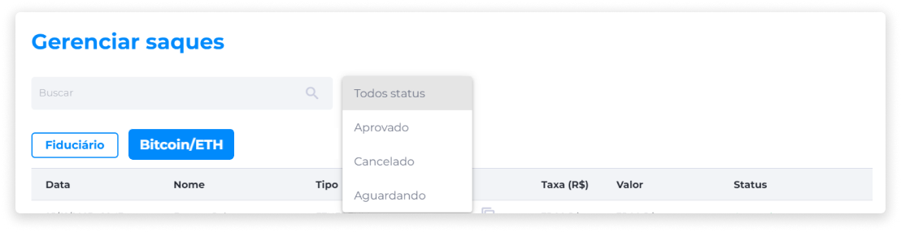

# Gerenciar Saques
O gerenciamento de saques exibe informações sobre todos os saques solicitados pelos usuários.

### Solicitação de Saque
Ao receber uma solicitação de saque, o administrador deve avaliar se a solicitação é válida. Se for, ele deverá realizar a transferência manualmente.

Após a confirmação de que a transferência foi realizada, o administrador deve aprovar a solicitação de saque, indicando o status como **Aprovado**.

Se por algum motivo a solicitação de saque não for aceita, ou ocorrer algum erro na transferência, o administrador deve negar a solicitação, indicando o status como **Cancelado**.

Para localizar solicitações de saque específicas, o administrador pode utilizar o campo de busca inserindo o nome do usuário, ou aplicar o filtro por Status (Todos, Aprovado, Aguardando e Cancelado).

A visualização dos saques é dividida em duas abas: [Fiduciário](../manage_assets/withdrawals_fiat.md) e [Bitcoin/ETH](../manage_assets/withdrawals_crypto.md).