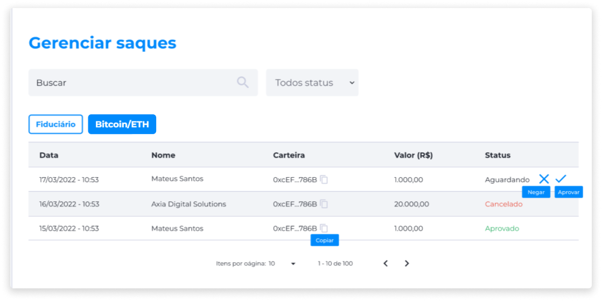

# Saques em Bitcoin/ETH
Assim como na aba Fiduciário, a aba Bitcoin/ETH também exibe o histórico de todas as solicitações, porém, são referentes a solicitações de saque em criptomoedas.

Nesse contexto, o administrador terá a visualização das seguintes informações:

- Data e Hora da solicitação.
- Nome do usuário.
- Tipo da criptomoeda.
- Número da carteira.
- Taxa em Reais (R$).
- Valor em Reais (R$).
- Status da solicitação.

::: info ℹ️ <infoblocktitle>Info</infoblocktitle>
<infoblocktext>Ao lado da informação de status, caso este esteja indicado como <b>Aguardando</b>, serão exibidos os botões <b>Negar</b> e <b>Aprovar</b>. O administrador deverá verificar as informações relativas à solicitação de saque pendente e decidir se irá aprovar ou negar a solicitação.</infoblocktext>
:::