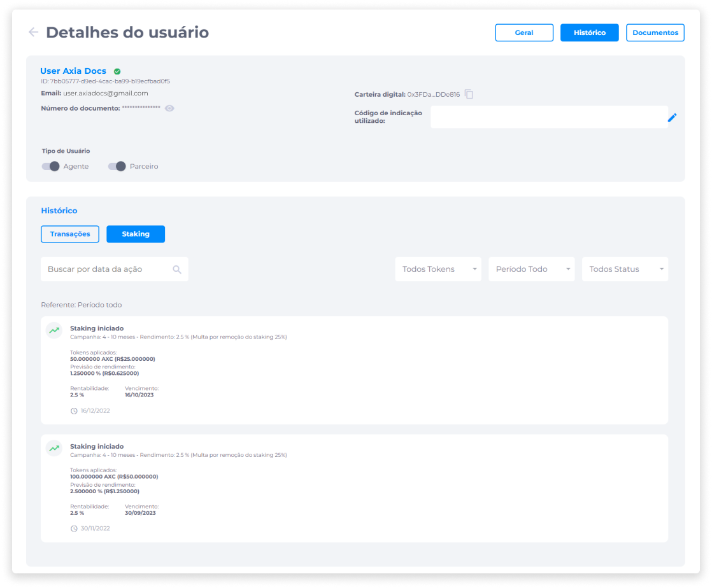

# Detalhes do Usuário
A área de detalhes do usuário reúne todas as informações que o administrador precisa para conhecer seus usuários, aplicar alterações de tipo de usuário, definir percentual de comissões a serem pagas e o período de pagamento, acompanhar saldos e históricos de transações, acessar documentos de identificação, e realizar a análise de autenticidade de documentos que são submetidos através da plataforma.

Na tela de detalhes do usuário, o administrador tem acesso aos dados básicos de seus usuários na seção principal, que exibe Nome do usuário, Selo de status de conta (Aprovado ou Reprovado), ID, E-mail, Número do Documento, Número da Carteira Digital, Código de Indicação utilizado, e o marcador de ativação/desativação de Tipo de Usuário.

Outras informações de usuários mais específicas são exibidas a partir de três abas: **Geral**, **Histórico** e **Documentos**.

## Geral
A aba **Geral** exibe os campos de definição de percentual de comissão para usuários dos tipos Agente e Parceiro, e o seletor de ativação/desativação para definição de pagamento destas comissões.

### Comissões
Comissões definidas pelo administrador são recompensas que consistem na efetuação do pagamento de um valor em tokens para usuários Agentes ou Parceiros. Para receber o pagamento de comissões, o usuário Agente ou Parceiro precisa fazer indicação de outras pessoas que, ao se cadastrarem na plataforma, façam aplicação de um valor em staking.

O administrador deverá definir se o pagamento das comissões será efetuado ao longo de aplicações de staking ou apenas no final do período de staking.

### Saldos do Usuário
Além das definições de percentual de comissão, também é exibida na aba **Geral** a seção **Saldos do Usuário**, que permite ao administrador visualizar todos os tokens que o usuário possui em sua carteira e o seu saldo atual em cada token.

### Alteração de Código de Indicação
O código de indicação pode ser inserido ou editado manualmente pelo administrador para cada usuário, através do campo **Código de indicação utilizado**. O uso do código de indicação permite que o usuário detentor daquele código receba recompensas quando o usuário que o utiliza se cadastrar na plataforma e/ou efetuar compras de tokens.

Os tokens por meio dos quais as recompensas serão pagas após cadastro na plataforma e/ou compra podem ser configurados pelo administrador.

### Relatórios idWall
Conforme requisito do Banco Central, o Backoffice irá dispor de um recurso de verificação de autenticidade de documentos para agilizar o processo KYC.

Para isso, será feita a integração idWall, uma solução que fornece relatórios completos sobre o usuário, possibilitando que o administrador obtenha mais segurança em momentos de tomada de decisão.

## Histórico
A aba **Histórico** possibilita ao administrador a visualização do histórico de **Transações** em tokens e de aplicações de **Staking** realizadas pelo usuário.

### Transações
As informações presentes no histórico de Transações são referentes às movimentações como Transferência Realizada, Débito Efetuado, Crédito Recebido e Recompensa de Staking.

Cada atividade registrada no histórico de Transações inclui os seguintes dados sobre a transação:
- Tipo de Transação.
- Número da carteira que recebeu a transferência ou recompensa de Staking.
- Valor em tokens que foi movimentado.
- Taxa sobre o valor movimentado.
- Valor da transação em moeda fiduciária.
- Data e hora da transação.

O histórico de Transações ainda viabiliza a busca por transações específicas, que pode ser feita através do campo de busca por ID da transação, ou através dos seguintes filtros:

- Por Token (selecionando um dos tokens que o usuário possua em sua carteira).
- Por Período (Todo o Período, 30 dias, 60 dias ou 90 dias).
- Por Status (Todos, Recebidos e Transferidos).

### Staking
As informações do histórico de Staking são referentes às aplicações de staking realizadas pelo usuário.

Cada ação registrada no histórico de Staking inclui os seguintes dados sobre a transação:
- Status do Staking (Iniciado/Interrompido).
- Período de duração da campanha.
- Rendimento.
- Tokens aplicados ou removidos.
- Previsão de rendimento.
- Percentual de rentabilidade.
- Data de Vencimento.
- Data de aplicação do staking.

O histórico de Staking também possibilita a busca por ações de staking específicas, que pode ser feita através do campo de busca por data da ação, ou através dos seguintes filtros:

- Por Token (selecionando um dos tokens que o usuário possua em sua carteira).
- Por Período (Todo o Período, 30 dias, 60 dias ou 90 dias).
- Por Status (Todos, Iniciados, Interrompidos e Recebidos).

## Documentos
A aba **Documentos** exibe os dados dos documentos de identificação que foram submetidos pelo usuário para a análise de autenticidade a ser feita pelo administrador.

### Documentos de Identificação
A lista com os documentos de identificação enviados pelo usuário fornece ao administrador o acesso aos arquivos dos documentos para visualização, informações de data de envio e status da análise.