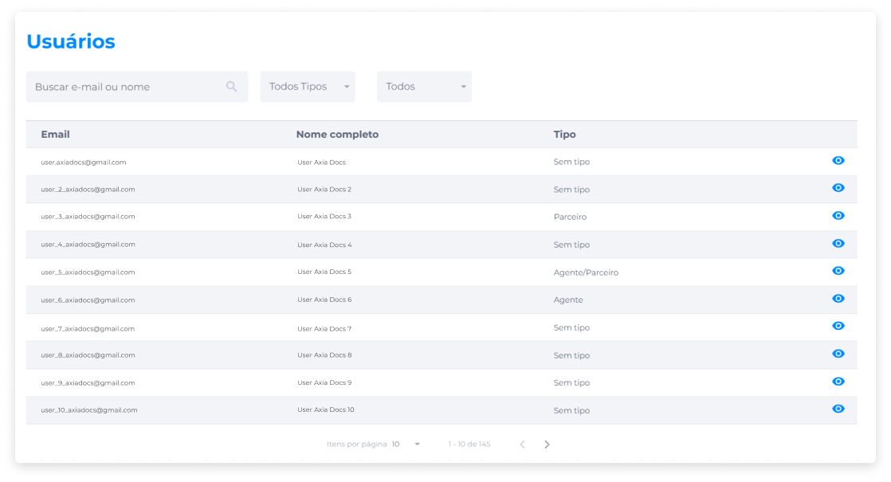

# Usuários
A visualização de usuários exibe os principais dados sobre os usuários cadastrados na plataforma: e-mail, nome completo e tipo de usuário.

Além da visualização em lista, é possível localizar usuários através do campo de busca, utilizando os filtros por Tipo de Usuário e por Status de Conta.

Para visualizar mais [detalhes do usuário](../manage_users/users_details.md), clique no ícone **Visualizar** ao lado dos dados de cada usuário.

## Tipos de Usuário
No Backoffice, o administrador pode ativar a configuração de classificar seus usuários como Agente, Parceiro ou ambos.

### Usuário Agente
Usuários definidos como Agente são aqueles que, ao indicarem novos usuários para se cadastrarem na plataforma, receberão comissões definidas pelo administrador, que poderá configurar as comissões a nível de usuário ou globalmente.

Essas comissões serão pagas ao Agente cada vez que ele indicar outras pessoas e elas aplicarem um valor em staking, e o recebimento da comissão será feito no mesmo token que foi aplicado no staking.

A partir da indicação de pessoas cadastradas, o usuário Agente ficará afiliado a estes novos usuários indicados.

> **Exemplo**: Se um usuário Agente indicar três pessoas e uma dessas pessoas comprar tokens e aplicar esses tokens em staking, o Agente receberá uma comissão em cima da aplicação feita pela pessoa indicada.

Dependendo da configuração feita pelo administrador, o usuário Agente poderá receber suas comissões em dois momentos:
- Durante a aplicação do staking, enquanto o staking estiver em andamento.
- Somente no final do período de staking.

### Usuário Parceiro
Usuários definidos como Parceiro são aqueles que sempre receberão uma percentagem do valor total do staking dos usuários.

O pagamento das comissões deverá ser feito no mesmo token que foi aplicado em staking, e efetuado em uma data específica do mês.

## Status de Conta e Processo KYC
::: tip 🔐 Ativação da Licença <feature>USER_KYC</feature>
O conteúdo desta seção é válido somente se a licença [<feature>**USER_KYC**</feature>](../about/licenses.md) estiver ativada.
:::

O status da conta é o modo em que o cadastro de um usuário na plataforma encontra-se atualmente a partir do processo KYC (_Know Your Customer_) ao qual o usuário foi submetido.

Os status podem ser definidos como **Aprovado**, **Aguardando aprovação** ou **Reprovado**.

O processo KYC viabiliza a análise de autenticidade de usuários através do envio de documentos pessoais, que é feito por meio das plataformas nas quais estes usuários estão cadastrados.

A solicitação de envio desses documentos é uma medida de segurança que valida a autencidade da conta e torna as transações mais seguras, e exige que o usuário forneça três documentos pessoais solicitados na plataforma para manter a segurança da conta e realizar transações de compra de tokens.

Ao usuário da plataforma, será solicitado o envio dos seguintes documentos:

- Documento de Identidade.
- Comprovante de Endereço.
- Selfie segurando o Documento de Identidade.

::: warning ⚠️ <warningblocktitle>Atenção</warningblocktitle>
<warningblocktext>A plataforma irá admitir o envio de apenas um arquivo para cada tipo de documento. Estes arquivos devem atender às seguintes especificações:</warningblocktext>

> <warningblocktext><b>Formatos</b>: PDF, PNG, JPEG e JPG. <b>Tamanho máximo permitido</b>: 10 MB.</warningblocktext>
:::

Após o usuário anexar e enviar todos os documentos solicitados, o administrador poderá acessar estes documentos através do Backoffice na aba **Documentos** da área [Detalhes do Usuário](../manage_users/users_details.md) e iniciar a análise de autenticidade.

O status **Aprovado** deve ser concedido pelo administrador se todos os documentos enviados pelo usuário tiverem sido devidamente analisados e aprovados. Para conceder o status de aprovação, clique em **Aprovar usuário**.

Após o início da análise e enquanto o processo estiver em andamento, o status será exibido ao administrador e ao usuário como **Aguardando aprovação**, indicando que o processo de análise ainda não foi concluído.

Caso a análise dos documentos indique qualquer erro que inviabilize a validação da autenticidade do usuário, o administrador deve clicar em **Rejeitar usuário** para marcar o status como **Reprovado**.

Com a reprovação, o usuário irá visualizar o status na área de Documentos Pessoais da plataforma, e será solicitado a reenviar seus documentos para autenticação.