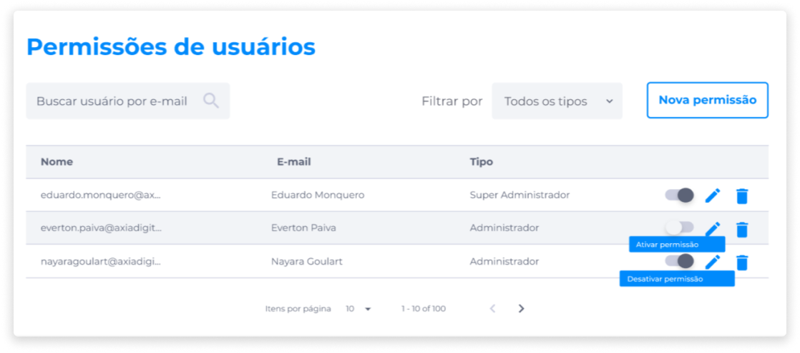
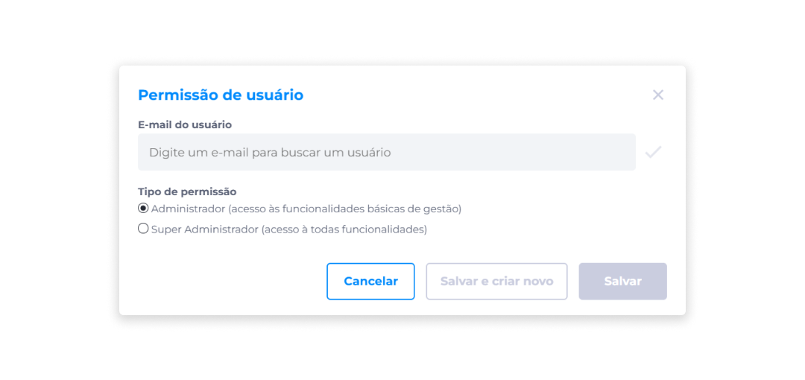
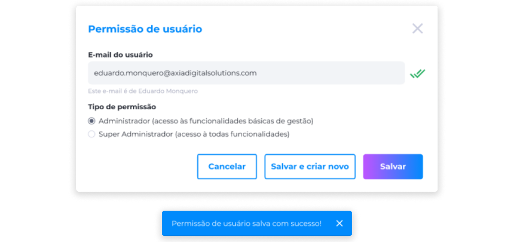

# Permissões de Usuários
As permissões de usuário são acessos a funcionalidades que o administrador da plataforma pode conceder a seus usuários.

Na área de gerenciamento de permissões de usuários do Backoffice, é disponibilizada para o administrador a visualização da lista de todos os usuários cadastrados na plataforma, assim como seus respectivos dados de e-mail, nome e os tipos de permissões que eles possuem atualmente.

O administrador também pode localizar usuários através do campo de busca por e-mail, ou utilizando o filtro por tipo de permissão (Todos os tipos, Administrador e Super Administrador).

Além disso, o administrador pode executar todas as funções relacionadas ao gerenciamento de permissões.

## Tipos de Permissões
Os três tipos de permissões que podem ser concedidas são: **Padrão**, **Administrador** e **Super Administrador**.

### Padrão
A permissão Padrão são as permissões que os usuários da plataforma possuem após a criação da conta. Esta permissão concede ao usuário o acesso às funcionalidades básicas da plataforma, que estão reunidas no menu de perfil.

### Administrador
A permissão Administrador é o tipo de permissão que o administrador da plataforma pode conceder a seus usuários. Esta permissão libera para o usuário o acesso às funcionalidades básicas de gestão dentro da plataforma, que é o gerenciamento de configurações de administrador (gerenciamento de ativos, de pacotes e de saques), mas não é liberado o gerenciamento de usuários.

### Super Administrador
Diferentemente da permissão Administrador, a permissão Super Administrador libera o gerenciamento de configurações de administrador e o gerenciamento de usuários, que permite ao usuário Super Administrador conceder, ativar, editar e remover permissões concedidas a outros usuários cadastrados na plataforma.

## Gerenciamento de Permissões
No gerenciamento de permissões, estão disponíveis as seguintes funções: adicionar **Nova permissão**, **Ativar/Desativar**, **Editar** e **Deletar** permissões.

### Nova permissão
Para conceder uma nova permissão:

1. Clique em **Nova permissão**.
2. Digite o e-mail do usuário a quem será concedida a permissão.

3. Clique no ícone **Validar usuário**.
4. Indique o tipo de permissão que será concedido.
5. Clique em **Salvar** ou em **Salvar e criar novo**, caso deseje continuar concedendo permissões a novos usuários.

### Ativar/Desativar permissão
Para desativar ou ativar a permissão de um usuário, basta clicar no seletor **Ativar/Desativar permissão** e as permissões do usuário serão concedidas ou bloqueadas.

### Editar permissão
Caso prefira apenas alterar as permissões de um usuário sem desativá-las:

1. Identifique o usuário que terá sua permissão modificada.
2. Clique no ícone **Editar**.
3. Selecione o novo tipo de permissão que será concedido.
4. Clique em **Salvar**.

### Deletar permissão
Com exceção da permissão Padrão, a ação de deletar permissão exclui definitivamente as permissões administrativas concedidas a um usuário cadastrado na plataforma. Para deletar uma permissão:

1. Identifique o usuário que terá sua permissão removida.
2. Clique no ícone **Deletar**.
3. Confirme se deseja realmente excluir a permissão.

Caso deseje conceder novamente a permissão administrativa a um usuário que teve suas permissões removidas, será necessário criar uma nova permissão.