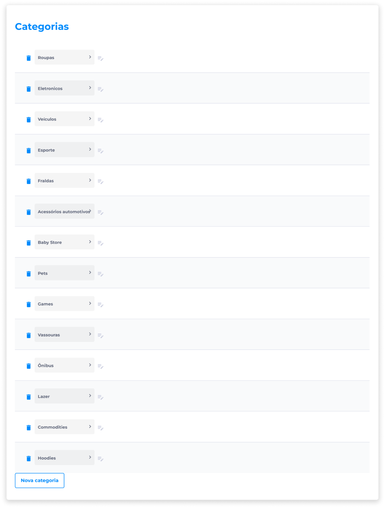

# Categorias
As categorias são estruturas de divisão de itens que criam um sistema de organização dos produtos, facilitando a busca dos usuários pelos itens desejados.

Categorias e subcategorias poderão ser adicionadas e alteradas livremente, a critério do administrador, e podem vir pré-definidas de acordo com os tipos de itens comercializados pela loja, sendo necessário apenas selecionar quais das categorias e subcategorias serão usadas.

Esta pré-definição dependerá do tipo de contrato firmado pelo cliente.

Através do painel administrativo do Backoffice, o administrador pode definir as configurações das categorias por meio da opção [Configurar categorias](../manage_virtualstore/categories_settings.md).