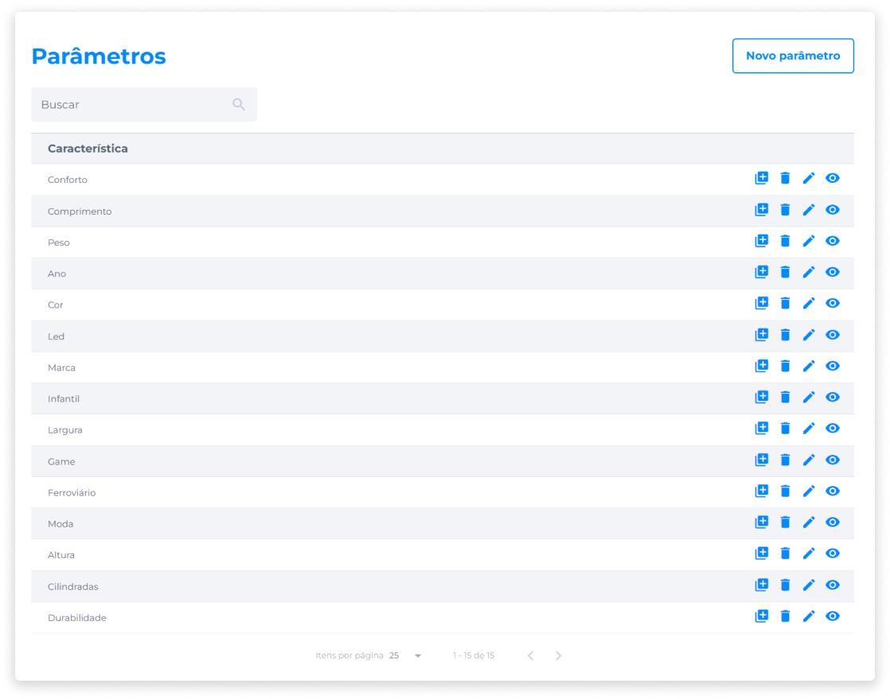
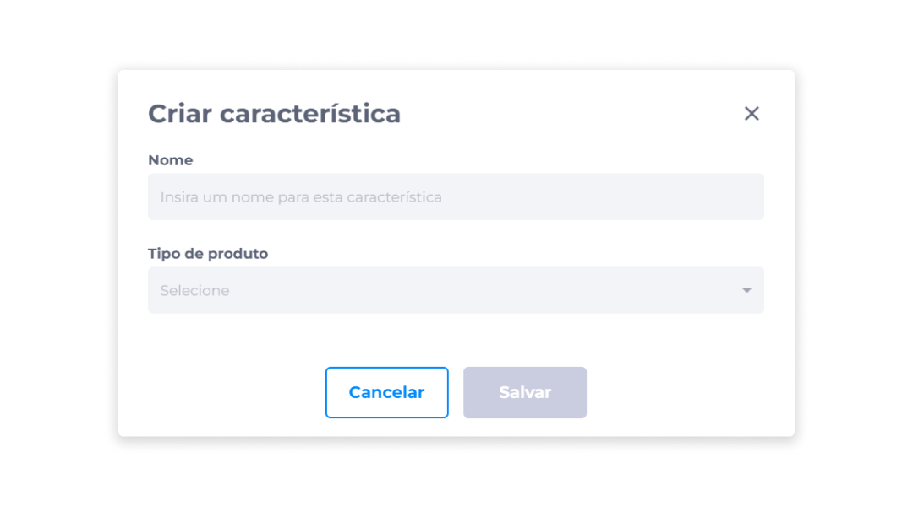

# Parâmetros
Relacionados às [configurações de categorias](../manage_virtualstore/categories_settings.md), os parâmetros são propriedades das [características flexíveis](../manage_virtualstore/categories_settings.md#caracteristicas-flexiveis) dos produtos. Ao configurar novos parâmetros, eles podem ser atribuídos aos itens no momento da criação de novas categorias.

A visualização dos parâmetros exibe a lista de todas características configuradas, as quais poderão ser aplicadas aos produtos que o administrador desejar. Também é possível localizar um parâmetro específico por meio do campo de busca.

Dentre outras ações de gerenciamento de Parâmetros, estão a criação de **Novo parâmetro**, **Visualizar**, **Editar**, **Duplicar** e **Deletar**.

## Novo parâmetro
Para criar um novo parâmetro:

1. Clique em **Novo parâmetro**.
2. Insira um **nome** para a nova característica.
3. Selecione o **tipo de produto**.
4. Clique em **Salvar**.

A definição de parâmetros pode ser feita a partir de três tipos de produto: Numérico, Opções e Texto Livre.

### Tipo 'Numérico'
Pode ser aplicado quando existir a necessidade atribuir ao produto propriedades numéricas.

> **Exemplo**: altura, largura, comprimento.

A configuração definida neste tipo será utilizada como validação dos valores no cadastro do produto ou serviço que tenha esta característica.

### Tipo 'Opções'
Pode ser usado para criar uma lista de características pré-determinadas, no caso de haver mais de uma característica possível para um produto.

> **Exemplo**: cor e tamanho.

As opções criadas serão exibidas em ordem alfabética.

### Tipo 'Texto Livre'
Este tipo pode ser aplicado para fornecer mais detalhes sobre o produto, permitindo a inserção de textos de no máximo 200 caracteres no cadastro do produto ou serviço que tenha esta característica.

## Duplicar parâmetro
Esta ação irá duplicar um parâmetro já existente, assim como todas as propriedades previamente definidas em sua configuração.

Para duplicar um parâmetro:

1. Identifique o item que deseja duplicar.
2. Clique no ícone **Duplicar**.

## Editar parâmetro
Para aplicar alterações em um parâmetro:

1. Ao lado do parâmetro cadastrado, clique no ícone **Editar**.
2. Na tela **Editar característica**, edite as informações nos campos desejados.
3. Clique em **Salvar** para aplicar as alterações.

## Deletar parâmetro
Para deletar um parâmetro:

1. Ao lado do item que deseja excluir, clique no ícone **Deletar**.
2. Confirme se realmente deseja remover o item.

::: danger <dangerblocktitle>⚠️ Atenção</dangerblocktitle>
<dangerblocktext>A ação de deletar um parâmetro é irreversível. Caso deseje inserir o parâmetro que foi removido, será necessário configurá-lo novamente.</dangerblocktext>
:::