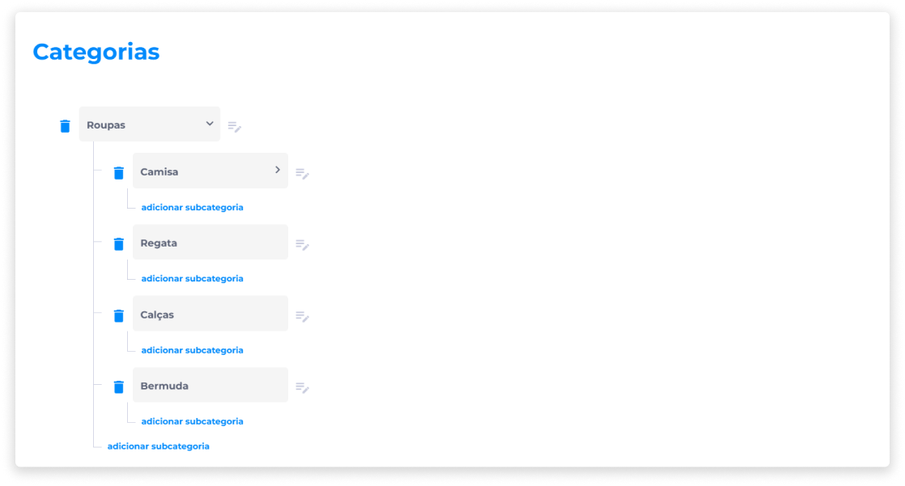
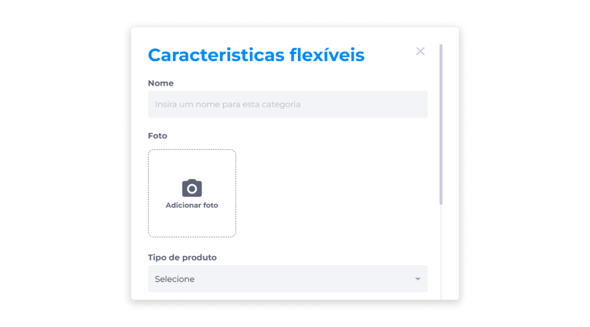
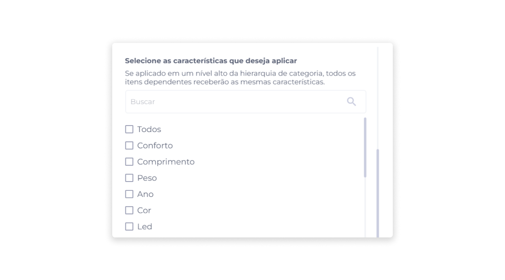
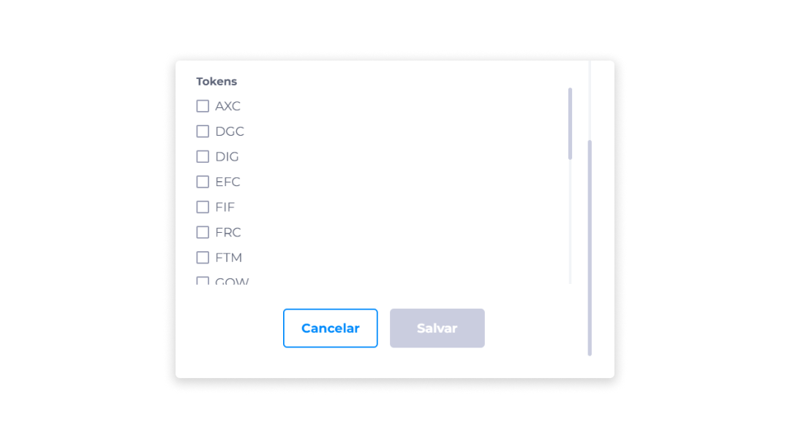

# Configurar categorias
A configuração das categorias de produtos permite ao administrador da loja a definição de **Características Flexíveis** e o gerenciamento de **Categorias/Subcategorias** dos itens.

## Características Flexíveis
As características flexíveis são atributos que caracterizam os itens da loja virtual.

A aplicação das características flexíveis está relacionada aos [parâmetros](../manage_virtualstore/categories_parameters.md) previamente cadastrados, e a definição delas tem como objetivo proporcionar aos usuários uma melhor experiência no processo de busca e obtenção de resultados de itens comercializados pela loja.

No Backoffice, é possível definir as seguintes características para um produto:

- Nome.
- Foto.
- Tipo de produto (Comprável ou Anúncio).
- Características flexíveis que serão atribuídas ao item.

::: info ℹ️ <infoblocktitle>Info</infoblocktitle>
<infoblocktext>Se uma característica for aplicada no nível mais alto da hierarquia de categorias, todos os itens dependentes receberão as mesmas características.</infoblocktext>
:::

## Categorias/Subcategorias
Dentro da configuração de categorias, é possível dividir as características em até três níveis hierárquicos: Categoria, Subcategoria Nível 1 e Subcategoria Nível 2.

As subcategorias são atributos vinculados ao nível hierárquico anterior. A definição destas subcategorias busca atribuir aos produtos maiores níveis de detalhamento.

**Exemplo**

> <infoblocktext>Categoria: Roupas</infoblocktext>

> <infoblocktext> Subcategoria Nível 1: Camisas</infoblocktext>

> <infoblocktext> Subcategoria Nível 2: Camisa Social</infoblocktext>

### Criar categoria/subcategoria
Para criar uma nova categoria de produtos:

1. Clique em **Nova categoria**.

Será exibida a tela para definição das Características Flexíveis.

2. Insira um **nome** para a nova categoria.
3. Adicione uma **foto** que represente a categoria.

4. Selecione o **tipo do produto** ao qual a nova categoria estará vinculada.
5. Selecione as **características** que deseja aplicar à categoria.

6. Selecione os **tokens** que serão aceitos como meio de pagamento para a nova categoria de produtos.
7. Clique em **Salvar**.

### Editar categoria/subcategoria
Para aplicar alterações em uma categoria ou subcategoria:

1. Ao lado da categoria ou subcategoria cadastrada, clique no ícone **Características**.
2. Na tela **Características flexíveis**, edite as informações nos campos desejados.
3. Clique em **Salvar** para aplicar as alterações.

### Deletar categoria/subcategoria
Para deletar uma categoria ou subcategoria:

1. Ao lado do item que deseja excluir, clique no ícone **Deletar**.
2. Confirme se realmente deseja remover o item.

::: danger <dangerblocktitle>⚠️ Atenção</dangerblocktitle>
<dangerblocktext>A ação de deletar uma categoria/subcategoria é irreversível. Caso deseje inserir as categorias ou subcategorias que foram removidas, será necessário configurá-las novamente.</dangerblocktext>
:::