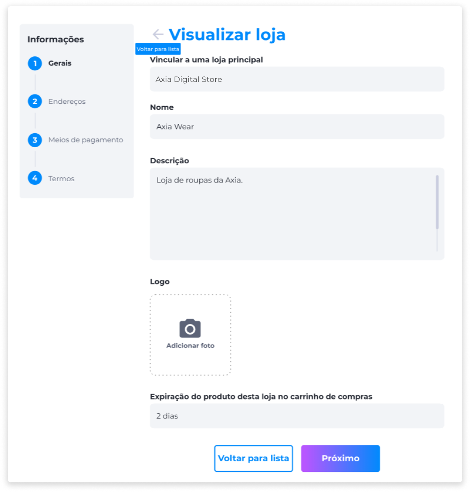

# Lojas
As lojas são ambientes de comércio eletrônico que permitem ao administrador vender seus produtos cadastrados na plataforma. No Backoffice, o admininstrador tem acesso às informações sobre as lojas cadastradas através da visualização em lista ou do campo de busca.

A visualização das lojas exibe informações sobre as configurações Gerais, de Endereços, Meios de Pagamento e Termos.

### Gerais
Na área de configurações Gerais, é exibido o nome da loja, descrição, imagem do logotipo e informação sobre os dias que foram definidos para expiração do produto da loja no carrinho de compras.

### Endereços
As informações de Endereços exibem dados de localização da loja cadastrada.

### Meios de Pagamento
Esta seção informa quais foram os Meios de Pagamento definidos na configuração da loja.

### Termos
Por fim, é exibida a informação sobre os Termos Gerais da loja, que servem para esclarecer toda a política interna que a loja aplica em suas operações comerciais.

