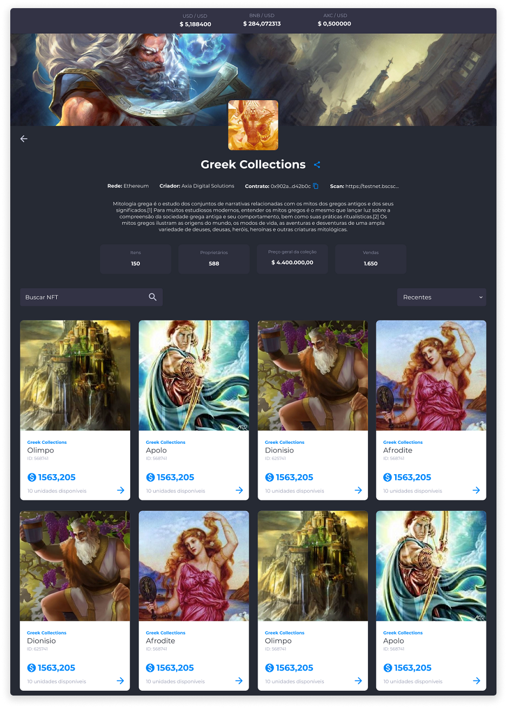

# Coleções de NFTs
No Axia Eniato, a criação de coleções de NFTs serve para dividir e organizar os NFTs.

O agrupamento de NFTs em coleções permite que o usuário tenha a possibilidade de adquirir itens colecionáveis do mesmo tema com facilidade e clareza.

