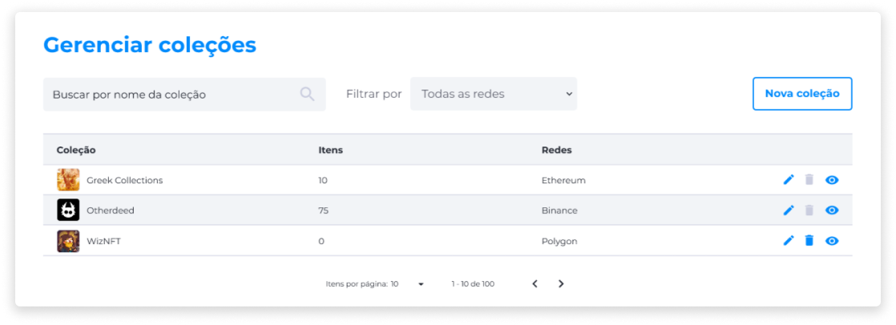
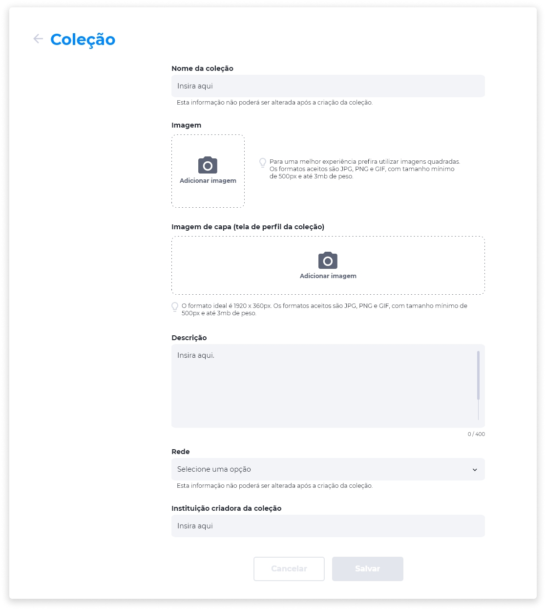

# Gerenciar Coleções de NFTs

## Criar uma Coleção de NFTs
1. No menu Administrador, clique em **Coleções**.
2. Clique em **Nova Coleção**.
3. Insira o nome da coleção.
4. Insira a imagem que representa a coleção.
5. Insira uma imagem de capa da página da coleção.
6. Insira uma descrição para a coleção.
7. Selecione uma opção de rede Blockchain.
8. Insira o nome da instituição criadora da coleção.
9. Clique em **Salvar**.

::: warning ⚠️ <warningblocktitle>Atenção</warningblocktitle>
<warningblocktext>Após a criação da Coleção, o nome da coleção, a rede e o contrato não podem ser alterados.</warningblocktext>
:::

## Editar uma Coleção de NFTs
Na página **Gerenciar Coleções**, identifique a Coleção de NFTs que deseja editar.

1. Clique no ícone **Editar**.
2. Aplique as alterações nos campos específicos.
3. Clique em **Salvar** para confirmar as alterações.

## Deletar uma Coleção de NFTs
Para deletar uma Coleção de NFTs, na página **Gerenciar Coleções**, identifique a Coleção na lista e clique no ícone **Deletar**.

::: danger ⚠️ <dangerblocktitle>Atenção</dangerblocktitle>
<dangerblocktext>Deletar uma Coleção de NFTs é um procedimento irreversível e fará com que todas as suas configurações sejam perdidas. Caso queira recuperá-la, será necessário criar uma nova.</dangerblocktext>
:::