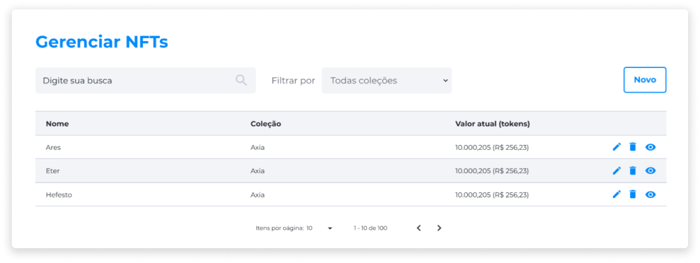

::: tip 🔐 Ativação da Licença <feature>MANAGE_NFTS</feature>
O conteúdo desta página é válido somente se a licença [<feature>**MANAGE_NFTS**</feature>](../about/licenses.md) estiver ativada.
:::

# Gerenciar NFTs
Na página **Gerenciar Ativos**, é possível criar, editar ou deletar NFTs.

