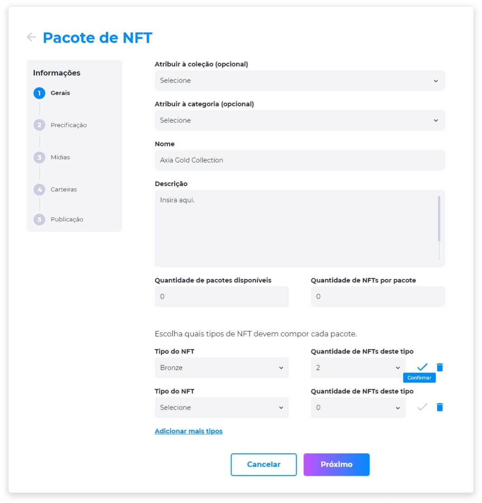
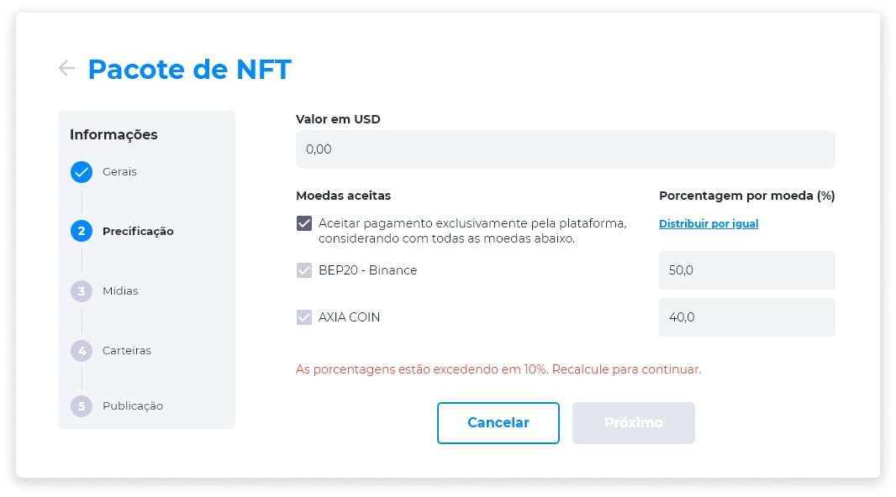
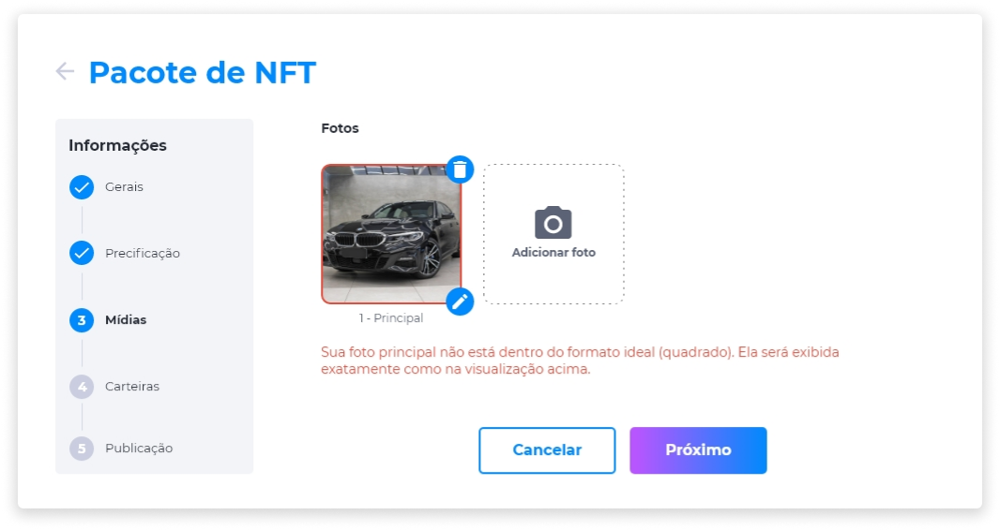
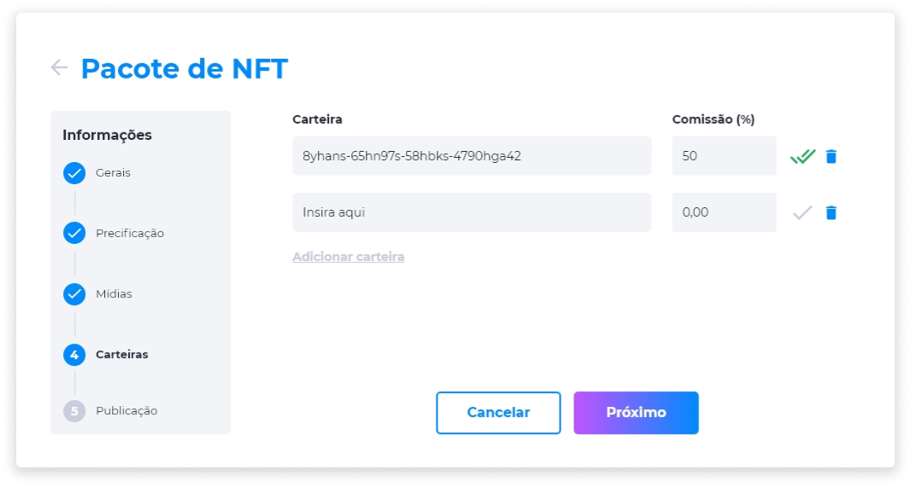
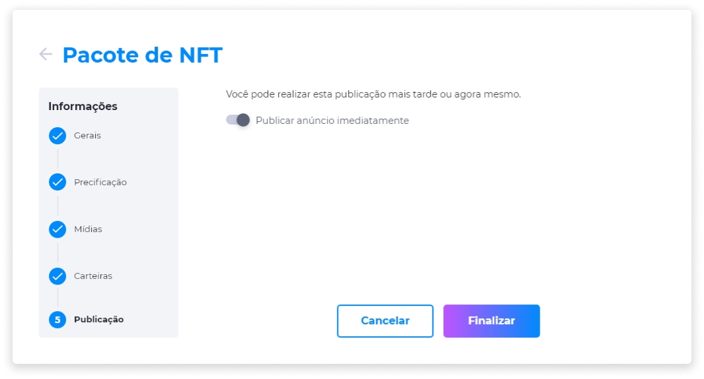

# Criar um Pacote de NFTs
No menu Administrador, clique na opção **Pacotes de NFTs**.

Na página **Gerenciar Pacotes**, clique em **Novo**.

### 1) Gerais
* Atribua o pacote a uma categoria (não é obrigatório, mas se nenhuma delas for selecionada, qualquer categoria será considerada).
* Insira o nome.
* Insira uma descrição.
* Insira a quantidade de pacotes disponíveis.
* Insira a quantidade de NFTs por Pacote.
* Escolha a quantidade de NFTs por classificação (por exemplo, se houver 5 NFTs em um pacote, todos podem ser Bronze, ou 3 Bronzes e 2 Silvers).
* Selecione se o Pacote deve ser publicado imediatamente.

::: warning ⚠️ <warningblocktext>Atenção</warningblocktext>
<warningblocktext>As classificações (Bronze, Silver, Gold, Platinum e Diamond) são utilizadas apenas em NFTs. Os pacotes em si não possuem classificação, eles contêm apenas os NFTs classificados.</warningblocktext>
:::

### 2) Precificação
* Insira o valor do ativo em moeda fiduciária.
* Indique:
   - Se apenas uma criptomoeda será aceita como pagamento.
   - Se mais de uma criptomoeda será aceita e o pagamento integral deverá ser feito com apenas uma das opções. 
   - Se mais de uma criptomoeda será aceita, mas o pagamento deve ser realizado obrigatoriamente com todas as criptomoedas selecionadas, especificando a porcentagem de cada uma.

### 3) Mídias
Adicione até 10 imagens, verificando as especificações às quais as imagens devem atender.

* **Especificações**:
   - Formatos: JPG, PNG, GIF.
   - Tamanho mínimo: 500px.
   - Tamanho máximo: 1200px.
   - Resolução: 72dpi.
   - Peso: até 3MB.

::: warning ⚠️ <warningblocktitle>Atenção</warningblocktitle>
<warningblocktext>Uma foto quadrada é o formato ideal. Se a imagem não estiver dentro do formato ideal, uma mensagem de alerta será exibida sinalizando esta informação.</warningblocktext>
:::

### 4) Carteiras
* Adicione até 10 carteiras para receber comissões com a venda dos ativos.
* Insira o valor de comissão de cada carteira, contanto que a soma das comissões **não exceda** 100%.
* A carteira **deve** ter o formato Ethereum, que se inicia com "0x" mais 40 caracteres alfanuméricos.
* Se nenhuma carteira for adicionada, o valor integral irá para a carteira que foi registrada no momento da configuração do Eniato.

::: info 💡 Dica
Certifique-se de que a carteira inserida seja a correta, pois o sistema valida se o formato está compatível, e não se a carteira existe.
:::

### 5) Publicação
Você pode cadastrar o novo Pacote de NFTs e realizar a publicação posteriormente, ou publicar o anúncio imediatamente.

Para publicar imediatamente, ative a opção **Publicar anúncio imediatamente** e clique em **Salvar**.

Se desejar publicar posteriormente, clique em **Salvar** e retorne à página **Gerenciar Pacotes**.