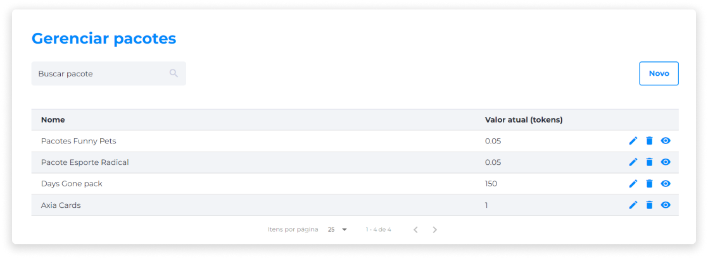

# Gerenciar Pacotes de NFTs
Os Pacotes de NFTs têm um gerenciamento à parte dos [NFTs](../nfts/nfts_management.md). Assim, o vendedor não corre o risco de confundir as vendas de NFTs com as vendas de Pacotes de NFTs.

Nesta aba, serão configurados todos os detalhes da venda de pacotes, como a categoria, quantidade, preço e imagens. A lista de Pacotes de NFTs contém:

* Nome.
* Quantidade de NFTs.
* Valor Atual.
* Editar.
* Deletar.
* Visualizar.