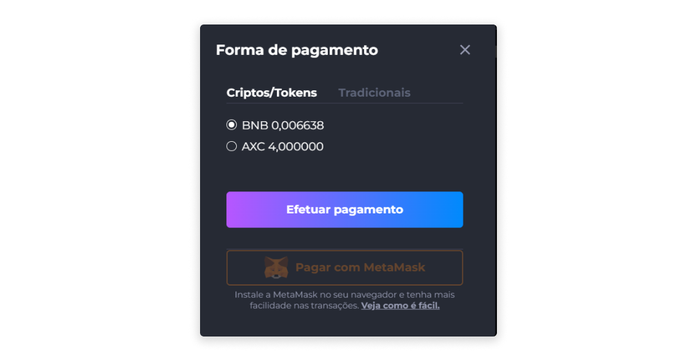
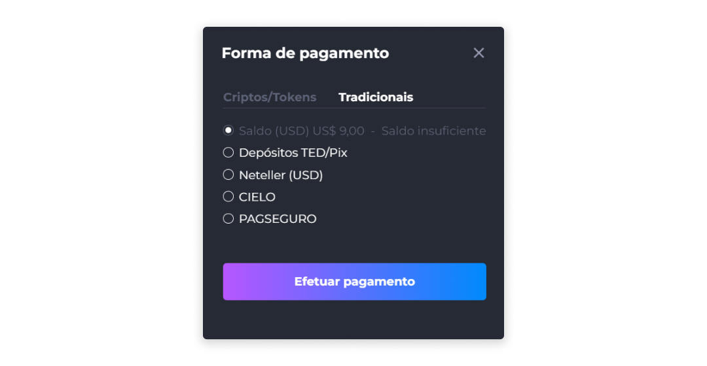

# Compra de NFTs
Para comprar um NFT:

1. Clique em um NFT à venda.
2. Clique em **Comprar**.
3. Selecione a forma de pagamento e clique em **Efetuar pagamento**.
4. Após a confirmação da compra, clique em **Ver meus ativos** e confira seu NFT em **Meus Ativos**.

## Meios de Pagamento
O pagamento pode ser realizado com os ativos disponíveis na conta do usuário, e que sejam aceitos como forma de pagamento pelo NFT a ser comprado.

Na tela **Forma de Pagamento**, são permitidos dois principais métodos de pagamento para a compra de NFTs: **Criptos/Tokens** e **Tradicionais**.

### Criptos/Tokens
O pagamento através de criptomoedas e tokens pode ser realizado em qualquer cripto aceita no Axia Eniato que possua saldo suficiente para a compra do NFT.

[<feature><🔐 **METAMASK**</feature>](../about/licenses.md) Além disso, caso o usuário tenha a extensão da MetaMask ativada em seu navegador, poderá optar por pagar pela sua carteira MetaMask, que terá um botão de acesso direto à carteira.

Caso não tenha a extensão ativada, será exibido um link de redirecionamento para que a MetaMask seja configurada. [<feature> **METAMASK**></feature>](../about/licenses.md)

### Tradicionais
O meio de pagamento tradicional aceita pagamentos em moeda fiduciária através das seguintes opções:

* Neteller
* Cielo [<feature><🔐 **PAYMENT_WITH_CIELO**></feature>](../about/licenses.md)
* PagSeguro [<feature><🔐 **PAG_SEGURO**></feature>](../about/licenses.md)

::: info 💳 Cielo e PagSeguro

Para pagamentos através do Cielo e PagSeguro, as formas de pagamento aceitas são exibidas de acordo com a definição realizada pelo próprio administrador da plataforma, que pode disponibilizar diversas formas de pagamento, sendo os mais comuns Débito, Crédito e PIX, mas podem existir outros.
:::