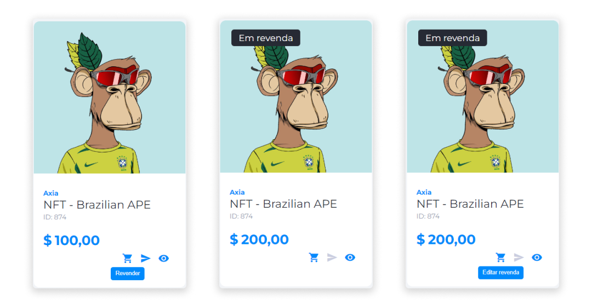
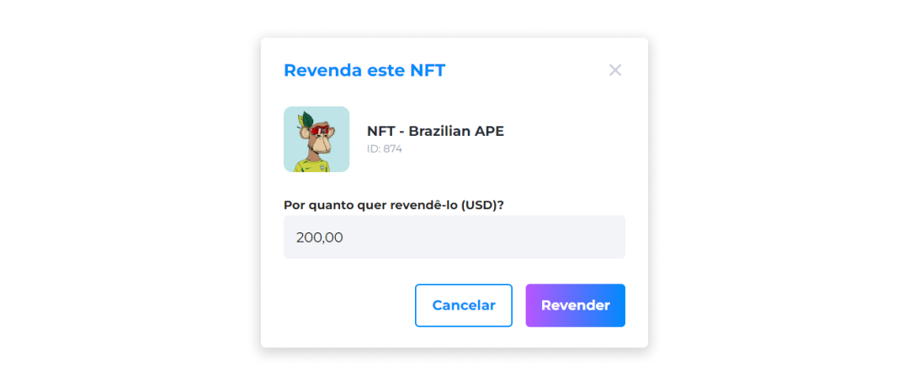
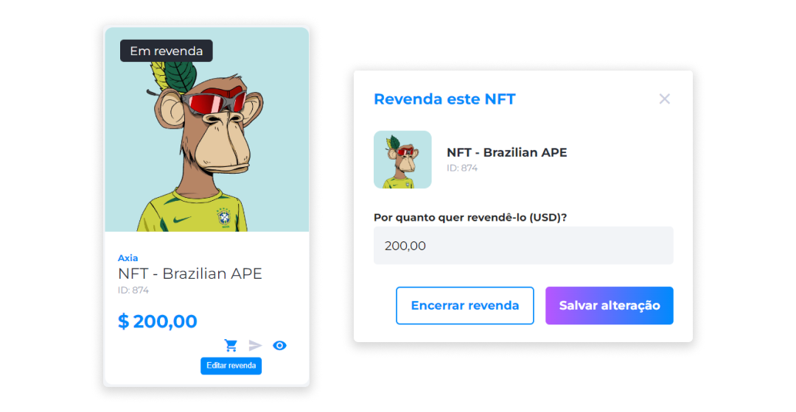

::: tip 🔐 Ativação da Licença <feature>NFT_RESALE</feature>
O conteúdo desta página é válido somente se a licença [<feature>**NFT_RESALE**</feature>](../about/licenses.md) estiver ativada.
:::

# Revenda de NFTs
Compradores que adquiriram NFTs na plataforma Axia Eniato podem revender seus NFTs através da página **Meus Ativos**. É possível estabelecer um novo valor para a revenda, porém, não será possível editar a descrição ou as fotos dos ativos.

::: warning ⚠️ <warningblocktitle>Atenção</warningblocktitle>
<warningblocktext>Para facilitar a venda e evitar possíveis fraudes, o nome do revendedor será exibido automaticamente nos detalhes do ativo, sem a possibilidade de editar ou remover.</warningblocktext>
:::

## Revender NFTs
Para revender um NFT:

1. Compre um NFT.
2. Na página **Meus Ativos**, escolha o NFT que deseja revender e clique no ícone **Revender**.
3. Insira o preço em moeda fiduciária.
4. Clique em **Revender**.

## Editar ou encerrar uma Revenda
1. Na página **Meus Ativos**, escolha um NFT em revenda e clique no ícone **Editar revenda**.
2. Altere o preço e clique em **Salvar alteração**.

3. Também é possível encerrar a revenda. Para executar esta ação, clique em **Encerrar revenda**.