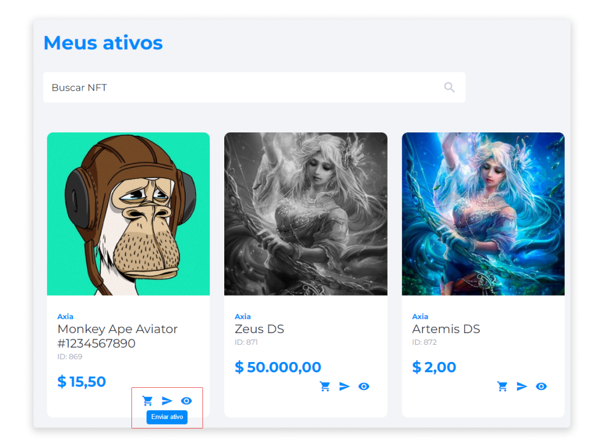
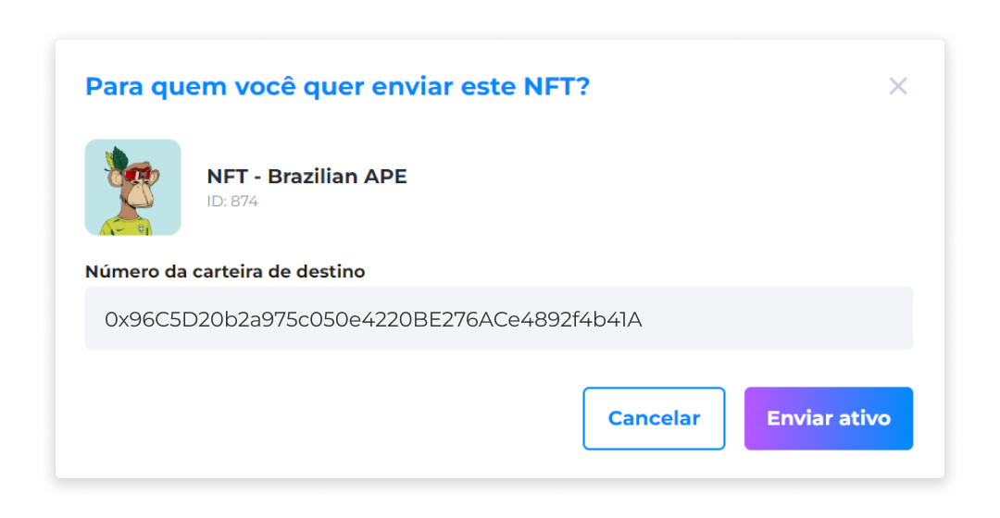

::: tip 🔐 Ativação da Licença <feature>SEND_NFT</feature>
O conteúdo desta página é válido somente se a licença [<feature>**SEND_NFT**</feature>](../about/licenses.md) estiver ativada.
:::

# Envio de NFTs
Quando adquiridos em conjunto, todos os produtos da Axia serão interligados. Sendo assim, a funcionalidade de enviar NFTs foi implementada para usuários que também possuem conta no **Axia Midas**, a carteira digital de compra, venda e envio de ativos, como NFTs ou tokens.

## Enviar NFTs
Para enviar NFTs:

1. No [menu de perfil](../profile/profile.md), clique em **Meus Ativos**.
2. Confira a lista com todos os NFTs e, através do ícone **Enviar ativo**, selecione o NFT que deseja enviar para alguém.
3. Insira a chave da carteira de destino que irá receber o ativo.
4. Confirme o contato de destino.

::: warning ⚠️ <warningblocktitle>Atenção</warningblocktitle>
<warningblocktext>O envio de NFTs não é uma ação de compra/venda. Ao enviar um NFT, você não recebe nenhum tipo de pagamento em troca. Para revender um NFT, você deve colocá-lo para</warningblocktext> [revenda](../nfts/nfts_resale.md).
:::