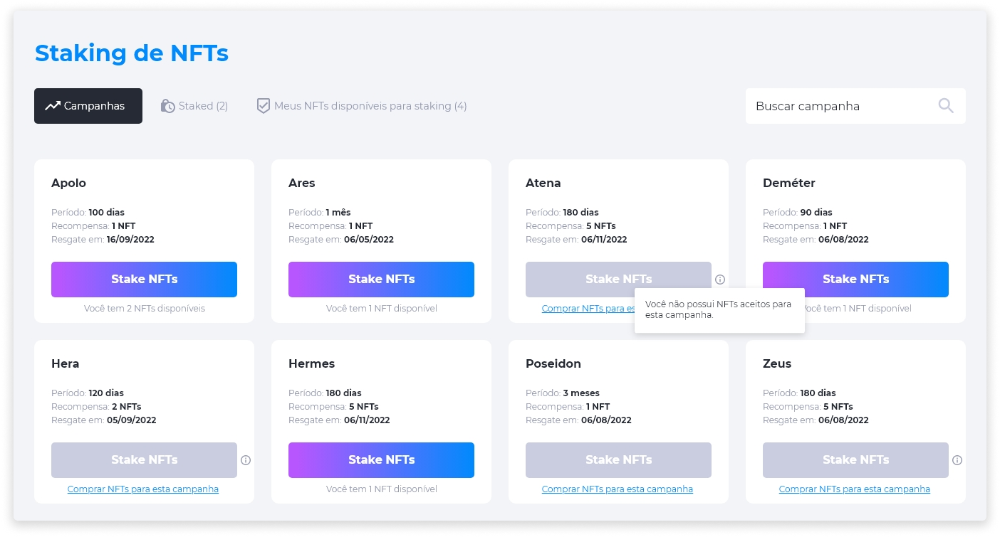
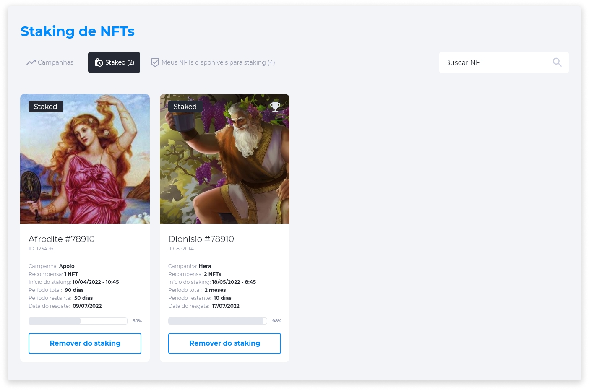
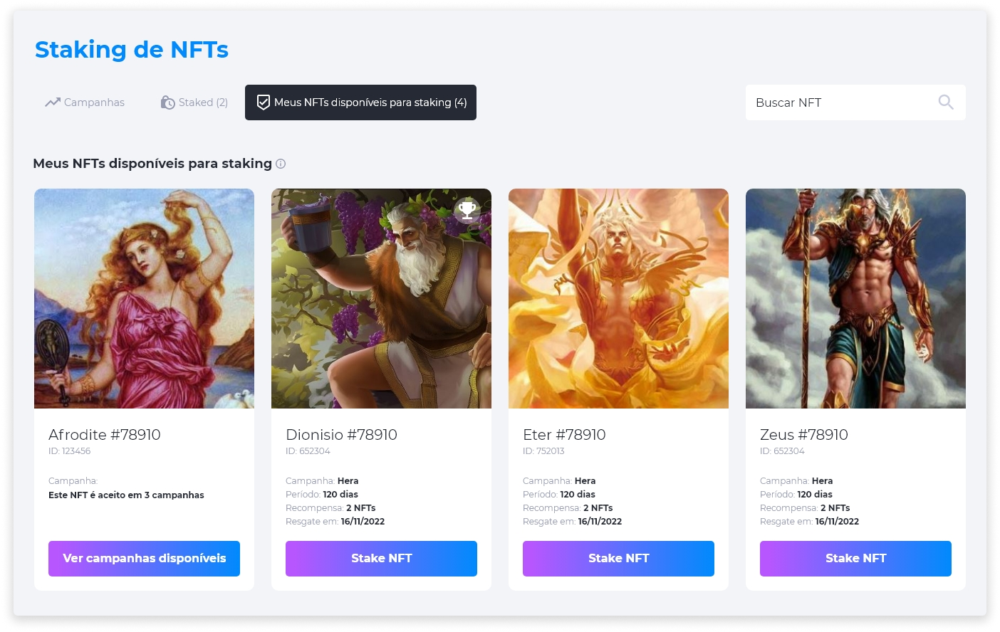

::: tip 🔐 Ativação da Licença <feature>STAKING_NFT</feature>
O conteúdo desta página é válido somente se a licença [<feature>**STAKING_NFT**</feature>](../about/licenses.md) estiver ativada.
:::

# Staking de NFTs
O Staking de NFTs irá ocorrer através de campanhas periódicas, que podem durar dias ou meses, podendo ter como recompensa um ou mais NFTs. É possível conferir todas as campanhas através da página **Staking de NFTs**, que pode ser acessada através do [menu de perfil](../profile/profile.md).

A página de Staking de NFTs possui um menu completo para o acesso de todas as informações necessárias para acompanhar o processo de staking como as **Campanhas**, **NFTs em Staking** e **NFTs disponíveis para Staking**.

## Campanhas
A aba **Campanhas** exibe todas as campanhas que estão disponíveis para o staking e as informações mais relevantes como o nome, período de duração, quantidade de recompensa e data de resgate (que é uma projeção baseada na data atual em que o usuário está visualizando a campanha). Além disso será exibida a quantidade de NFTs que o usuário tem disponível para participar. 

Cada campanha exige 1 NFT para participar, tendo como recompensa 1 ou mais NFTs. É possível participar de uma campanha com mais de 1 NFT, mas não será possível participar de mais de uma campanha com o mesmo NFT, ou seja, se um NFT entra em uma campanha, ele não poderá participar de outra até que a atual se encerre ou você retire o NFT da campanha atual.

::: info 💡 Habilitação de NFTs para Staking
As campanhas exigem NFTs específicos. Caso você não possua nenhum dos NFTs aptos a participar da campanha desejada, clique em **Comprar NFTs para esta campanha** para adquirir NFTs e habilitar sua participação na campanha de Staking.
:::

## Staked
Na aba **Staked** é possível visualizar todos os NFTs que estão em Staking atualmente e acompanhar seu progresso temporal. Cada NFT exibirá informações relevantes da própria campanha, como:

* Nome do NFT com foto.
* ID do NFT.
* Nome da campanha.
* Quantidade de NFTs para recompensa.
* Data e hora do início do Staking.
* Período total em que o NFT deve permanecer em staking.
* Período restante para o resgate de recompensa.
* Data do resgate da recompensa.
* Barra de progresso em porcentagem.
* Opção de remover o NFT do Staking.

::: danger ⚠️ <dangerblocktitle>Atenção</dangerblocktitle>
<dangerblocktext>Caso o NFT seja removido, a recompensa não poderá ser resgatada.</dangerblocktext>
:::

## NFTs disponíveis para Staking
Esta aba exibe todos os NFTs que você possui e que podem participar de uma campanha de Staking ativa.

::: warning ⚠️ <warningblocktitle>Atenção</warningblocktitle>
<warningblocktext>Caso um NFT esteja disponível para mais de uma campanha, será possível visualizar quais as opções antes de colocá-lo em Staking.</warningblocktext>
:::

::: warning ⚠️ <warningblocktitle>Atenção</warningblocktitle>
<warningblocktext>Os NFTs que estão em revenda não podem ser colocados em Staking.</warningblocktext>
:::

## Aplicar um NFT para Staking
No [menu de perfil](../profile/profile.md), clique na opção **Staking de NFTs**.

1. Selecione a campanha da qual deseja participar e clique em **Stake NFTs**.
2. Na página de detalhes da Campanha, selecione o NFT disponível que deseja aplicar para Staking e clique em **Stake NFT**.
3. Confirme se deseja aplicar o NFT na Campanha escolhida.
4. Após a confirmação do NFT em Staking, acesse a página **Staking de NFTs**, verifique os detalhes do Staking e acompanhe o processo de Staking através da aba **Staked**.