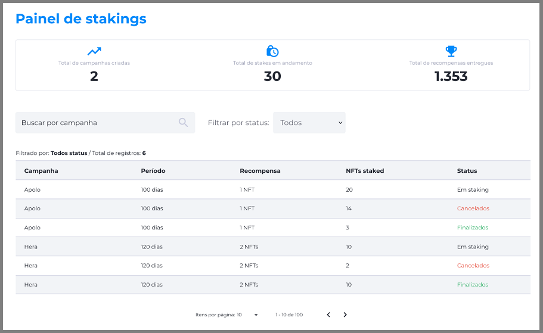

# Painel de Staking
O Painel de Staking exibe as informações de todas as campanhas, tanto as atuais quanto as finalizadas. O usuário com a permissão Administrador não poderá interferir em nenhuma campanha através do painel, já que todas as configurações são feitas diretamente na database do produto.

O objetivo do Painel de Staking é reunir informações e estatísticas para a empresa. Algumas informações que podem ser visualizadas no painel são:
* Número total de campanhas criadas.
* Número total de NFTs em staking.
* Número total de NFTs distribuídos como recompensa.
* Relação de campanha/status (em staking, cancelados, finalizados).

