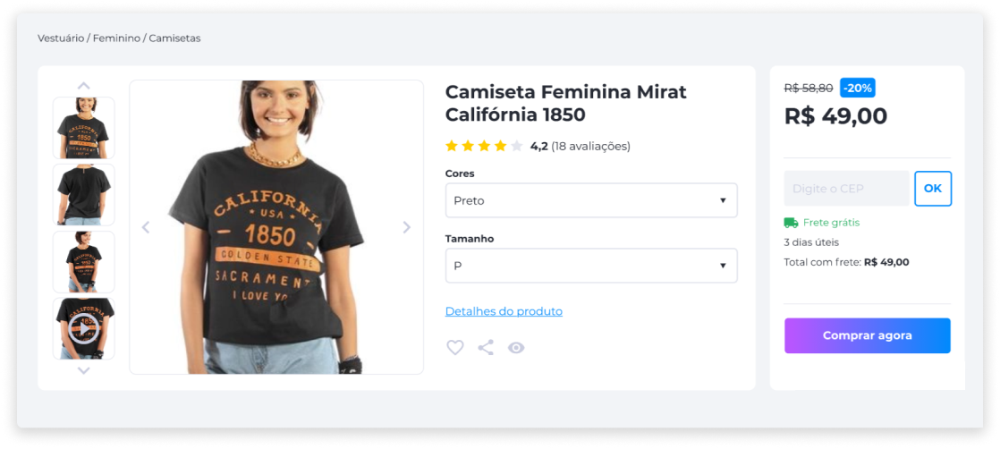
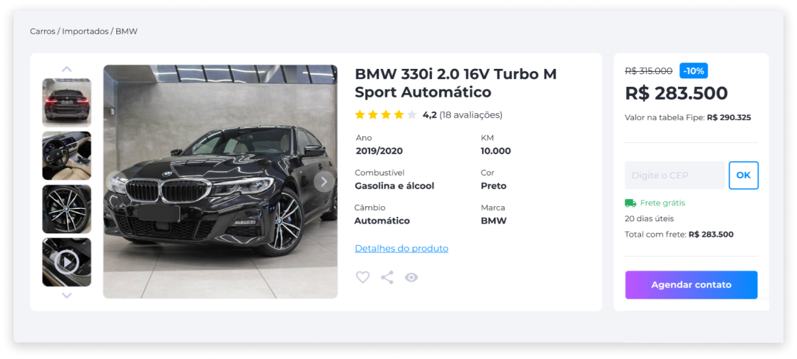
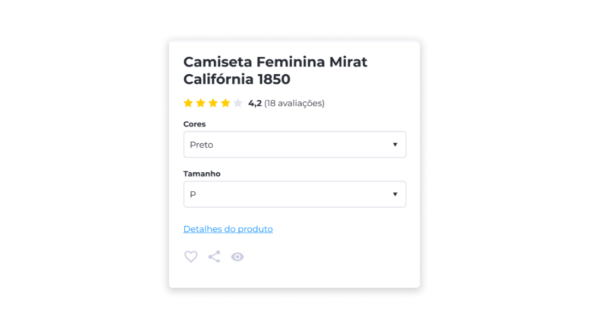
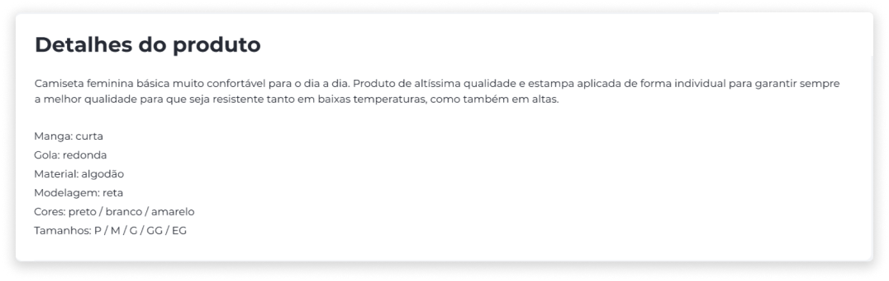

# Produtos
Os produtos à venda na loja podem ser classificados de duas maneiras: Produtos Compráveis e Produtos Anunciados.

## Produtos Compráveis
São produtos que estão cadastrados no sistema para serem vendidos, portanto, terão um preço e gerenciamento de estoque.

## Produtos Anunciados
São produtos que estão cadastrados no sistema para serem apenas anunciados e expostos na plataforma. Porém, não serão vendidos na hora, e por este motivo, não há gerenciamento de estoque.

A venda será negociada após o cliente demonstrar interesse pelo produto através do site.

### Descrição do Produto
Tanto nos produtos compráveis como nos anunciados, a exibição principal do produto apresenta as seguintes informações:

- Nome
- Especificações de acordo com o tipo do produto (cor, tamanho, ano, marca etc.)

### Detalhes do Produto
Abaixo da exibição principal, os detalhes informam ao usuário sobre características mais específicas do produto. Os detalhes vão variar de acordo com as características flexíveis que foram atribuídas ao produto.

