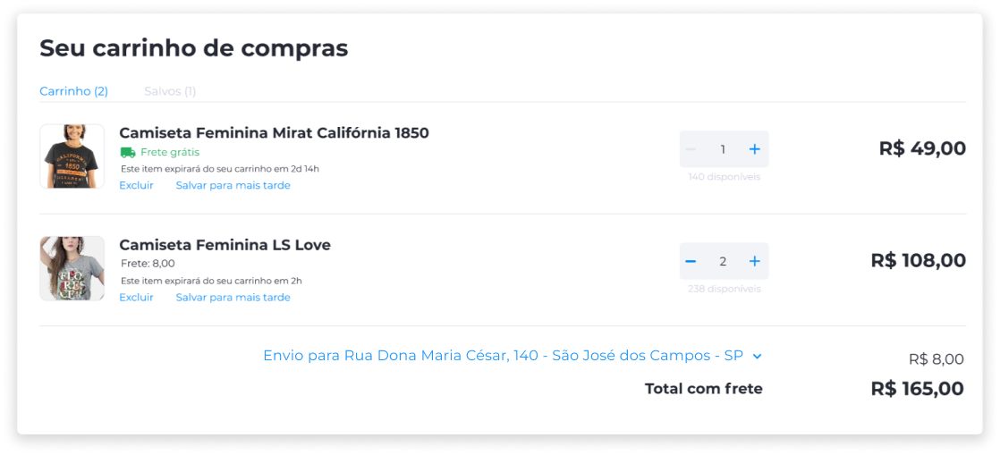
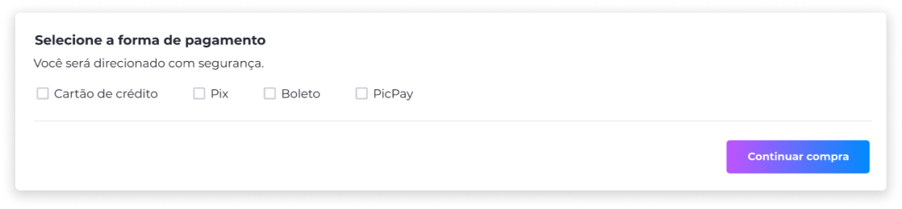

# Comprar um produto
As operações comerciais realizadas por meio do Kairos possibilitam o processo de compra e venda através de tokens. Com esta funcionalidade, as lojas podem abrir as portas para o mundo das criptomoedas, que têm conquistado mais espaço e reconhecimento a cada dia.

O pagamento por token pode ser realizado por compradores que venderam uma conversão de crédito no site, ou qualquer outro comprador que possua os tokens que a loja irá aceitar. Será possível consultar o saldo de tokens no site, que irá exibir também a conversão do valor em moeda fiduciária e a cotação do dia em tempo real.

Para proporcionar segurança e conforto ao comprador, em todas as etapas do processo de compras serão exibidos os valores em tokens e os valores em moeda fiduciária. Assim, o cliente saberá a todo tempo o valor exato que estará gastando, sem precisar recorrer a sites de conversão.

## Meios de Pagamento
Os meios de pagamento válidos podem ser utilizados com os ativos disponíveis na conta do cliente, caso sejam aceitos como forma de pagamento na loja.

Na efetuação de pagamento, são admitidos dois principais meios de pagamento: meios tradicionais fiduciários e tokens.

### Tradicionais
Dependendo das preferências e necessidades da empresa, são viabilizados diversos meios de pagamento tradicionais.

#### Cartão de Crédito
Amplamente utilizado em operações comerciais, o pagamento por meio de cartão de crédito oferece muitas possibilidades ao cliente. Uma delas é a variedade de serviços de pagamento que existem atualmente.

No Kairos, as operadoras de pagamento disponíveis para integração com a plataforma são Cielo e PagSeguro.
  

#### PIX
O PIX permite a transferência de dinheiro entre contas de forma instantânea e sem custo, 24 horas por dia, todos os dias da semana, incluindo finais de semana e feriados.

Pode ser utilizado para fazer transferências entre contas de diferentes bancos e instituições financeiras, além de permitir o pagamento de compras por meio de um QR Code gerado pela loja.
  

#### Boleto
Por meio da emissão de boleto bancário, o cliente pode efetuar o pagamento em qualquer agência bancária, lotérica ou através de aplicativos de pagamento.

Com ampla aceitação no mercado, o boleto é um meio de pagamento seguro, além de ser uma boa opção para lojas que desejam oferecer uma forma de pagamento simples e sem os custos das taxas de cartões de crédito ou débito.
  

#### PicPay
O PicPay é uma opção interessante para clientes que buscam uma forma de pagamento simples, segura e amplamente aceita para compras em lojas virtuais, e oferece diversas camadas de proteção para as transações, como a validação biométrica, o uso de tokenização para proteger os dados do cartão.
  

### Tokens
No Kairos, além dos meios tradicionais, é possível efetuar pagamentos a partir de dois mecanismos Blockchain:
  

#### Moedas cadastradas
Mecanismo de cadastro de moedas que pertencem às redes EVM. É integrado ao Kairos e aceita todas as moedas listadas na ChainList.
  

#### CoinPayments BTC
O CoinPayments é um mecanismo de processamento de pagamentos em BTC. O Axia Kairos suporta a integração com o CoinPayments. Para estabelecer esta integração, é necessário que você possua acesso próprio na plataforma CoinPayments com BTC ativado como moedas aceitas, e tenha suas próprias chaves.

Durante o checkout, para efetuar o pagamento por meio do CoinPayments, selecione BTC como forma de pagamento. Você será redirecionado para a plataforma CoinPayments. O pagamento será validado por um agendador que será executado a cada 30 minutos.