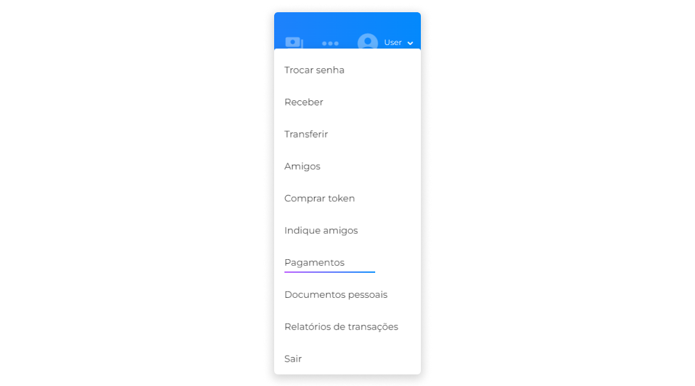
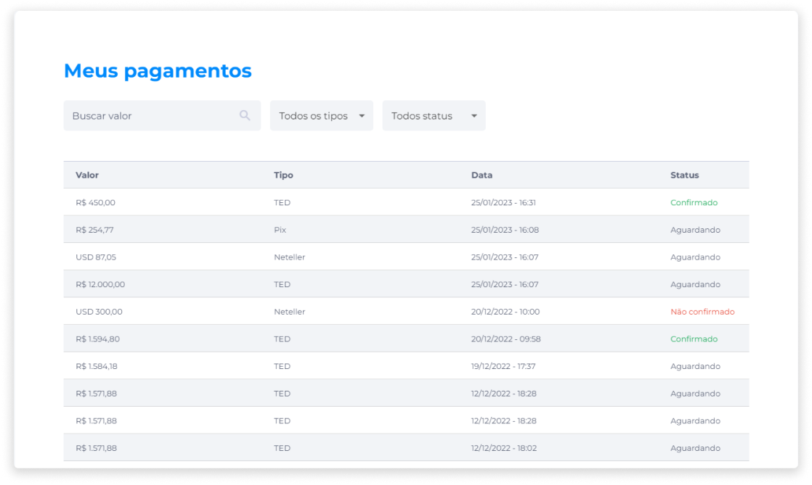

# Pagamentos
A tela de pagamentos fornece os detalhes necessários para consultas sobre todas as transações fiduciárias realizadas. Através do menu Perfil, o usuário pode acessar a opção **Pagamentos** para consultar todos os pagamentos efetuados por meio da carteira digital.

Na área **Meus Pagamentos**, a lista informa os dados sobre Valor, Tipo, Data e Status de pagamentos efetuados.

Também é possível localizar pagamentos específicos através dos filtros disponíveis, como busca pelo valor, por Tipo (PIX, TED, Neteller) ou por Status do pagamento (Confirmado, Não Confirmado, Aguardando).