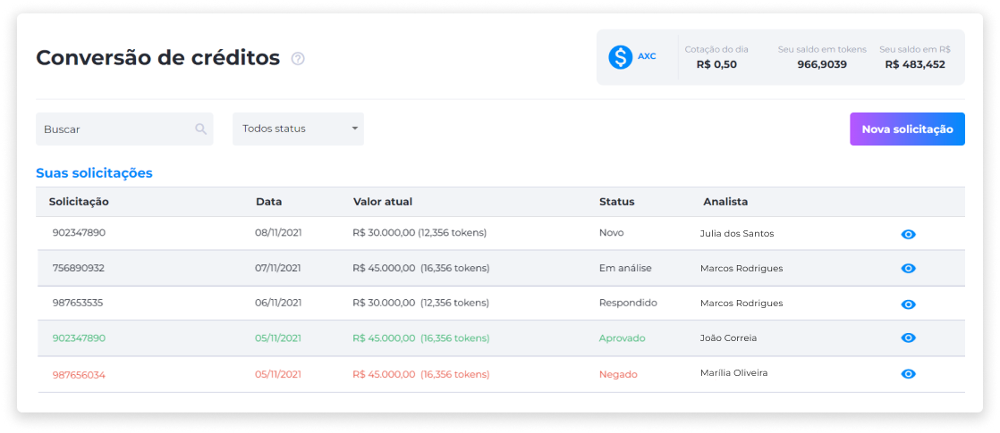
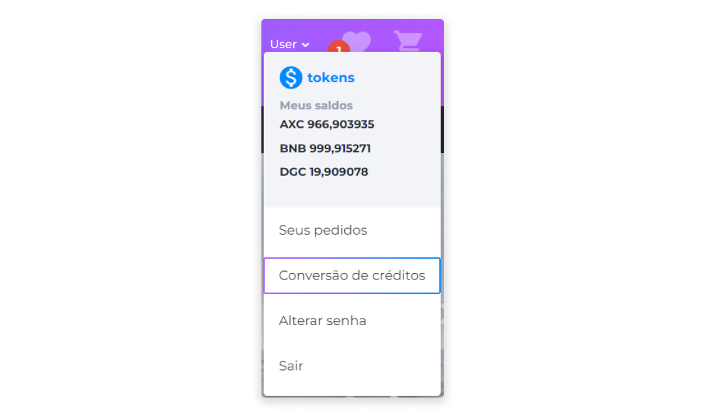
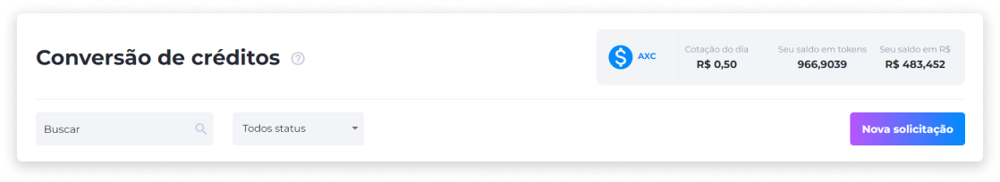
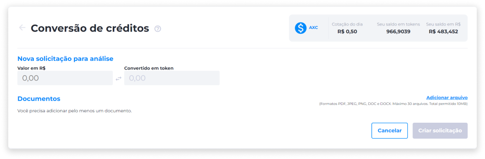
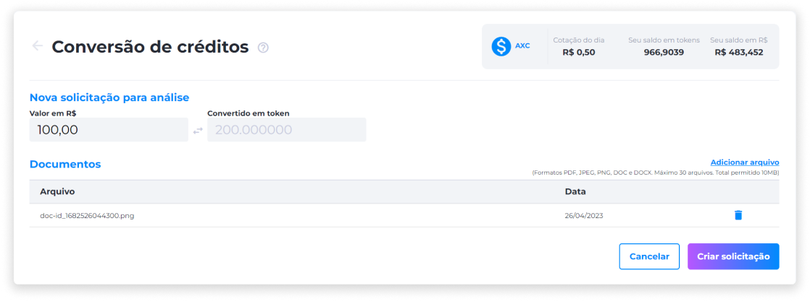

# Conversão de Créditos
Em operações comerciais, a conversão de crédito é um instrumento financeiro que garante o pagamento a um vendedor em nome do comprador.

É possível fazer conversão de créditos através de lojas que possuam esta funcionalidade.

Os usuários que desejem vender conversões de crédito podem acessar o site e fazer uma proposta de venda em troca de tokens. Neste caso, os tokens pertencem à própria empresa, que irá utilizá-los como uma forma de crédito para ser usado na loja ou em outros lugares que aceitem aquele token.

Caso haja uma oferta diferente, existe a possibilidade de o operador sugerir outro valor para o vendedor. Neste caso, o operador fará uma proposta e o vendedor poderá aceitar ou negar. Toda proposta é encerrada assim que o operador ou o vendedor aceitam ou negam uma venda/proposta.

Os tokens adquiridos ficarão armazenados na conta do usuário que vendeu a conversão de crédito. Assim, ele poderá gastar seus tokens a partir da própria conta.

Caso o usuário queira vender ou transferir esse tokens, é necessário que ele possua uma carteira digital, como por exemplo o Midas, que facilita na gestão segura de tokens para compras, vendas e transferências.

O usuário pode fazer multiplas solicitações de conversão de crédito diferentes. Para solicitar uma venda de conversão de crédito, é necessário ter uma conta na loja.

Para acessar a área de conversões de crédito, basta acessar o menu [Perfil](../profile/profile.md).

A área de Conversões de Crédito exibe o histórico de todas as solicitações feitas pelo usuário, a cotação do dia, o saldo em tokens e o saldo em moeda fiduciária.

A lista de solicitações inclui:

- ID da solicitação
- Data da solicitação
- Valor solicitado
- Status da solicitação
- Nome do analista

## Solicitação de Conversão de Créditos
Para criar uma nova solicitação de conversão de créditos:

1. Através do menu Perfil, clique na opção **Conversão de Créditos**.

2. Clique em **Nova Solicitação**.

3. Insira o valor em moeda fiduciária. O valor convertido em token será preechido automaticamente com base na cotação do dia.

4. Adicione os documentos requeridos pela loja.

::: info ⚙️ <infoblocktitle>Especificações de Documentos</infoblocktitle>
 
<infoblocktext>- <b>Formatos aceitos</b>: PDF, JPEG, PNG, DOC e DOCX. 
- <b>Quantidade máxima</b>: 30 arquivos. 
- <b>Total permitido</b>: 10MB.</infoblocktext>
:::

5. Clique em **Criar Solicitação**.

::: warning ⚠️ <warningblocktitle>Atenção</warningblocktitle>
<warningblocktext>Enquanto o status da solicitação estiver <b>Em Análise</b>, não será possível enviar documentos.</warningblocktext>
:::