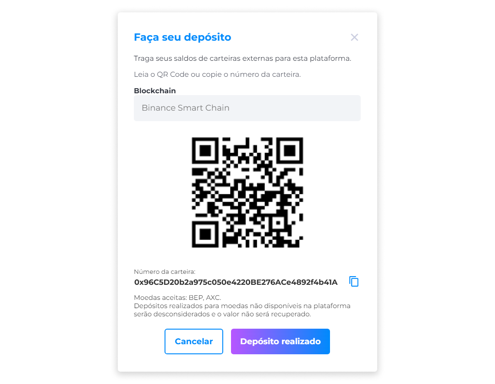

::: tip 🔐 Ativação da Licença <feature>DEPOSITS_HANDLING</feature>
O conteúdo desta página é válido somente se a licença [<feature>**DEPOSITS_HANDLING**</feature>](../about/licenses.md) estiver ativada.
:::

# Depósitos
Na página de depósitos, é possível visualizar o histórico de todos os depósitos realizados.

## Realizar um Depósito
Para realizar um depósito:

1. Insira o valor desejado e clique em **Gerar QRcode**.
2. Abra o aplicativo de seu banco e escaneie o QRcode.
3. Clique em **Depósito realizado**.
4. Aguarde a confirmação do pagamento.

::: warning ⚠️ <warningblocktitle>Atenção</warningblocktitle>
<warningblocktext>Os depósitos realizados para moedas não disponíveis na plataforma serão desconsiderados e o valor não será recuperado.</warningblocktext>
:::