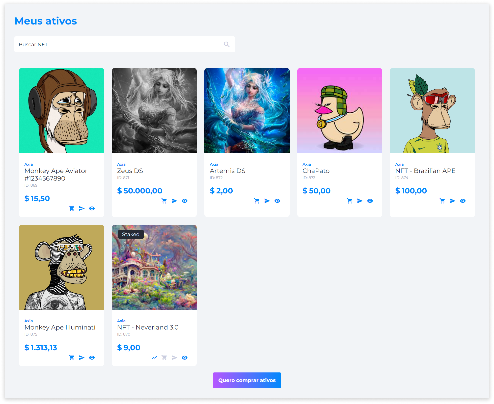

# Meus Ativos
A página **Meus Ativos** reúne todos os ativos que foram adquiridos por meio de [compra](../nfts/nfts_purchase.md) ou recebidos de outros usuários por meio de [<feature><🔐 **SEND_NFT**</feature>](../about/licenses.md) [envio de NFTs](../nfts/nfts_sending.md) [<feature>**SEND_NFT**></feature>](../about/licenses.md).

A partir dela, é possível visualizar os detalhes de cada NFT e selecionar um ativo diretamente para realizar ações de [<feature><🔐 **NFT_RESALE**</feature>](../about/licenses.md) [revenda](../nfts/nfts_resale.md) [<feature>**NFT_RESALE**></feature>](../about/licenses.md) e [<feature><🔐 **SEND_NFT**</feature>](../about/licenses.md) [envio](../nfts/nfts_sending.md) [<feature>**SEND_NFT**></feature>](../about/licenses.md).

Nesta página, o usuário também pode realizar a compra de novos ativos através do botão **Quero comprar ativos**.