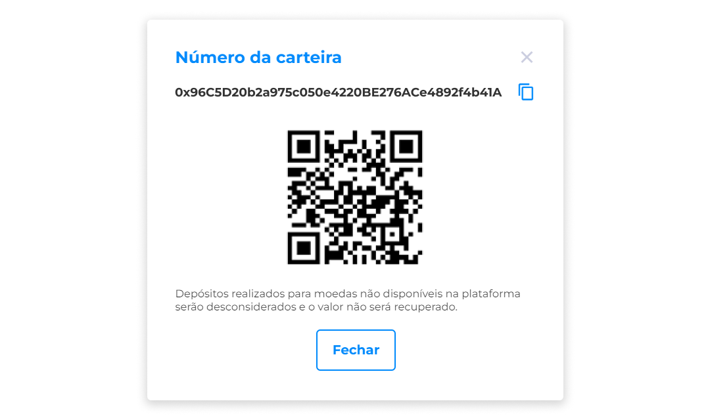

# Minha Carteira
A partir da criação da conta no Axia Eniato, é disponibilizada para o usuário a carteira com um número único, o qual também pode ser escaneado pelo QR Code exibido na tela.

::: warning ⚠️ <warningblocktitle>Atenção</warningblocktitle>
<warningblocktext>Os depósitos realizados para moedas não disponíveis na plataforma Eniato serão desconsiderados e o valor não será recuperado.</warningblocktext>
:::