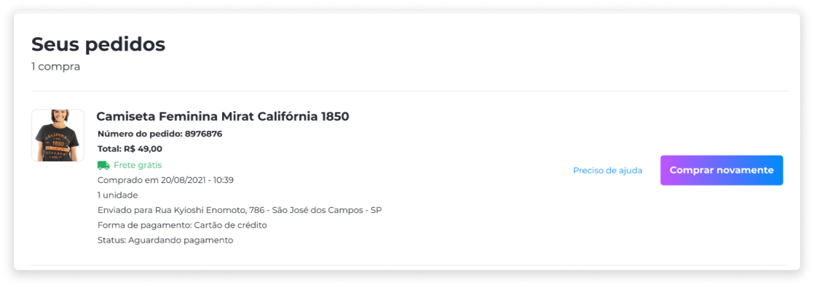

# Pedidos
O histórico de pedidos registra todas as compras efetuadas pelo cliente da loja e todas as informações referentes ao pedido. Assim, o comprador terá a informação sobre os produtos adquiridos e valores gastos na loja, além de conseguir monitorar suas compras, caso alguém efetue uma compra indevida em sua conta.

A partir do histórico, também é possível repetir uma compra que já foi efetuada anteriormente. Para isso, basta clicar em **Comprar novamente** e serão adicionados ao carrinho de compras todos os produtos que foram incluídos na primeira compra do pedido selecionado.

Caso ocorra algum problema no pedido, clique em **Preciso de ajuda** e envie uma mensagem para o suporte da loja.