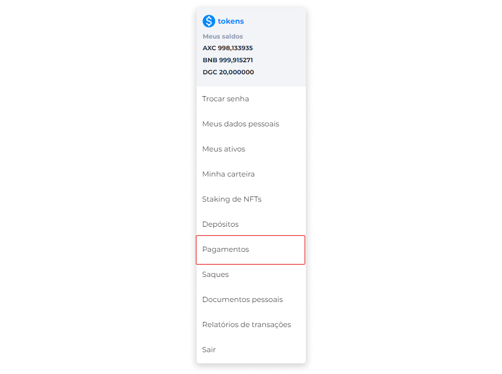
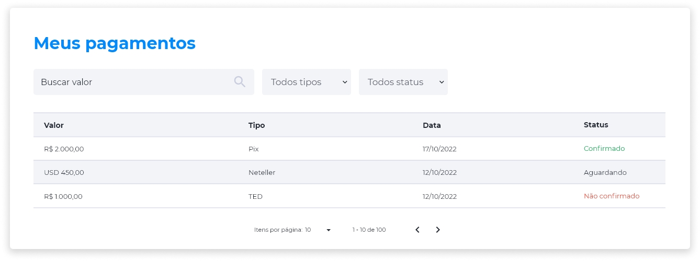

::: tip 🔐 Ativação da Licença <feature>FIAT_DEPOSITS</feature>
O conteúdo desta página é válido somente se a licença [<feature>**FIAT_DEPOSITS**</feature>](../about/licenses.md) estiver ativada.
:::

# Pagamentos
A tela de pagamentos fornece os detalhes necessários para consultas sobre todas as transações fiduciárias realizadas. Para visualizar seus pagamentos efetuados em moeda fiduciária, no menu **Perfil**, clique na opção **Pagamentos**.

Na página **Meus Pagamentos**, a lista exibe informações sobre Valor, Tipo, Data e Status de pagamentos efetuados.

Também é possível localizar pagamentos específicos através dos filtros disponíveis, como busca pelo valor, pelo tipo ou status do pagamento.