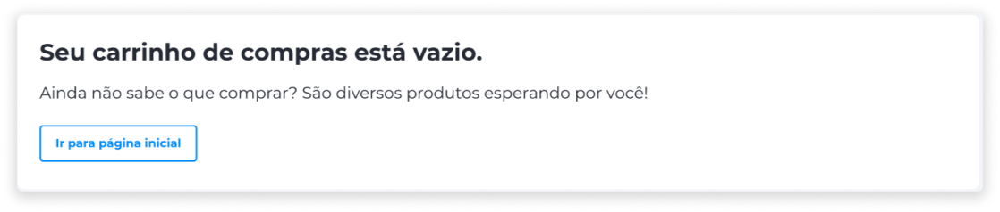
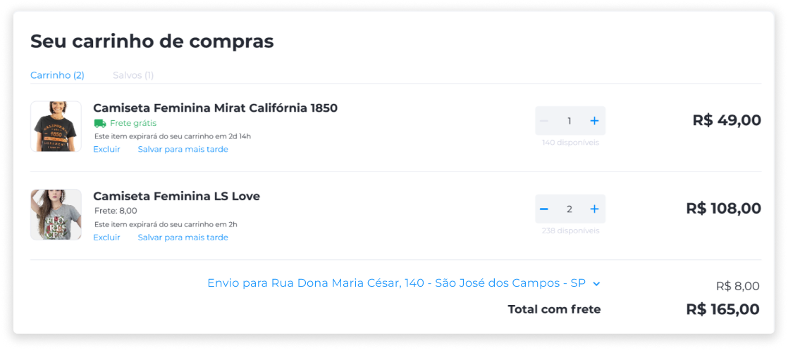
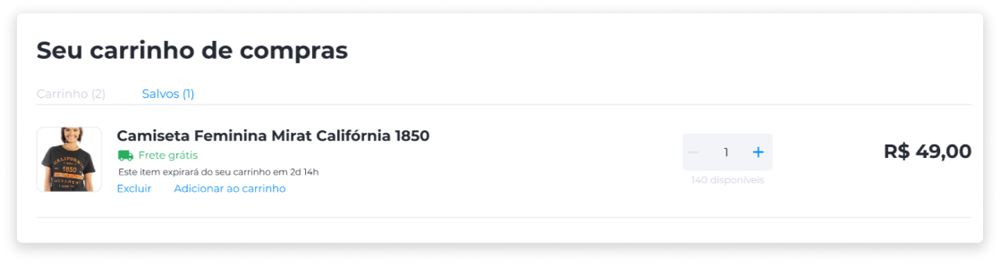
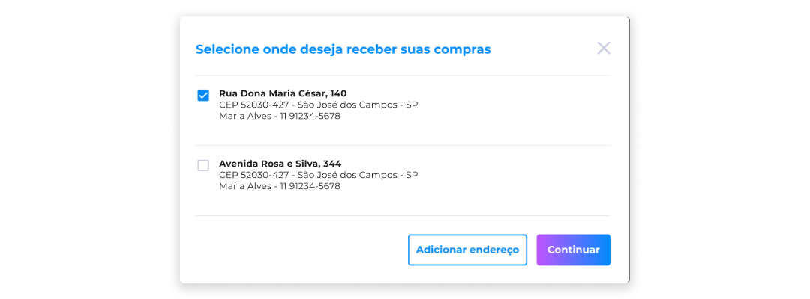
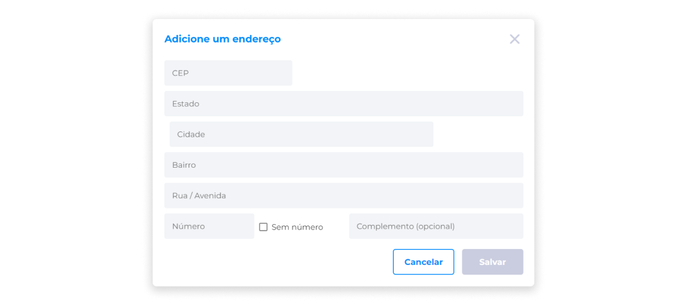
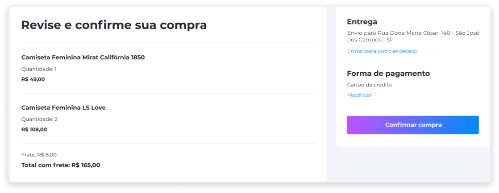

# Carrinho de Compras
O carrinho de compras do Kairos possui um funcionamento simples e semelhante a outros e-commerces e marketplaces existentes.

Ao adicionar um produto no carrinho, o cliente pode escolher entre ir para o carrinho e finalizar a compra, ou continuar navegando pela loja à procura de mais produtos.

Além disso, caso o cliente ainda não tenha certeza da compra, é possível salvar um carrinho com produtos específicos.

Quando o produto é adicionado ao carrinho, ele é retirado do estoque, pois assim não haverá conflito caso haja mais compradores do que produtos disponíveis.

Os produtos que estiverem no carrinho, salvos ou não, têm um limite de tempo para expirar, o qual é estabelecido pela loja. 

Caso haja mais de um endereço cadastrado, o cliente poderá escolher em qual endereço o produto deverá ser entregue.

Se o endereço do cliente não estiver cadastrado, ele terá a opção de cadastrar na hora da compra.

Antes da finalização da compra, será exibida uma tela com todas as informações da compra, onde o cliente poderá revisá-las e corrigir, caso seja necessário.

Após a conclusão da compra, será exibida a mensagem de confirmação.

