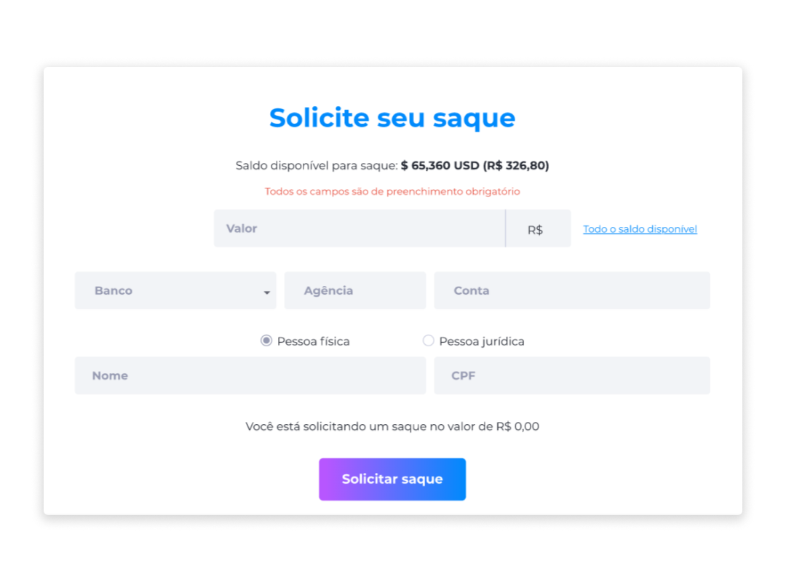
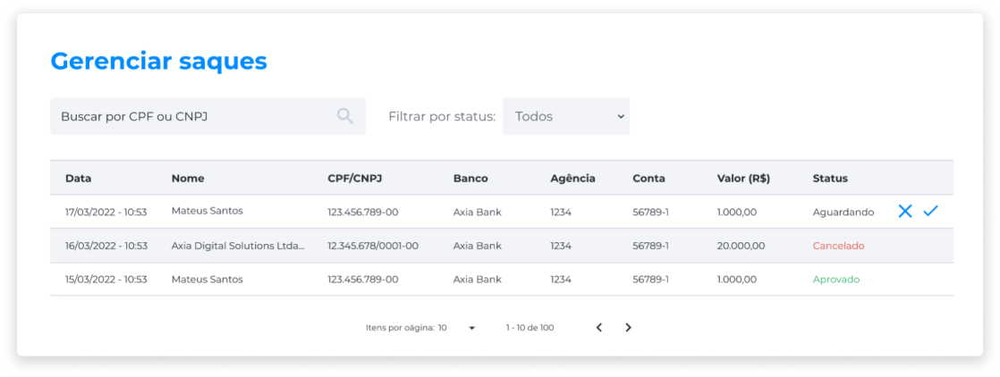

::: tip 🔐 Ativação da Licença <feature>WITHDRAWAL_HANDLING</feature>
O conteúdo desta página é válido somente se a licença [<feature>**WITHDRAWAL_HANDLING**</feature>](../about/licenses.md) estiver ativada.
:::

#  Saques
Saques podem ser realizados se o usuário possuir, em moeda fiduciária, o valor necessário para realizar a transação. O valor mínimo para o saque pode não existir, ou variar de acordo com o que a empresa contratante desejar.

Na página de saques, também é possível visualizar o histórico de todos os saques realizados.

## Realizar um Saque
Para realizar um saque:

1. Abra a página de solicitação de saque.
2. Insira o valor em moeda fiduciária.
3. Informe o banco, a agência e o número da conta.
4. Selecione se a conta é Pessoa Física ou Pessoa Jurídica.
5. Insira o nome completo e o CPF ou CNPJ.
6. Clique em **Solicitar saque**.

## Gerenciamento de Saques
O gerenciamento de saques possui as informações sobre todos os saques solicitados e o status de cada um. Ao receber uma solicitação, o usuário com a [permissão Administrador](../account/account_permissions.md#administrador) deve avaliar se a solicitação é valida. Se for, ele deverá realizar a transferência manualmente.

Após a confirmação de que a transferência foi realizada, o usuário Administrador deve marcar o novo status como **Aprovado**.

Se por algum motivo a solicitação não for aceita, ou ocorrer algum erro na transferência, o usuário Administrador deve marcar o novo status como **Cancelado**.