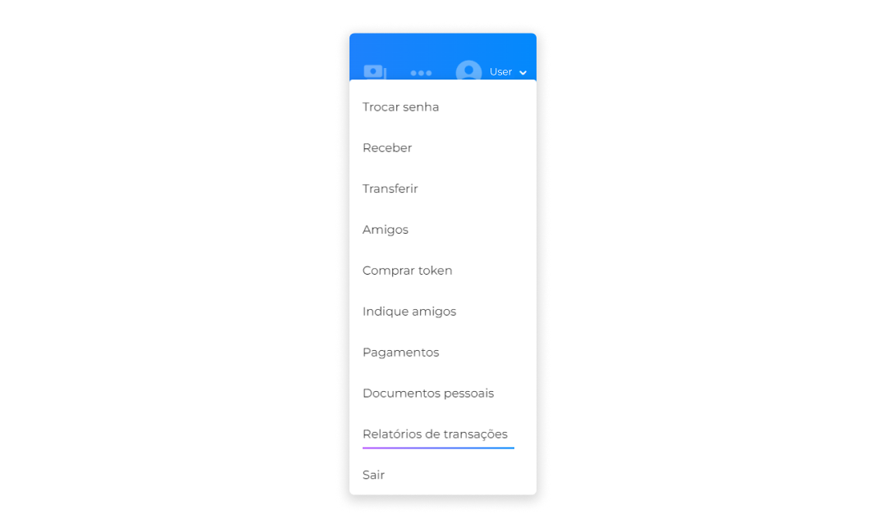
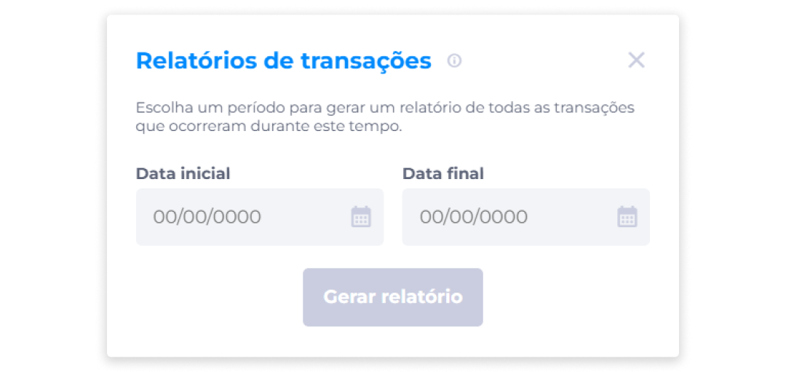
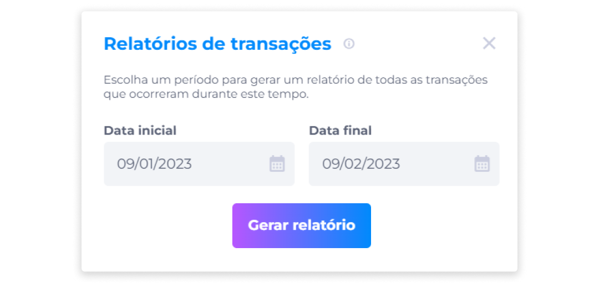

# Relatório de Transações
O relatório de transações reúne dados sobre as transferências de cada usuário, e contém informações referentes apenas sobre transações de compra e venda de tokens.

Ao gerar o relatório, você terá acesso aos seguintes dados da transação:

- Tipo.
- Nome e número do documento.
- Criptomoeda.
- Valor da criptomoeda.
- Preço em Reais (R$).
- Taxa de Serviço.
- Carteira.

::: info ℹ️ <infoblocktitle>Info</infoblocktitle>
<infoblocktext>Os relatórios de transações são referentes à Instrução Normativa ou IN 1888/2019, que institui e disciplina a obrigatoriedade de prestação de informações relativas às operações realizadas com criptoativos à Secretaria Especial da Receita Federal do Brasil.</infoblocktext>
:::

Para acessar o relatório de transações, siga as instruções abaixo:

1. No menu Perfil, clique em **Relatórios de Transações**.

2. Insira uma data inicial.
3. Insira uma data final.

4. Clique em **Gerar relatório**.

Em seguida, um arquivo de extensão .txt será baixado em seu dispositivo. Clique no arquivo para visualizar o relatório.

::: warning ⚠️ <warningblocktitle>Atenção</warningblocktitle>
<warningblocktext>A data inicial a ser selecionada deve ser configurável durante a instalação, correspondendo à data em que a versão com a feature foi instalada no ambiente do cliente (administrador). </warningblocktext>

> <warningblocktext><b>Exemplo</b>: Caso a instalação da versão da feature tenha sido realizada na data 01/01/2020, o administrador não poderá tentar gerar o relatório com dados de períodos anteriores a esta data (01/01/2020), mas somente a partir da data em que a versão da feature foi instalada.</warningblocktext>
:::