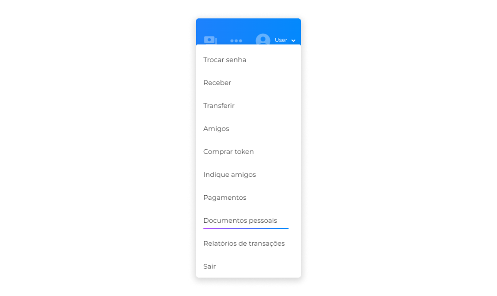
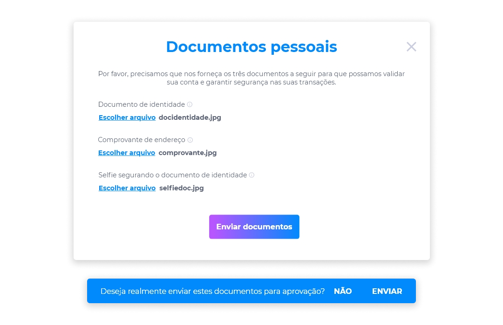
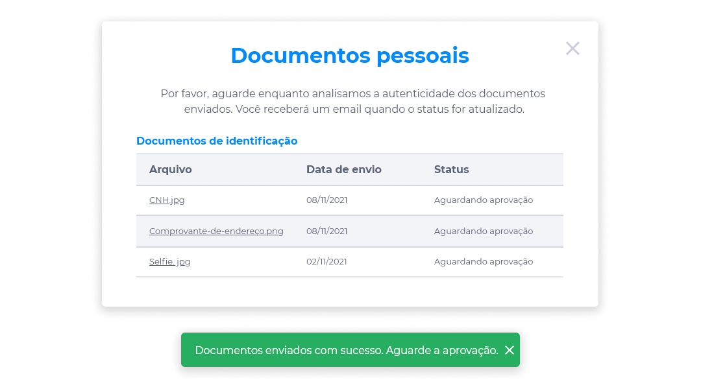
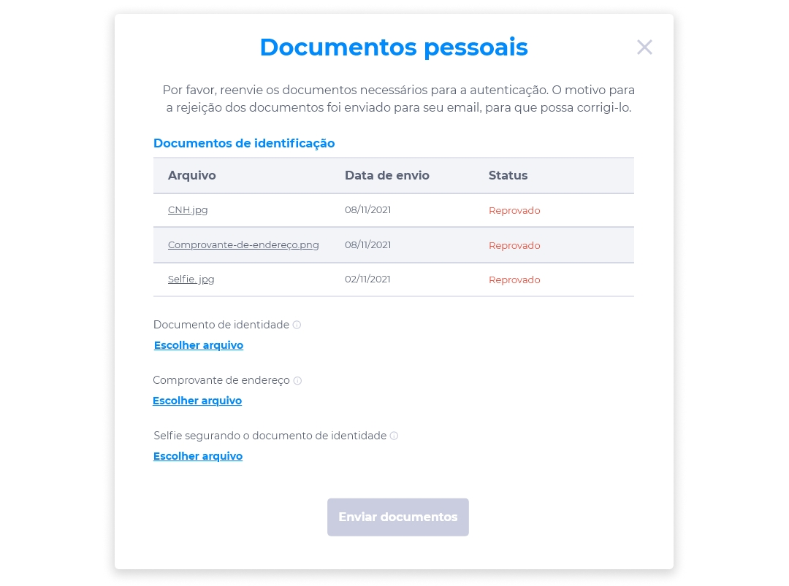
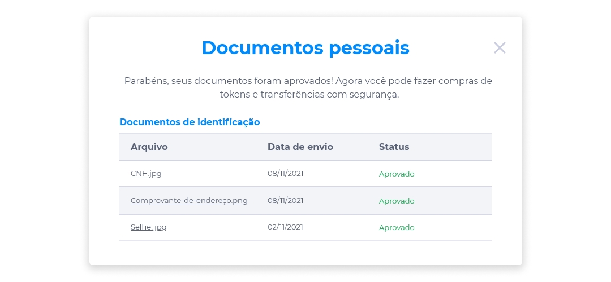

# Documentos Pessoais
::: tip 🔐 Ativação da Licença <feature>USER_KYC</feature>
O conteúdo desta seção é válido somente se a licença [<feature>**USER_KYC**</feature>](../about/licenses.md) estiver ativada.
:::

O envio de documentos pessoais é uma medida de segurança que valida a autencidade da conta e torna as transações mais seguras.

No Midas, é necessário que o usuário forneça os três documentos pessoais solicitados para manter sua conta segura e realizar transações de compra de tokens.

Para realizar o envio de seus documentos pessoais:

1. No menu Perfil, clique na opção **Documentos Pessoais**.

2. Envie em anexo os seguintes documentos:
    - Documento de Identidade.
    - Comprovante de Endereço.
    - Selfie segurando o Documento de Identidade.

::: warning ⚠️ <warningblocktitle>Atenção</warningblocktitle>
<warningblocktext>A plataforma irá admitir o envio de apenas um arquivo para cada tipo de documento. Estes arquivos devem atender às seguintes especificações:</warningblocktext>

> <warningblocktext><b>Formatos</b>: PDF, PNG, JPEG e JPG. <b>Tamanho máximo permitido</b>: 10 MB.</warningblocktext>
:::

3. Após anexar todos os documentos solicitados, clique em **Enviar documentos**.
4. Confirme se realmente deseja enviar os documentos para aprovação.

Por meio da opção **Documentos Pessoais**, o usuário poderá sempre acompanhar o andamento da análise de seus documentos, a qual receberá os seguintes status: Aguardando aprovação, Aprovado ou Reprovado.

### Aguardando aprovação
Após o envio de todos os arquivos, os documentos serão submetidos a uma análise de autenticidade, recebendo o status **Aguardando aprovação** até que o processo seja concluído.

### Reprovado
Se os documentos enviados receberem o status **Reprovado**, o motivo da não aprovação será informado através de seu e-mail para que os erros sejam corrigidos, sendo necessário o reenvio dos documentos para uma nova análise de autenticidade.

### Aprovado
Se após a análise os seus documentos receberem o status **Aprovado**, basta prosseguir com a realização das compras de tokens e transferências normalmente.

