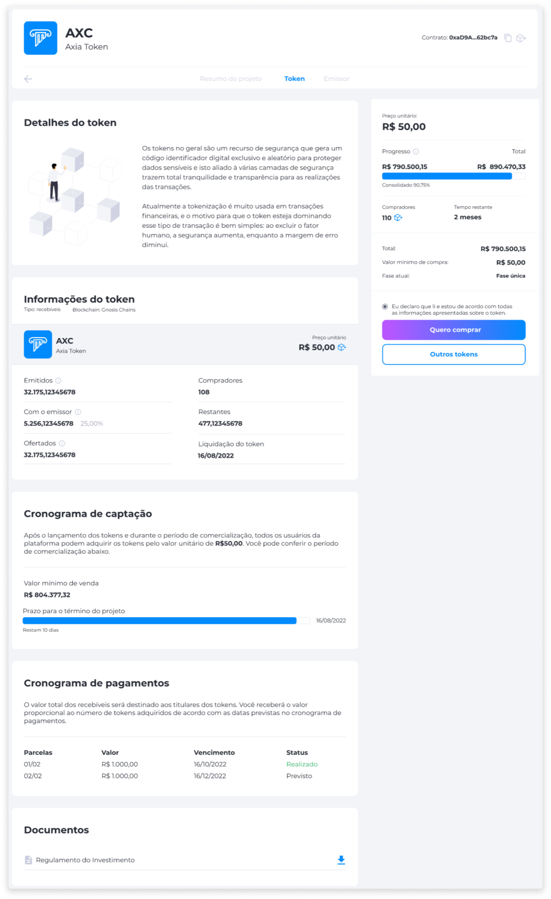

# Tokens
Os tokens são um recurso de segurança que gera um código identificador digital exclusivo e aleatório para proteger dados sensíveis, e isto aliado a várias camadas de segurança que proporcionam total tranquilidade e transparência para a realização das transações.

Atualmente, a tokenização é muito usada em transações financeiras, e o motivo para que o token esteja dominando este tipo de transação é bem simples: ao excluir o fator humano, a segurança aumenta, enquanto a margem de erro diminui.

Além da compra e venda, existem diversas funcionalidades para um token dentro do Eniato. Há a possibilidade de tokens de recompra (pela própria empresa), [<feature><🔐 **METAMASK**</feature>](../about/licenses.md) transações pela MetaMask [<feature> **METAMASK**></feature>](../about/licenses.md) e [<feature><🔐 **STAKING_NFT**</feature>](../about/licenses.md) Staking [<feature> **STAKING_NFT**></feature>](../about/licenses.md). Nem todos os tokens terão todas as funcionalidades disponíveis, e isso irá depender do token e da empresa.

Nas páginas de cada token, você encontra todas as informações necessárias para adquirir o token que estiver visualizando, desde o contrato na Blockchain até a quantidade de usuários que compraram o token.

Veja a seguir uma lista detalhada de informações:

* Contrato na Blockchain
* Preço unitário
* Quantidade ofertada
* Quantidade de tokens emitidos
* Quantidade de compradores
* Tempo restante de compra e venda
* Documentos

