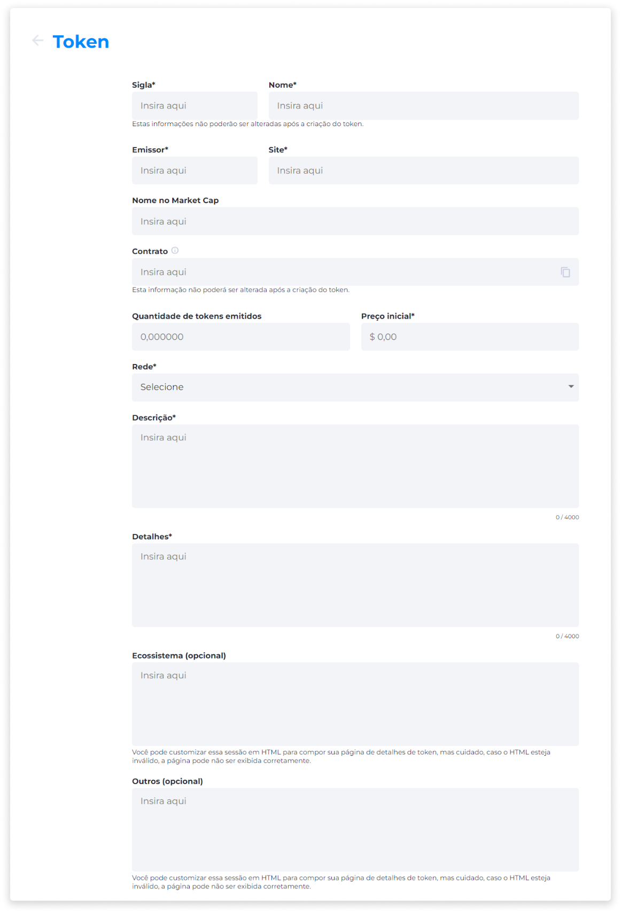
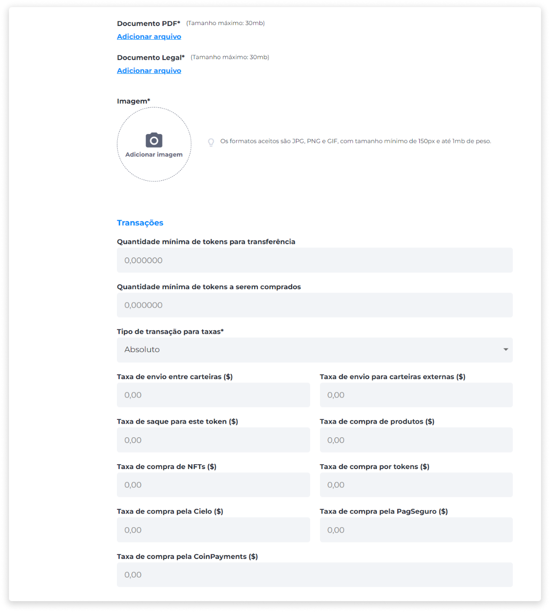
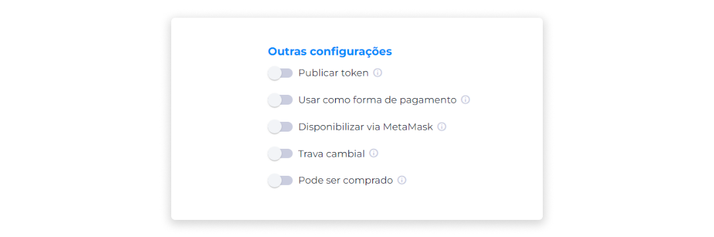
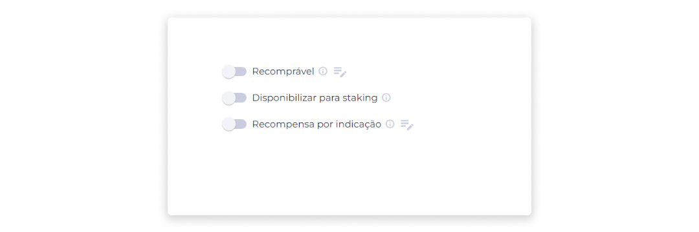
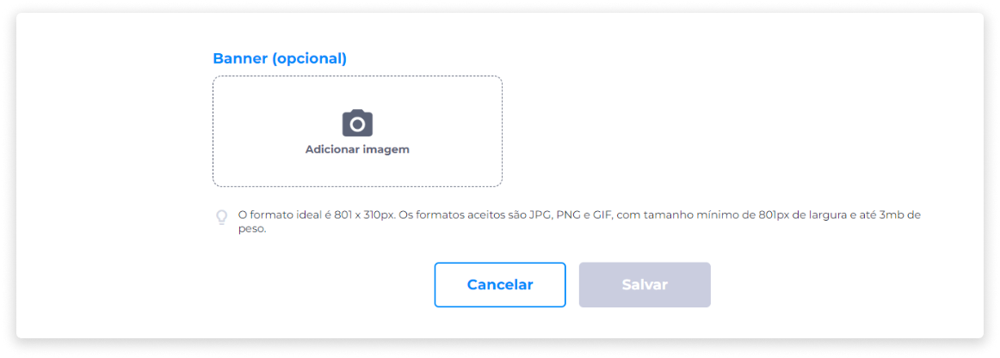

::: warning ⚠️ <warningblocktitle>Atenção</warningblocktitle>
<warningblocktext>As funcionalidades referentes ao Gerenciamento de Tokens foram movidas para o Axia Backoffice.</warningblocktext>
:::

::: tip 🔐 Ativação da Licença <feature>MANAGE_TOKENS</feature>
O conteúdo desta página é válido somente se a licença [<feature>**MANAGE_TOKENS**</feature>](../about/licenses.md) estiver ativada.
:::

# Criar um token
1. Na página **Gerenciar Tokens**, clique em **Novo token**.
2. Insira a sigla que representa o token e o nome.
3. Insira o nome do token na Market Cap.
4. Caso esteja importando um token existente para a plataforma, insira o número do contrato. Caso não tenha, deixe em branco para que o sistema (Axia Eniato) crie um.
5. Insira a quantidade de tokens que serão emitidos.
6. Insira o preço inicial.
7. Selecione a rede.
8. Insira uma descrição.

9. Adicione um arquivo PDF sobre as informações do projeto.
10. Adicione a imagem do token.
11. Selecione a quantidade mínima de tokens para transferência, se houver uma.
12. Selecione o tipo de transação para taxas.
13. Insira o valor da taxa de transação.
14. Insira o valor da taxa de saque.

## Outras configurações
Além do preenchimento dos campos de informações básicas sobre o token, é possível adicionar configurações personalizadas para cada token criado. Nesta seção, você pode marcar ou desmarcar as opções disponíveis, gerenciando as seguintes configurações:

- **Publicar token**
15. Selecione se o token deve ser publicado, permitindo que ele seja exibido na plataforma.

- **Usar como forma de pagamento**
16. Selecione se o token pode ser usado como forma de pagamento em transações.

- **Disponibilizar via MetaMask**
17. Selecione se o token poderá ser transacionado pela MetaMask.

- **Trava cambial**
18. Selecione se o token estará sujeito a trava cambial.

> A partir da compra de um token, o sistema registra a quantidade de tokens e sua cotação atual, gerando um preço médio. À medida que mais tokens são comprados, o preço médio deste ativo é atualizado com base na compra atual. Por isso, cada vez que este token for usado, o sistema não irá considerar a cotação atual, mas sim o seu preço médio.  
Com o objetivo de evitar que um token sofra com a alta volatilidade de mercado, e para que o usuário possa adquiri-lo a partir de um valor estável, a trava cambial é uma solução que pode ser configurada no momento da criação de um token, e consiste em travar o saldo do usuário para o momento da aquisição do ativo.

::: warning ⚠️ <warningblocktitle>Atenção</warningblocktitle>
<warningblocktext>Ao aplicar uma trava cambial, a operação não poderá ser desfeita.</warningblocktext>
:::

- **Pode ser comprado**
19. Selecione se o token poderá ser viabilizado para operações de compra.

- **Recomprável**
20. Selecione se o token será recomprável pela empresa emissora (é necessário configurar as especificações).

- **Disponibilizar para Staking**
21. Selecione se o token poderá ser disponibilizado para Staking.

- **Transferível**
22. Selecione se o token poderá ser transferido via carteira digital.

- **Disponibilizar para saque**
23. Selecione se o usuário poderá sacar seus tokens através da carteira digital.

Após aplicar as configurações personalizadas disponíveis na seção anterior:

23. Insira um banner para a página do token (ação opcional).
24. Salve as configurações.