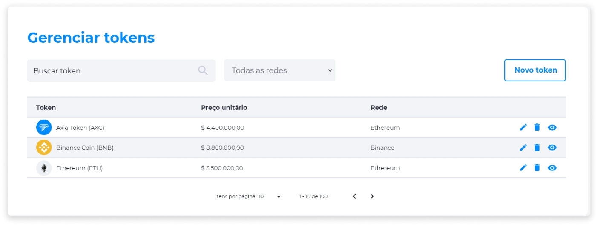

::: warning ⚠️ <warningblocktitle>Atenção</warningblocktitle>
<warningblocktext>As funcionalidades referentes ao Gerenciamento de Tokens foram movidas para o Axia Backoffice.</warningblocktext>
:::

::: tip 🔐 Ativação da Licença <feature>MANAGE_TOKENS</feature>
O conteúdo desta página é válido somente se a licença [<feature>**MANAGE_TOKENS**</feature>](../about/licenses.md) estiver ativada.
:::

# Gerenciar Tokens
No Axia Eniato, a página de gerenciamento de tokens permite criar, editar e deletar tokens. Após a criação do token, algumas configurações não podem ser editadas, como o nome, a sigla e o número do contrato. Há também a possibilidade de inserir tokens já existentes na rede Blockchain para o Eniato, a fim de utilizar as funcionalidades da plataforma como a compra e venda, o staking, a distribuição de dividendos e outras transações.

