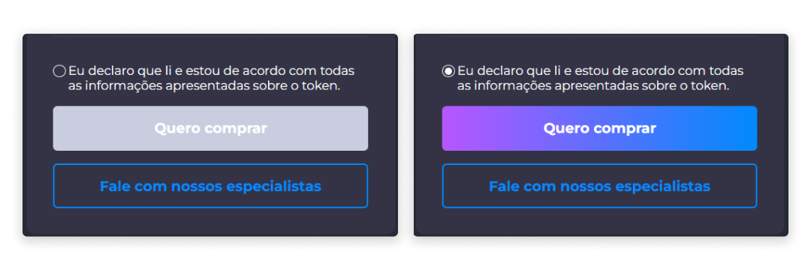
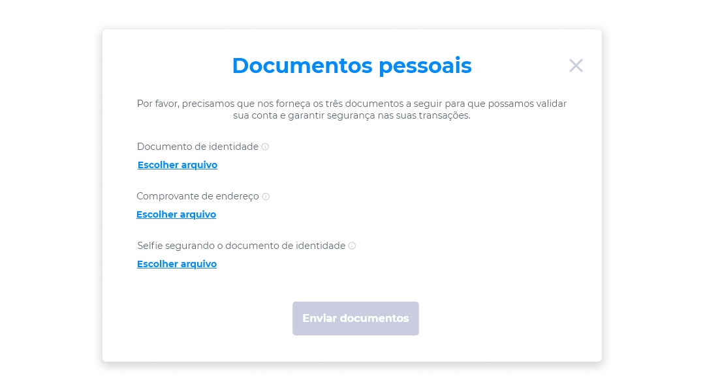
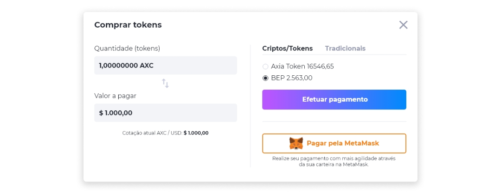
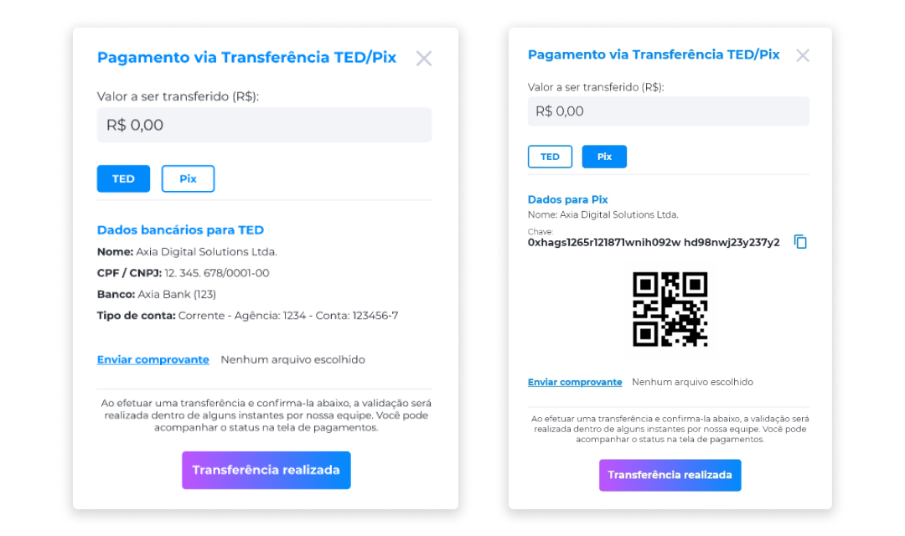
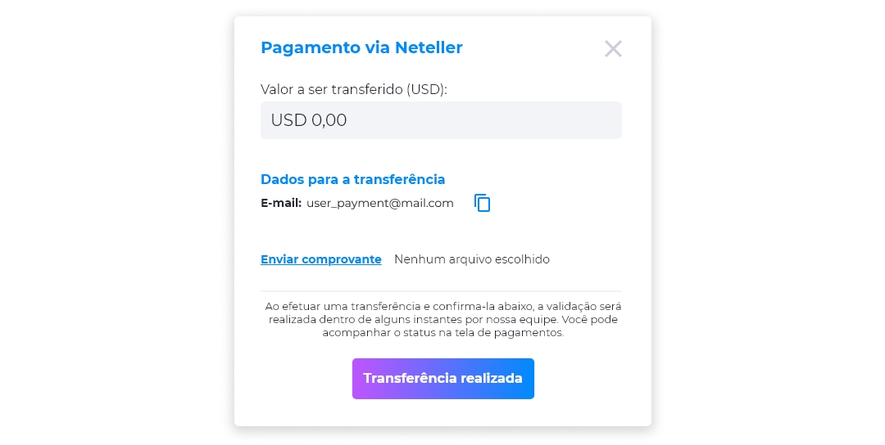

::: tip 🔐 Ativação da Licença <feature>BUY_TOKEN</feature>
O conteúdo desta página é válido somente se a licença [<feature>**BUY_TOKEN**</feature>](../about/licenses.md) estiver ativada.
:::

# Compra de Tokens
Para realizar a compra de um token:
1. Clique em um token disponível à venda.

No Eniato, cada token vendido na plataforma deverá ter seu próprio termo de uso. Para que o botão de compra do token seja liberado, o usuário deverá declarar que leu e está de acordo com todas as informações apresentadas sobre o token.

Esta ação é necessária para que o comprador confirme sua decisão sobre a compra do produto.

Para incluir o documento de termo de uso de cada token, você pode utilizar o campo de upload do documento, que está disponível no painel administrativo dos tokens.

2. Na página do token, após aceitar os Termos de Uso, clique em **Quero comprar**.

[<feature><🔐 **USER_KYC**</feature>](../about/licenses.md)
Caso esteja comprando um token pela primeira vez, como medida de segurança nas suas transações, será exibida uma tela que irá solicitar o envio de três documentos pessoais que serão analisados para que sua conta seja validada.

Para verificar o status dos documentos enviados, clique no menu [Perfil](../profile/profile.md) e na opção **Documentos Pessoais**.

Caso os documentos enviados estejam com o status **Aguardando aprovação**, você deverá aguardar a análise de autencidade dos documentos para prosseguir com a compra de tokens.

Caso os documentos enviados estejam com o status **Reprovado**, será necessário reenviá-los para autenticação.

Caso seus documentos já tenham sido enviados e aprovados, basta prosseguir com a realização da compra normalmente. [<feature>**USER_KYC**></feature>](../about/licenses.md)

3. Selecione a forma de pagamento e clique em **Efetuar pagamento**.

4. Após a confirmação da compra, confira seu tokens no seu menu de perfil na área **Meus saldos**.

## Meios de Pagamento
O pagamento pode ser realizado com os ativos disponíveis na conta do usuário, e que sejam aceitos como forma de pagamento pelo ativo a ser comprado.

Na tela **Forma de Pagamento**, são permitidos dois principais métodos de pagamento para a compra de Tokens: **Criptos/Tokens** e **Tradicionais**.

### Criptos/Tokens
O pagamento através de criptomoedas e tokens pode ser realizado em qualquer cripto aceita no Axia Eniato que possua saldo suficiente para a compra do token.

[<feature><🔐 **METAMASK**</feature>](../about/licenses.md) Além disso, caso o usuário tenha a extensão da MetaMask ativada em seu navegador, poderá optar por pagar pela sua carteira MetaMask, que terá um botão de acesso direto à carteira.

Caso não tenha a extensão ativada, será exibido um link de redirecionamento para que a MetaMask seja configurada. [<feature> **METAMASK**></feature>](../about/licenses.md)

### Tradicionais
O meio de pagamento tradicional aceita pagamentos em moeda fiduciária através das seguintes opções:

* Depósitos TED/PIX [<feature><🔐 **FIAT_DEPOSITS**></feature>](../about/licenses.md)
* Neteller [<feature><🔐 **NETELLER_PAYMENT**></feature>](../about/licenses.md)
* Cielo [<feature><🔐 **PAYMENT_WITH_CIELO**></feature>](../about/licenses.md)
* PagSeguro [<feature><🔐 **PAG_SEGURO**></feature>](../about/licenses.md)

#### Depósitos TED/PIX [<feature><🔐 **FIAT_DEPOSITS**></feature>](../about/licenses.md)
Ao optar por efetuar o pagamento da compra de um token via TED ou PIX:

1. Insira o valor a ser transferido em moeda fiduciária.

Na tela de pagamento, serão exibidos os dados bancários para TED ou chave PIX do vendedor do token.

2. Envie o comprovante de transferência.
3. Após enviar o comprovante de transferência, clique em **Transferência realizada**.

#### Neteller [<feature><🔐 **NETELLER_PAYMENT**></feature>](../about/licenses.md)
A Neteller é um meio de pagamento na compra de tokens. Com a Neteller, é possível realizar o pagamento de tokens em dólar. Para realizar pagamentos via Neteller:

1. Selecione o token que deseja comprar.
2. Clique em **Quero comprar**.
3. Na tela de pagamento, clique na aba **Tradicionais**.
4. Selecione a opção **Neteller**.
5. Clique em **Efetuar pagamento**.

6. Insira o valor a ser transferido em dólar (USD).
7. Forneça os dados necessários para a realização da transferência.
8. Envie o comprovante de transferência.
9. Clique em **Transferência realizada**.

::: info 📄 Info
Ao efetuar uma transferência e realizar a confirmação, a validação da transação deverá ser confirmada dentro de alguns instantes pela empresa, através do Backoffice.
:::

#### Cielo e PagSeguro

Para pagamentos através do Cielo e PagSeguro, as formas de pagamento aceitas são exibidas de acordo com a definição realizada pelo próprio administrador da plataforma, que pode disponibilizar diversas formas de pagamento, sendo os mais comuns Débito, Crédito e PIX, mas podem existir outros.

Para acompanhar os status dos seus pagamentos, clique no menu [Perfil](../profile/profile.md), na opção [Pagamentos](../profile/profile_payments.md).