# Compra de Tokens
Na página de compra de tokens, são exibidos o saldo do usuário em tokens, a cotação corrente da moeda, o valor total em moeda fiduciária e a quantidade de tokens disponíveis para venda.

Assim, o usuário dispõe de fácil acesso às informações essenciais que poderão auxiliar na decisão de compra.

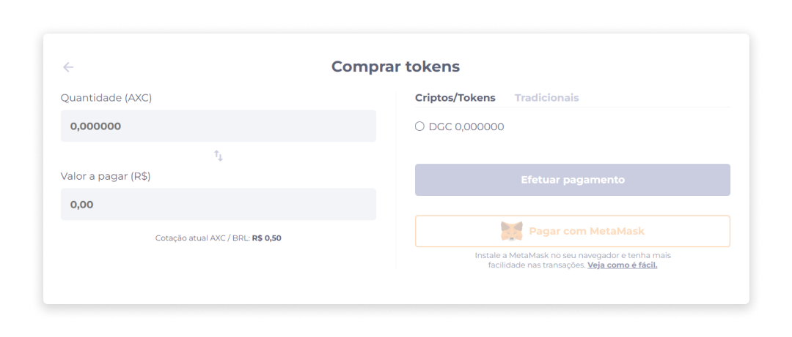

Através do campo **Valor a pagar (R$)**, o valor em tokens é convertido em tempo real para valor em moeda fiduciária, assim como o valor fiduciário também é exibido em tokens no campo **Quantidade (TOKEN)**.

Para realizar a compra de tokens, é necessária a configuração do método de autenticação [Autenticação de Dois Fatores](../account/authentication.md) (2FA) com o aplicativo Authy.

## Comprar token
1. Na página inicial ou no menu Perfil, clique em **Comprar token**.

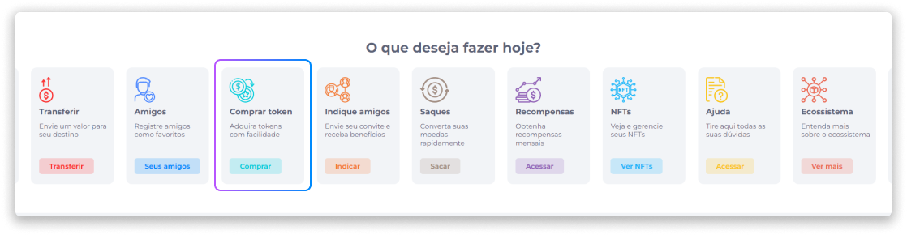

[<feature><🔐 **USER_KYC**</feature>](../about/licenses.md)
Caso esteja comprando um token pela primeira vez, como medida de segurança nas suas transações, será exibida uma tela que irá solicitar o envio de três documentos pessoais que serão analisados para que sua conta seja validada.

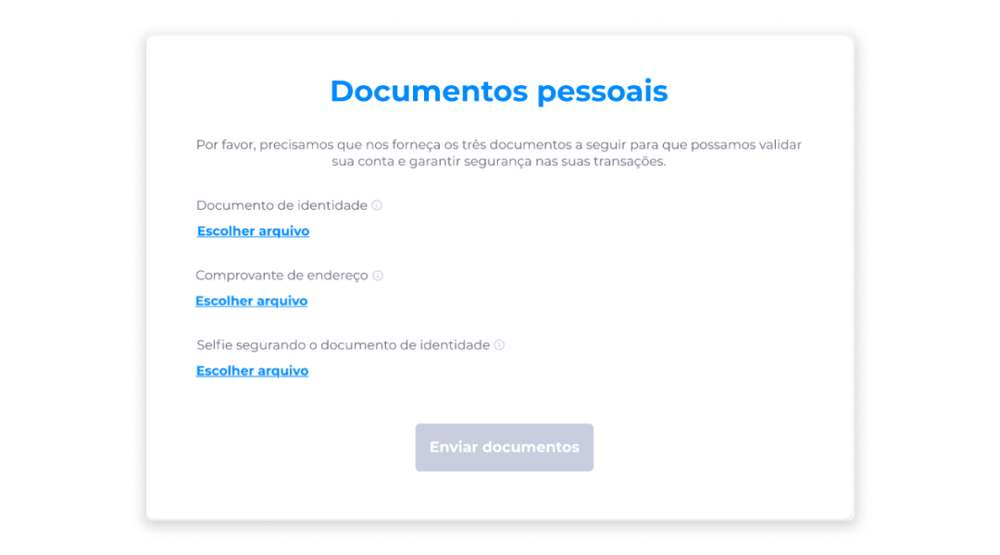

Para verificar o status dos documentos enviados, clique no menu Perfil, na opção **Documentos Pessoais**.

Caso os documentos enviados estejam com o status **Aguardando aprovação**, você deverá aguardar a análise de autencidade dos documentos para prosseguir com a compra de tokens.

Caso os documentos enviados estejam com o status **Reprovado**, será necessário reenviá-los para autenticação.

Caso seus documentos já tenham sido enviados e aprovados, basta prosseguir com a realização da compra normalmente. [<feature>**USER_KYC**></feature>](../about/licenses.md)

2. Insira a quantidade de tokens que deseja comprar ou o valor em moeda fiduciária.

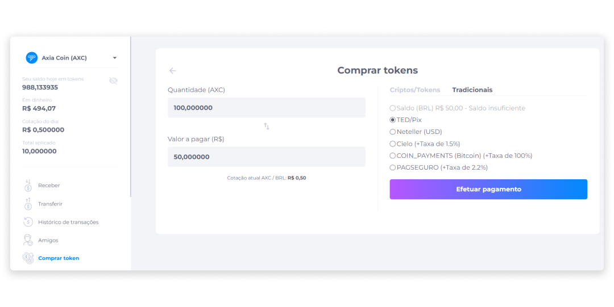

## Meios de Pagamento
O pagamento de tokens pode ser realizado com os ativos disponíveis na conta do usuário, e que sejam aceitos como forma de pagamento pelo ativo a ser comprado.

Para a compra de tokens, são permitidos dois principais meios de pagamento: Criptos/Tokens e Tradicionais.

### Criptos/Tokens
O pagamento através de criptomoedas e tokens pode ser realizado em qualquer cripto aceita na carteira e que possua saldo suficiente para a compra do token.

Para efetuar pagamentos com Criptos/Tokens:

1. Selecione o token disponível em sua conta que será utilizado como meio de pagamento.
2. Clique em **Efetuar pagamento**.

Após a confirmação, usuário pode visualizar seu novo saldo na área de saldos ou retornar à página inicial e continuar realizando novas compras. O registro da transação também pode ser verificado no Histórico de Transações.

::: info 🦊 <infoblocktitle>MetaMask</infoblocktitle>
<infoblocktext>Além dos tokens disponíveis na carteira Midas, caso o usuário tenha a extensão da MetaMask ativada em seu navegador, poderá optar por pagar pela sua carteira MetaMask, que terá um botão de acesso direto à carteira.  
Caso não tenha a extensão ativada, será exibido um link de redirecionamento para que a MetaMask seja configurada.</infoblocktext>
:::

### Tradicionais
O meio de pagamento tradicional aceita pagamentos em moeda fiduciária através das seguintes opções:

- TED/PIX
- Neteller
- CoinPayments
- Cielo
- PagSeguro

 

#### TED/PIX
Ao optar por efetuar o pagamento da compra de um token via TED ou PIX:

1. Insira o valor em moeda fiduciária que será transferido.
2. Clique na aba **Tradicionais**.
3. Selecione a opção **TED/Pix**
4. Clique em **Efetuar pagamento**.

Na tela de pagamento, serão exibidos os dados bancários para TED ou chave PIX do vendedor do token.

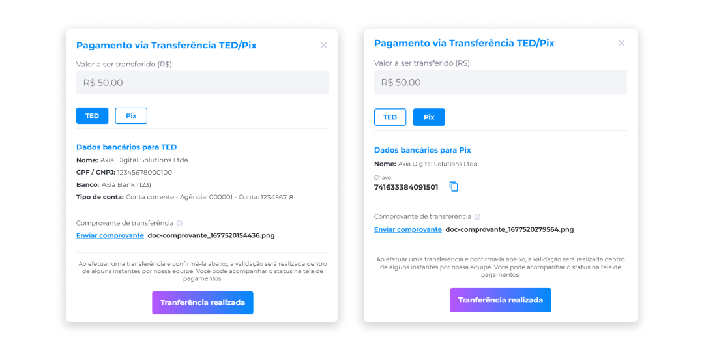

5. Envie o comprovante de transferência.
6. Após enviar o comprovante de transferência, clique em **Transferência realizada**.

 

#### Neteller
A Neteller é um meio de pagamento em que é possível realizar o pagamento de tokens em dólar. Ao optar por efetuar o pagamento da compra via Neteller:

1. Insira o valor em moeda fiduciária que será transferido.
2. Clique na aba **Tradicionais**.
3. Selecione a opção **Neteller**.
4. Clique em **Efetuar pagamento**.

Na tela de pagamento, serão exibidos os dados do vendedor do token para a realização da transferência.

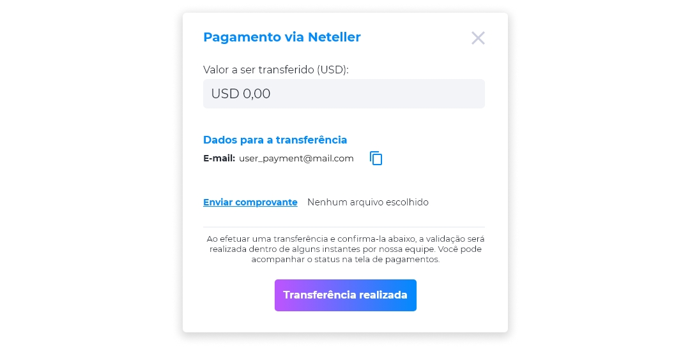

5. Insira o valor a ser transferido em dólar (USD).
6. Envie o comprovante de transferência.
7. Após enviar o comprovante de transferência, clique em **Transferência realizada**.

::: info ℹ️ <infoblocktitle>Validação de Transferência</infoblocktitle>
<infoblocktext>Ao efetuar uma transferência e realizar a confirmação, a validação da transação deverá ser confirmada dentro de alguns instantes pela empresa através do BackOffice.</infoblocktext>
:::

 

#### CoinPayments (Bitcoin)
A CoinPayments é um mecanismo de processamento de pagamentos em BTC integrado ao Midas. Para estabelecer esta integração, é necessário que o usuário possua acesso próprio na plataforma CoinPayments com o Bitcoin ativado como moedas aceitas, e tenha suas próprias chaves.

Ao optar pelo pagamento via CoinPayments, o usuário irá visualizar a tela de redirecionamento.

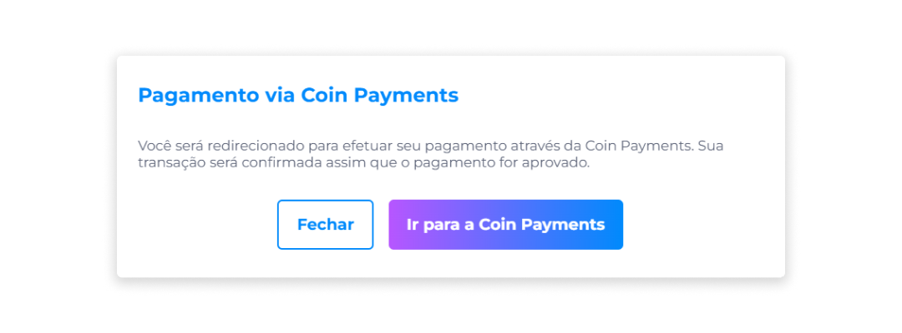

Em seguida, deverá seguir as instruções para que o pagamento seja efetuado através da tela de checkout da CoinPayments.

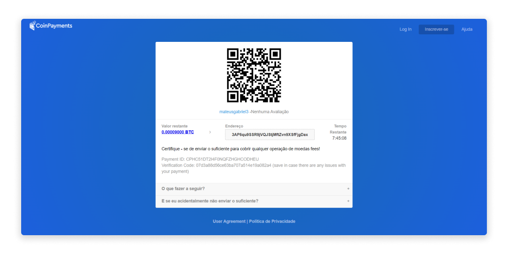

 

#### Cielo e PagSeguro
Para pagamentos através do Cielo e PagSeguro, as formas de pagamento aceitas serão exibidas de acordo com a definição realizada pelo próprio administrador da plataforma, que pode disponibilizar diversas formas de pagamento, sendo os mais comuns Débito, Crédito e PIX, mas podem existir outros.

Ao optar pelo pagamento via Cielo, o usuário irá visualizar a tela de redirecionamento.

Em seguida, deverá seguir as instruções para que o pagamento seja efetuado através da tela de checkout da Cielo.

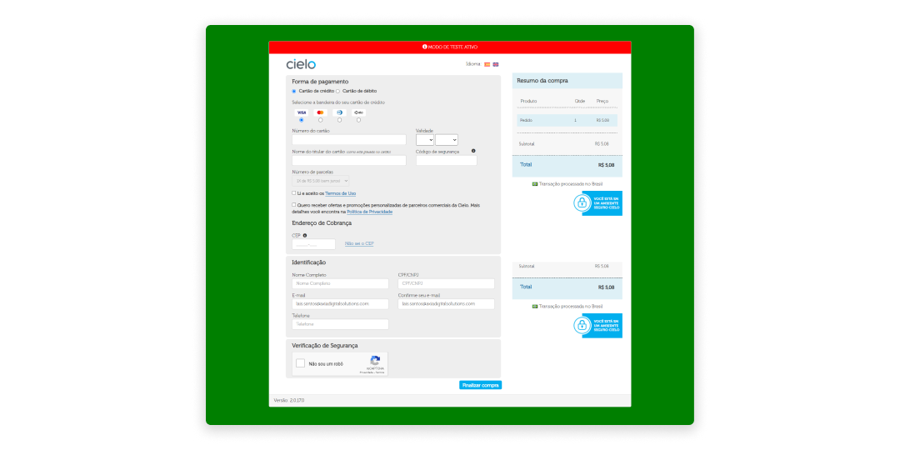

Ao optar pelo pagamento via PagSeguro, o usuário irá visualizar a tela de redirecionamento.

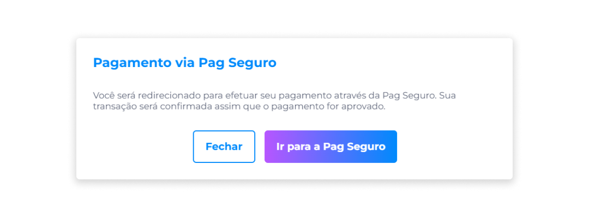

Em seguida, deverá seguir as instruções para que o pagamento seja efetuado através da tela de checkout da PagSeguro.

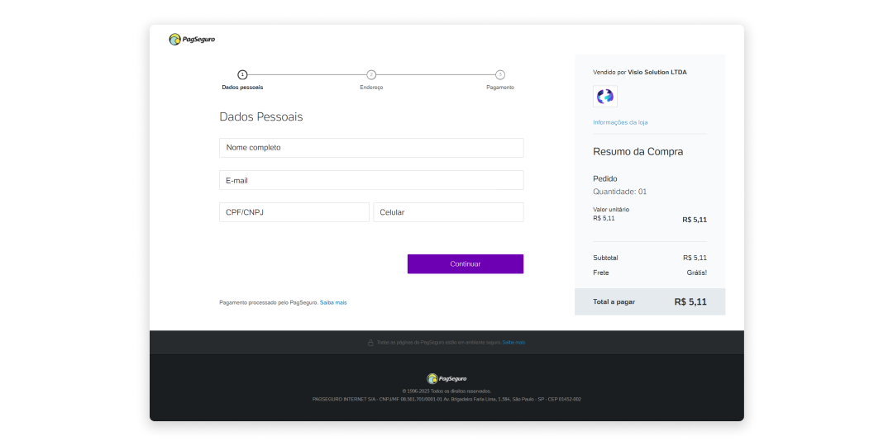

::: info ℹ️ <infoblocktitle>Registro de Compra</infoblocktitle>
<infoblocktext>Após a compra de um token, o histórico é automaticamente atualizado com o registro da transação.</infoblocktext>