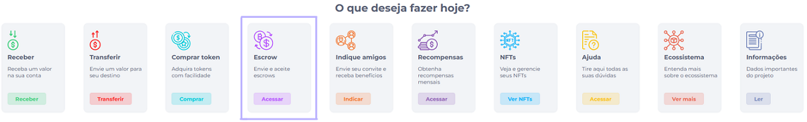
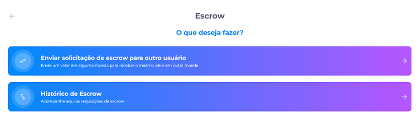
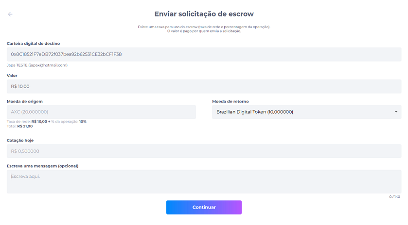
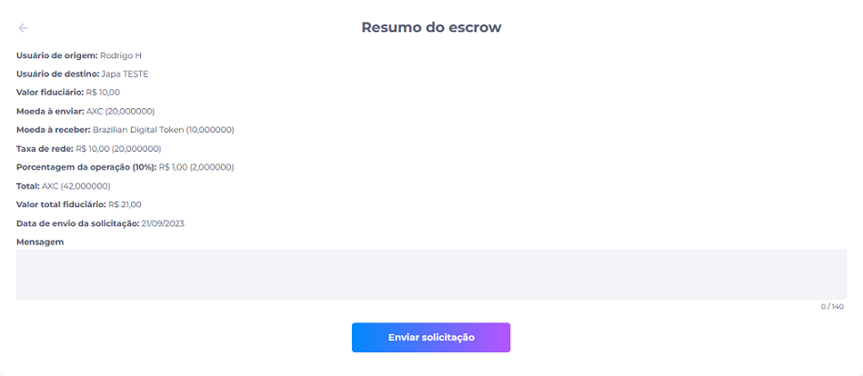
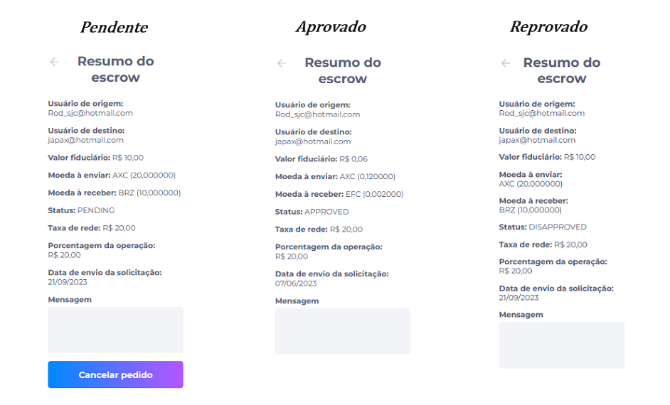
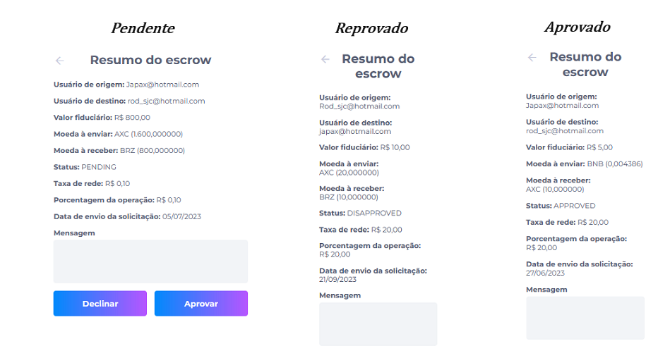

# Escrow

É a garantia de operação com troca de valores para receber o mesmo valor em outra moeda.

Durante a operação acontece o travamento dos valores até o momento da aprovação ou reprovação da solicitação.

Clicando no ícone do Escrow, o usuário poderá fazer a solicitação de troca ou ver o histórico de Escrow.

Ao fazer o solicitação o usuário deverá preencher as seguintes informações:

- Carteira digital de destino;
- Valor;
- Moeda de origem;
- Moeda de retorno;
- Exibição de cotação diária do token;
- Escrever uma mensagem, item opcional.

::: info ℹ️ <infoblocktitle>Taxa de rede e operação</infoblocktitle>
<infoblocktext>As taxas são configuradas de acordo com cada cliente.</infoblocktext>
:::

Preenhido as informações, aparecerá um resumo do Escrow:

Em seguida clicando no histórico de Escrow, será exibido todas solicitações de Escrow e será possível filtrar por enviadas, recebidas ou buscar pelo item desejado.

Dentre cada solicitação é exibido o status como aprovado, reprovado ou pendente.

- Ao clicar na solicitação, o usuário será exibido os detalhes de acordo com o status da solicitação.
- Exemplos de resumos de solicitações enviadas e seus status.
- O usuário poderá cancelar a solicitação enviada uma vez que não seje aprovado pelo outro usuário de destino.

- Exemplos de resumos de solicitações recebidas e seus status.
- O usuário tem a opção de reprovar ou aprovar a solicitação recebida

